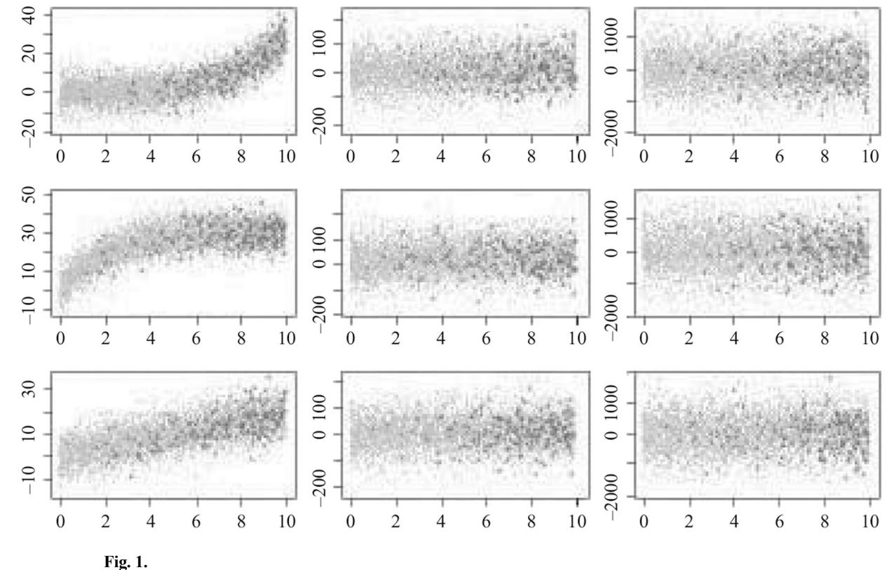
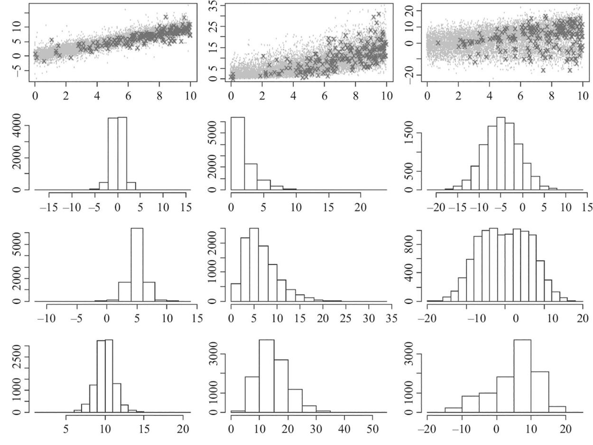
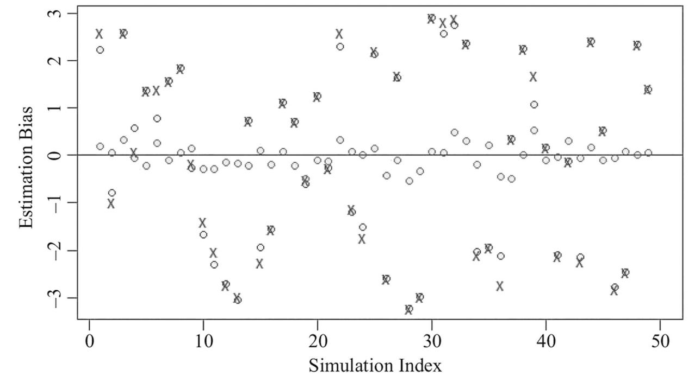

# **HHS Public Access**

Author manuscript J Off Stat. Author manuscript; available in PMC 2021 September 03.

Published in final edited form as:

J Off Stat. 2021 March ; 37(1): 71–95. doi:10.2478/jos-2021-0004.

## **Weighted Dirichlet Process Mixture Models to Accommodate Complex Sample Designs for Linear and Quantile Regression**

**Michael R. Elliott**1, **Xi Xia**2

1Department of Biostatistics, University of Michigan, 1415 Washington Heights, Ann Arbor, MI 48109, U.S.A.

2Ford Motor Company, 21931 Michigan Ave, Dearborn, MI 48124, U.S.A.

### **Abstract**

Standard randomization-based inference conditions on the data in the population and makes inference with respect to the repeating sampling properties of the sampling indicators. In some settings these estimators can be quite unstable; Bayesian model-based approaches focus on the posterior predictive distribution of population quantities, potentially providing a better balance between bias correction and efficiency. Previous work in this area has focused on estimation of means and linear and generalized linear regression parameters; these methods do not allow for a general estimation of distributional functions such as quantile or quantile regression parameters. Here we adapt an extended Dirichlet Process Mixture model that allows the DP prior to be a mixture of DP random basis measures that are a function of covariates. These models allow many mixture components when necessary to accommodate the sample design, but can shrink to few components for more efficient estimation when the data allow. We provide an application to the estimation of relationships between serum dioxin levels and age in the US population, either at the mean level (via linear regression) or across the dioxin distribution (via quantile regression) using the National Health and Nutrition Examination Survey.

### **Keywords**

Sampling weights; bayesian finite population inference; posterior predictive distribution; dioxin; NHANES

### **1. Introduction**

Many population surveys use complex probability sample designs with unequal selection probabilities, clustering, and stratification. Standard "design-based" approaches to analyzing such data use randomization inference, treating population values as fixed, sampling indicators as random, and focusing on developing estimators that are at least approximately unbiased with respect to the repeated sampling distribution. While the design-based approach does not make distributional assumptions, it can be very inefficient under certain scenarios, such as when the sample size is small, the weights are highly variable, and/or the

relationship between the quantity of interest and the probability of selection is weak. For example, if one is interested in a population-level linear regression parameter, if the model is correctly specified and the errors are homoscedastic, incorporating sampling weights in estimation is unnecessary for bias correction and will likely only inflate variance. However, misspecified models or designs with non-ignorable inclusion mechanisms can lead to settings where weights are required for bias correction.

An alternative approach uses Bayesian finite population inference, a model-based method that assumes a model for the observed data. The unobserved elements of the population are treated as missing data, and posterior predictive distributions of the population are generated by repeatedly imputing the unobserved elements of the population using draws from the posterior distribution of the parameters governing the data model (Ericson 1969; Rubin 1983; Fienberg 2011; Little 2012). Work by Zheng and Little (2003); Chen et al. (2010); and Chen et al. (2012) model an outcome of interest as a flexible function of the probability of selection, and develop consistent and efficient estimators of means and quantiles – descriptive statistics of a scalar variable. However, accommodating design elements, particularly sampling weights, is more complex when regression parameters themselves are of interest. One method to accommodate weights in a linear or generalized linear regression model setting is to create dummy variables stratified by equal or approximately equal case weights and include indicators for these weight strata and interactions between the covariates of interest and the weight strata in the regression model (Elliott 2007). Inference is based on the posterior predictive distribution of the population level regression model of interest, which no longer needs to explicitly include the weight interactions. This suggests a more general approach of developing models that retain the level of structure needed to incorporate the design features when necessary, but to default back to simpler models that are more efficient if the data suggest that they are not needed. More generally, the overarching goal of this work is to use modeling to balance bias-variance tradeoffs inherent in design-adjusted estimates of population parameters.

Here we consider an approach that does not directly incorporate design features into the model, but rather develops a very robust model that is relatively immune to substantial model misspecification, so that if a complex model is required to capture the key points of inference for the population, it is available, but if a simpler model is adequate, it will be used. This manifests in inference typically as a sort of bias-variance tradeoff, so that the complex model will yield something approximating a fully-weighted estimator, and the simpler model will yield something approximating an unweighted estimator. Specifically, we investigate use of Dirichlet Process Mixture (DPM) models (Blackwell and MacQueen 1973; MacEachern 1994) which loosen the assumption of a pre-determined number of mixture components, and provide a convenient mechanism to add or remove components from the model. Si et al. (2015) used a DPM in the estimation of population means, finding substantial reduction in mean square error and credible interval length over standard designbased estimators. Here we consider regression settings, which, as we note below, requires an extension of the DPM to accommodate weights in estimation. In particular, we consider a weighted Dirichlet Process Mixture (WDPM) model proposed by Dunson et al. (2007), which adds extra flexibility by assigning weights to locations in the population domain, relaxing implicit linearity in the regression setting. (We briefly note that "weighted" in

WDPM should not be confused with the sampling design weight – the former are estimated as a flexible extension of a DPM model, whereas we treat the latter as a fixed elements of the population to generate population predictive distributions under the WDPM model.)

We focus on the estimation of linear and quantile regression parameters. While quantile regression is commonly used with population survey data, methodological exploration in the complex sample setting has been somewhat limited, and little if any work has explored the effect of highly variable sampling weights in the quantile regression setting. Use of WDPM in the quantile regression context is particularly appealing given its ability to accommodate a wide variety of continuous distributions.

In this study we extend the WDPM model to estimate quantities of interest from complex survey design data, in order to build data-driven inference that captures a wide variety of normal and non-normal distributions in a fashion that takes account of unequal probabilities of selection, but also offers increased efficiency when data permit. Because the WDPM models are highly flexible and can generate predictive distributions that are accurate in tails of the distribution, they are a natural choice for model-based methods to obtain population quantile regression estimates as well. We consider an application to the analysis of the association between blood dioxin level and age, using data from the National Health and Nutrition Examination Survey (NHANES) (CDC 2015).

This article is organized as follows. In Section 2 we review the theory of Bayesian finite population inference, quantile regression, Dirichlet Process Mixture models, and the the weighted Dirichlet Process Mixture model. Section 3 extends the WDPM model to incorporate survey weights in the draws from the posterior predictive distribution. Section 4 provides a simulation study, and compares bias, coverage and RMSE of the proposed method with standard methods, under both linear model and quantile regression settings. Section 5 applies the method to estimate associations between blood level dioxin and age using data from NHANES. Section 6 provides a summary discussion.

### **2. Background Methodology**

### **2.1. Bayesian Finite Population Inference**

To review Bayesian finite population inference, we denote the sample design variables by Z, and the population data Y is modeled as Y ~ f (Y|θ, Z). Design variables can include case weights, cluster indicators, or stratum indicators, although in this article we will focus on weights. The distribution f could be either highly parametric, with a low dimension θ, or semi-parametric or "non-parametric" with a high-dimension θ. Let N be the number of elements in the population, Yobs consist of the n observed data elements, and Ynob consist of the N – n unobserved cases in the population. (Note that, in this general description, Y is multivariate and includes both regression outcomes, elsewhere denoted traditionally by a scalar Y, and regression predictors, denoted by multivariate X.) Considering Ynob as missing data, its posterior predictive distribution is given by:

$$
p(Y_{nob} | Y_{obs}, I, Z)
$$
  
= 
$$
\frac{\iint p(Y_{nob} | Y_{obs}, Z, \theta, \phi)p(I | Y, Z, \theta, \phi)p(Y_{obs} | Z, \theta)p(\theta, \phi)d\theta d\phi}{\iiint p(Y_{nob} | Y_{obs}, Z, \theta, \phi)p(I | Y, Z, \theta, \phi)p(Y_{obs} | Z, \theta)p(\theta, \phi)d\theta d\phi dY_{nob}}
$$
(1)

where ϕ models the inclusion indicator I. If ϕ and θ have independent priors, and the sampling design is ignorable, that is, I does not depend on Ynob given Yobs and Z, the formula of predictive posterior distribution reduces to

$$
p(Y_{nob} \mid Y_{obs}, Z) = \frac{\int p(Y_{nob} \mid Y_{obs}, Z, \theta) p(Y_{obs} \mid Z, \theta) p(\theta) d\theta}{\int p(Y_{nob} \mid Y_{obs}, Z, \theta) p(Y_{obs} \mid Z, \theta) p(\theta) d\theta dY_{nob}}
$$

allowing inference about Q(Y) to be made without explicitly modeling the sampling inclusion parameter I (Ericson 1969; Holt and Smith 1979; Little 1993; Rubin 1987; Skinner et al. 1989). This approach can be extended to develop inference on a function Q(Y) of the population data, by repeatedly obtaining draws from p(Ynob | Yobs , Z) and computing Q(Y) = Q(Ynob, Ynob) to thus obtain a draw from p(Q(Y) | Yobs , Z):

To move this review from the abstract to the concrete, consider data obtained from a (possibly disproportionately) stratified sampling design. Here Z would identify sampling strata, say z = 1, …, H, with known population sizes Nz , and samples of size nz with associated arithmetic sample means for single scalar covariate *y z* . Consider a simple model of the form

$$
y_{zi} | \mu_z \sim N(\mu_z, \sigma^2), i = 1, ..., n_z
$$
  

$$
p(\mu_z) \propto 1
$$

$$
p(\mu_z) \propto 1
$$

where for illustration purposes σ 2 is assumed known. Assume that the target of inference Q(Y) is the population mean *Y* = *N* −1*Σz Nz* − *n z Ynob*,*z* + *n z y z* , where

*Ynob*,*z* = *Nz* − *n z* −1∑*i* = 1 *Nz* − *n z Ynob*,*z*, *i* is the mean of the non-sampled elements and N = Σz Nz . Since *p Ynob*,*z* ∣ *y*, *Z* = ∫ *p Ynob*,*z* , *μ* ∣ *y*, *Z p*(*μ* ∣ *y*, *Z*)*dμ* = ∫ *p Ynob*,*z* , *μ z* ∣ *y z p μ z* ∣ *y z dμ z* (where the second equality follows from prior independence across the strata), we could obtain draws from the posterior distribution of *Y* in three steps:

- **1.** Draw *μ z rep* ∣ *y*, *Z*, from its posterior *N y z* , *σ* 2 /*n z*
- **2.** Draw Nz–nz of *Ynob*,*z*, *i rep* from *N μ z rep* , *σ* 2 for each of the z = 1, …, H strata
- **3.** A draw of of the posterior of *Y* is then obtained by computing

$$
\overline{Y}^{rep(1)} = N^{-1} \sum_z \left[ \left( N_Z - n_z \right) \overline{Y}^{rep}_{nob,z} + n_z \overline{y}_z \right]
$$

.

Note that, when the population is large, generating an entire population may be highly time consuming. Hence we show that the exact draw *Y rep*(1) is well approximated, where sample sizes and population sizes are large, by *Y rep*(2), obtained as follows. For each of the nz observations in each of the z = 1, … , H strata

- **1.** Draw *μ z rep* ∣ *y*, *Z*, from its posterior *N y z* , *σ* 2 /*n z*
- **2.** Draw *Ynob*,*z*, *i rep* from *N μ z rep* , *σ* 2
- **3.** Repeat 1) and 2) and compute

$$
\overline{Y}^{rep(2)}=N^{-1}\sum_{z}\left[\sum_{i=1}^{n_{z}}\left(w_{z}-1\right)\!Y_{nob,\,z,\,i}^{rep}\!+\!n_{z}\overline{y}_{z}\right],
$$

where wz = Nz /nz

.

Conceptually, *Y rep*(2) can be seen as obtaining posterior predictive draws of the population under the model and then "expanding" them to create a synthetic population by duplicating them by the number of unobserved elements they represent. To see the equivalence mathematically, note that the posterior distributions of *Y rep*(1) and *Y rep*(2) will both be normally distributed, with means equal to *N* −1∑*z Nz y z* :

$$
\begin{split} &E\Bigl(\overline{Y}^{rep(1)}\mid\boldsymbol{y},\boldsymbol{Z}\Bigr)=\boldsymbol{N}^{-1}\sum_{z}\Bigl[\Bigl(\boldsymbol{N}_{z}-\boldsymbol{n}_{z}\Bigr)\boldsymbol{E}\Bigl(\overline{Y}^{rep}_{nob,\boldsymbol{z}}\mid\boldsymbol{y},\boldsymbol{Z}\Bigr)+\boldsymbol{n}_{z}\overline{\boldsymbol{y}}_{z}\Bigr]\\ &=\boldsymbol{N}^{-1}\sum_{z}\Bigl[\Bigl(\boldsymbol{N}_{z}-\boldsymbol{n}_{z}\Bigr)\boldsymbol{E}\Bigl(\boldsymbol{E}\Bigl(\overline{Y}^{rep}_{nob,\boldsymbol{z}}\mid\boldsymbol{\mu}_{z},\boldsymbol{y},\boldsymbol{Z}\Bigr)\Bigr)+\boldsymbol{n}_{z}\overline{\boldsymbol{y}}_{z}\Bigr]=\boldsymbol{N}^{-1}\sum_{z}\Bigl[\Bigl(\boldsymbol{N}_{z}-\boldsymbol{n}_{z}\Bigr)\boldsymbol{E}\Bigl(\boldsymbol{\mu}_{z}\mid\boldsymbol{y},\boldsymbol{Z}\Bigr)+\boldsymbol{n}_{z}\overline{\boldsymbol{y}}_{z}\Bigr]\\ &=\boldsymbol{N}^{-1}\sum_{z}\Bigl[\Bigl(\boldsymbol{N}_{z}-\boldsymbol{n}_{z}\Bigr)\overline{\boldsymbol{y}}_{z}+\boldsymbol{n}_{z}\overline{\boldsymbol{y}}_{z}\Bigr]=\boldsymbol{N}^{-1}\sum_{z}\boldsymbol{N}_{z}\overline{\boldsymbol{y}}_{z} \end{split}
$$

and similarly

$$
E(\overline{Y}^{rep(2)}) = N^{-1} \sum_{z} \left[ \sum_{i=1}^{n_z} (w_z - 1) E(Y^{rep}_{nob, z, i} | y, z) + n_z \overline{y}_z \right] = N^{-1} \sum_{z} \left[ \frac{N_z - n_z}{n_z} \sum_{i=1}^{n_z} \overline{y}_z + n_z \overline{y}_z \right]
$$
  
=  $N^{-1} \sum_{z} \left[ (N_z - n_z) \overline{y}_z + n_z \overline{y}_z \right] = N^{-1} \sum_{z} N_z \overline{y}_z.$ 

The posterior sampling variances are given by

$$
v(\bar{r}^{rep(1)} | y, z) = N^{-2}v\left(\sum_{z} \sum_{i=1}^{N_{z} - n_{z}} r_{nob, z, i}^{rep} | y, z\right) = N^{-2}\left[E\left(v\left(\sum_{z} \sum_{i=1}^{N_{z} - n_{z}} r_{nob, z, i}^{rep} | \mu_{z}, y, z\right)\right] + v\left(E\left(\sum_{z} \sum_{i=1}^{N_{z} - n_{z}} r_{nob, z, i}^{rep} | \mu_{z}, y, z\right)\right)\right] = N^{-2}\left[E\left(\sum_{z} (N_{z} - n_{z})\sigma^{2}\right) + \sum_{z} (N_{z} - n_{z})^{2}v(\mu_{z} |, y, z)\right]
$$

$$
= N^{-2}\left[\sum_{z} (N_{z} - n_{z})\sigma^{2} + \sum_{z} \frac{(N_{z} - n_{z})^{2}}{n_{z}}\sigma^{2}\right]
$$

$$
= \frac{\sigma^{2}}{N^{2}}\sum_{z} (N_{z} - n_{z})\left(\frac{N_{z} - n_{z}}{n_{z}} + 1\right) \approx \frac{\sigma^{2}}{N^{2}}\sum_{z} \frac{(N_{z} - n_{z})^{2}}{n_{z}}
$$

and

$$
v(\bar{Y}^{rep(2)} | y, z) = N^{-2} \sum_{z} \sum_{i=1}^{n_z} (w_z - 1)^2 v(Y^{rep}_{nob, z, i} | y, z) = N^{-2} \sum_{z} (w_z - 1)^2 n_z (E(v(Y^{rep}_{nob, z, i} | \mu_z, y, z)) + v(E(Y^{rep}_{nob, z, i} | \mu_z, y, z))) = N^{-2} \sum_{z} [(w_z - 1)^2 \times n_z \sigma^2 (1 + 1/n_z)] = \frac{\sigma^2}{N^2} \sum_{z} \left(\frac{N_z - n_z}{n_z}\right)^2 (n_z + 1) \approx \frac{\sigma^2}{N^2} \sum_{z} \frac{(N_z - n_z)^2}{n_z}
$$

where the first equality for *V Y rep*(2) ∣ *y*, *Z* follows from the fact that the draws of the common mean *μ k rep* are made independently for each observation. Note that a bit of algebra shows that *V Y rep*(1) ∣ *y*, *Z* − *V Y rep*(2) ∣ *y*, *Z* can be written as *σ* 2 *N* 2 ∑*z Nz* − *n z* − *Nz* − *n z n z* 2 , showing that the variance estimate using the weighed approximation is usually conservative, with the positive bias going to 0 as N and nz increase, since ∑*z Nz* − *n z N* 2 0 and

∑*z Nz* − *n z N* 2 1 *n z* 2 0. We use the approximation *Y rep*(2) throughout the remainder of the

manuscript to improve computational efficiency. (Note also that *V Y rep*(1) ∣ *y*, *Z* can be written as *σ* 2∑*z Pz* 2 1 − *f z* /*n z* where Pz = Nz /N and fz= nz /Nz , corresponding to the designbased estimator of a population mean with a finite population correction adjustment.)

### **2.2. Quantile Regression**

Quantile regression is a general class of linear models that estimates quantiles of the response variable conditional on covariates. Consider a real valued random variable Y with

$$
Q_Y(\tau) = F_Y^{-1}(\tau) = \inf \left\{ y : F_Y(y) \ge \tau \right\}
$$

The quantile function provides a complete characterization of the distribution of Y with various values of τ. To solve for the τ-th quantile numerically, we define the piecewise linear loss function

$$
\rho_\tau(y) = y(\tau-I(y<0))
$$

where I equals one if y < 0 is satisfied, and zero otherwise. The τ-th quantile of Y, namely u, is calculated by minimizing the expected loss of ρτ (Y – u)

$$
\min_{u} E(\rho_{\tau}(Y-u)) = \min_{u} (\tau - 1) \int_{-\infty}^{u} (y-u) dF_Y(y) + \tau \int_{u}^{\infty} (y-u) dF_Y(y).
$$

Thus

$$
\hat{u} = \underset{u \in R}{\operatorname{argmin}} E(\rho_{\tau}(Y - u))
$$

Assuming a random sample of Y, yi , i = 1, …, n, the sample analogue of τth-quantile is attained by solving the following minimization problem:

$$
\hat{u} = \underset{u \in R}{\operatorname{argmin}} \sum_{i=1}^{n} \rho_{\tau}(y_i - u)
$$

Now we extend to a regression setting under a linear model assumption. Let xi , i = 1, …, n be a p × 1 vector of regressors. The τ-th conditional quantile function is then given by *QYi* ∣ *Xi* (*T*) = *Xi T β τ* , and one can obtain βτ by solving:

$$
\hat{\beta}_{\tau} = \operatorname{argmin}_{\beta} E(\rho_{\tau}(Y_i - X_i \beta))
$$

The sample analogue:

$$
\hat{\beta}_{\tau} = \underset{\beta \in R^p}{\operatorname{argmin}} \sum_{i=1}^n \rho_{\tau}(y_i - x_i \beta) \tag{2}
$$

is usually solved by the simplex method (Murty, 1983).

Yu and Moyeed (2001) suggest a likelihood form based on the asymmetric Laplace distribution:

$$
f_{\tau}(u) = \tau (1 - \tau) \exp\{-\rho_{\tau}(u)\}
$$

where pτ (u) has the same form of the loss function stated above. Thus the likelihood function could be written as:

$$
L(y | \beta) = \tau^{n} (1 - \tau)^{n} \exp \left\{ - \sum_{i} \rho_{\tau} (y_{i} - x_{i}^{T} \beta) \right\}
$$

Differentiating L(y | β) yields the objective function given in Equation (2).

#### **2.3. Dirichlet Process Mixture Model**

Assuming IID observations, the finite Gaussian mixture regression model is given by:

$$
Y_i | x_i, C_i = c, \beta_c, \sigma_c^2 \sim N \left( x_i^T \beta_c, \sigma_c^2 \right), c = 1, ..., K
$$

$$
C_i = c \mid \alpha, z_i, x_i \sim \text{MULTI}(1; p_{i1}, \dots, p_{ik})
$$

$$
\log\left(\frac{P_{ij}}{P_{i1}}\right) = f\left(\alpha_j, z_i, x_i\right), j = 2, ..., K
$$

where Ci is the class membership, identifying the latent mixture component to which an observation belongs; U ~ MULTI(1; p1, …, pk) denotes the multinomial distribution for single trial with P(U = k) = pk; and f(aj , zi , xi ) is the function of the multinomial logit parameterized by aj , and can take on a simple parametric form (e.g., linear in zi and xi ) or semi-parametric (e.g., penalized splines). Given a sufficiently large K, a finite Gaussian mixture model can maintain robustness in the presence of regression model misspecification, as well as skewness and overdispersion in the residual error term. Yet when the data permit, fitting a simpler model with a small value of K could lead to increased efficiency.

The finite Gaussian mixture model can be written in a more general form as

$$
f(y_i \mid x_i) = \int N(y_i \mid \phi_i) G_{xi}(\phi_i)
$$

where ϕi defines subject-level means and variances, and Gxi is multinomial. An alternative approach defines Gx as an element in an uncountable collection of probability measures Gx ~ DP(αG0), where DP denotes a Dirichlet Process (Ferguson 1973) centered at base distribution G0 with precision α. This leads to standard DP mixture models (MacEachern 1994) and avoids explicitly specifying the number of components K in advance.

Expressing the Dirichlet process in "stick-breaking" form leads to:

$$
G=\sum_{h\,=\,1}p_h\delta_{\theta h}\cdot\frac{ph}{\prod_{l\,-\,1}^{h\,-\,1}p_l}\!\!\!\!\!\!\!\!\!\!\!\!\!\!\!\!\!\!\!\!\!\!\!\!\!\!\!\!\!\!\!\!\!\!\!\!\
$$

where U ~ BETA(a, b) denotes the beta distribution, with PDF *f*(*U* = *u*; *a*, *b*) = *Γ*(*a* + *b*) *Γ*(*a*)*Γ*(*b*) *u a* − 1(1 − *u*) *b* − 1 for 0 ≤ u ≤ 1 and a, b > 0; δθh is degenerate at θ; and {θh} are atoms generated from G0. Use of a Polya urn scheme (Blackwell and MacQueen 1973) integrates out the infinite dimensional G and provides an easier form for simulation:

$$
\phi_i \mid \phi^{(i)}, \alpha \sim \frac{\alpha}{\alpha + n - 1} G_0 + \frac{1}{\alpha + n - 1} \sum_{j \neq i} \delta_{\phi j}.
$$

That is, a new draw of observation i could be the same component of an existing observations with probability 1/(α + n − 1), or initiate a new draw from base measure G0 with probability α /(α + n − 1) Thus through each cycle of the Gibbs sampler, each observation is either assigned to an existing component of the base distribution or to a newly generated component, with the probability of assignment to a new component governed by the a parameter, where large values of the "precision parameter" α encourage creation of new components and small values suppress new components. Consequently large values of α encourage larger values of K and vice versa; α can be fixed in advance as a tuning parameter, or estimated from the data after assignment of a hyperprior (typically a gamma distribution). Here we consider a normal distribution for G0, so that Y is a continuous outcome.

The drawback of the standard DP mixture emerges in the regression setting, where a draw from the posterior predictive distribution of yi | xi is generated from

*α α* + *n N y i* ∣ *x i* , *β* 0 , *σ* 0 2 + ∑*h* = 1 *k n h α* + *n N y i* ∣ *x i* , *β h* , *σ h* 2 where nh is the number of observations assigned to component h = 1,…, K, and β0 and *σ* 0 2 are further independent draws from Go. The conditional posterior predictive distribution of y for any value of K takes a linear form of x:

$$
E(y_i^{rep} \mid x_i, \beta_0, ..., \beta_K, \sigma_0^2, ..., \sigma_K^2) = x_i \bar{\beta}
$$

where *β* = *α α* + *n β* 0 + ∑*h* = 1 *K n k α* + *n β h* . This restricts the model's ability to capture non-linear patterns in data, including, for example, interactions with selection probabilities.

**2.3.1. Weighted Dirichlet Process Mixture (WDPM) Model—**The weighted Dirichlet Process Mixture model is a more flexible extension proposed by Dunson et al. (2007), that allows the DP prior itself to be a mixture of DP random basis measures.

Assuming *GX j* \* *DP aG*0 , where j = 1, …n indexes random basis measures at each distinct covariate value, the actual DP prior is built as a mixture model of *GX j* \* :

$$
G_{\mathbf{x}} = \sum_{j=1}^{n} b_j(\mathbf{x}) G_{\mathbf{x}}^*
$$

$$
b_j(\mathbf{x}) = \frac{\gamma_j \exp(-\psi) \|\mathbf{x} - \mathbf{x}_j\|)}{\sum_l^n \gamma_l \exp(-\psi \|\mathbf{x} - \mathbf{x}_l\|)}
$$

The form of bx grants high weight in Gx to subjects with xj closer to x, encouraging clustering of subjects that are near to each other in the covariate space. The parameter γ is designed to add extra "weight" at specific locations where data are sufficiently dense to detect the need for potential additional mixture components. The smoothing parameter ψ is included to control the degree to which Gx loads across multiple draws from DP(αG0). Note that the standard DP mixture model is a special case of the weighted DP mixture model, where bj (x) = 1/n for all j.

To obtain values of γj and ψ in a data-driven manner, ψ is assigned a truncated lognormal hyperprior, *ψ* log − *N μ ψ* , *σ ψ* 2 , ψ ∈ (0, 5). The choice for the weight parameter γ is more subtle to avoid either single dominating weight or uniformly distributed weights equivalent to a standard DP mixture model. Here we consider the γj ~ Gamma(αγ, βγ) which favors a few dominant locations.

To complete the Bayesian specification of the linear regression model for N(yi | ϕi ) with *φi* = *β i* , *σ i* 2 and βi = (βi1, …, βip),

$$
\beta_i \mid \beta, \sigma_i^2, \Sigma_{\beta} \sim N\left(\beta, \sigma_i^2 \Sigma_{\beta}\right)
$$

$$
\tau_i = \sigma_i^{-2} \sim Gamma(a_\tau, b_\tau)
$$

$$
\beta \sim N(\beta_0, V_{\beta 0})
$$

$$
\Sigma_{\beta}^{-1} \sim \text{Wishart} \Big( \big( v_0 \Sigma_0 \big)^{-1}, v_0 \Big)
$$

*b τ Gamma a* 0 , *b* 0

## **3. Generating Posterior Predictive Draws from the Finite Population using WDPM**

Here we describe how we obtain posterior predictive draws of the quantity of interest, for example, the population regression parameters, using a data augmentation method.

First, using the analytical form of all conditional probabilities outlined in Dunson et al. (2007), we obtain draws from the posterior distribution of the parameters from the WDPM model using Gibbs Sampler (see online Supplementary Material). We then obtain a draw of *y i rep*, the posterior predictive distribution of yi at xi conditional on a draw of all other

parameters from a normal distribution with mean ∑*h* = 0 *K wihx i T β h* , and variance

$$
\sum_{h=0}^{K} w_{ih}^{2}(x_i)\sigma_h^2 + w_{i0}^{2}x_i^T \sum_{\beta} x_i, \text{ where } w_{i0}(x_i) = \sum_{j=1}^{n} \frac{ab_j(x_i)}{\alpha + \sum_{l \neq i} t \binom{c_{s_i} - j}{s_i}} \text{ and}
$$
  

$$
w_{ih}(x_i) = \frac{bC_h(x_i)\sum_{m \neq i} t(S_m = h)}{\alpha + \sum_{l \neq i} t \binom{c_{s_i} - c_h}{s_i}} \text{ for } S = (S_1, ..., S_n) \text{ mapping } n \text{ subjects into } K \text{ distinct}
$$

clusters and C = (C1, …, CK) denoting the K cluster themselves; thus for n = 4 and K = 2, S = (1,1,2,2) indicates that the first two observations are assigned to cluster C1 and the second two observations to cluster C2.

The next step changes the focus from the WDPM model to the finite population model of interest. First, we consider the linear regression model *y i N x i T β*, *σ* 2 , so that the target population quantity of interest is the value β such that U(B) = 0 for

$$
U(\beta) = \sum_{i=1}^{N} \frac{\partial}{\partial \beta} \log f(y_i; \beta) = -\frac{1}{\sigma^2} \sum_{i=1}^{N} (y_i - x_i^T \beta) x_i,
$$

or *B* = ∑*i* = 1 *N x i x i T* −1 ∑*i* = 1 *N x i y i* . An approximate draw from the posterior predictive distribution of B is obtained as

$$
B^{rep} = (X^T W^* X)^{-1} X^T (W^* - I_n) (y^{rep} + y).
$$
\n(3)

where W\* is a n × n diagonal matrix of the sampling weights *wi*\* and y rep is the vector of draws *y i rep* , …, *y n rep*. If the sampling fraction is trivial, an approximate draw can be obtained simply using the predicted values: Brep = (XTW\*X) −1XTW\*y rep .

For the quantile regression model, our population target is Bτ such that such that *U B τ* = 0

for

$$
U(\beta_{\tau}) = \sum_{i=1}^{N} \frac{\partial}{\partial \beta} \log f_{\tau}(y_{i}; \beta) = \underset{\beta \in R^{p}i}{\text{argmin}} \sum_{i=1}^{N} \rho_{\tau}(y_{i} - x_{i}\beta)
$$

and an approximate draw from the posterior predictive distribution of Bτ is obtained as

$$
\underset{\beta \,\in\, R}{argmin} \Bigg( \sum_{i \,=\, 1}^{n} \big( w_i - 1 \big) \rho_{\tau} \big( y_i^{rep} - x_i \beta \big) + \sum_{i \,=\, 1}^{n} \rho_{\tau} \big( y_i - x_i \beta \big) \Bigg)
$$

or, if ignoring finite population corrections, from *argmin β* ∈ *R p* ∑*i* = 1 *n wi ρ τ y i rep* − *x i β* .

Efficiency is gained when K is small, approximating unweighted linear prediction. To see why this is the case, consider the linear regression setting. If K = 1, then the prediction is exactly linear, with y rep = Xβ rep , e ~ N(0, σ 2 In). Then β rep = (XTW\*X) −1 XTW\*(Xβ rep + e) = β rep + (XTW\*X) −1XTW\*e, which is a draw of β independent of the weights plus a weighted average error term with mean 0. Large values of K can accommodate nonlinearities that lead to bias if the survey weights are ignored, at some cost to variance, especially if the weights are highly variable. Hence a data-driven bias-variance tradeoff is induced.

### **4. Simulation Study**

In this section we evaluate the application of the Weighted Dirichlet Process Mixture model in complex survey design in two scenarios: ordinary linear regression and quantile regression. For each setting, the target of interest is the population slope. The competing methods are the unweighted estimator, the fully-weighted estimator, and a "weight trimming" estimator (Potter 1990) with extreme weights trimmed at three standard deviations of mean weight. For the linear regression model, we also consider a semiparametric spline model as a more direct competitor to the WDPM model. Bias, relative root of mean square error (RMSE), and coverage of 95% confidence or credible intervals are calculated to assess the performance of the estimators. R code for generating the population and samples, and for fitting the WDMP model, is available at [https://github.com/mrelliot/](https://github.com/mrelliot/WPDM) [WPDM](https://github.com/mrelliot/WPDM).

#### **4.1. Weighted Dirichlet Mixture Model for Ordinary Linear Regression**

For the linear regression setting, a population of N = 20, 000 is generated. The predictor X is uniformly distributed on the interval from 0 to 10. The response variable Y is created from a linear spline function of X, with knots at integer values. Three sets of coefficients are considered to represent different associations of Y and X, including convex and concave curves, and a linear slope:

$$
Y_i \mid X_i, \beta, \sigma^2 \sim N \left( \sum_{h=0}^{9} \beta_h (x_i - h)_+, \sigma^2 \right)
$$

$$
X_i\text{-}UNI(0,10), i=1,...,N=20,000
$$

$$
\beta^a = c(0, 0, 0, 0, .5, .5, 1, 1, 2, 2)
$$

$$
\beta^{\mathbf{b}} = c(0, 11, -4, -2, -2, -1, -1, -0.5, -0.5, 0)
$$

$$
\beta^{\mathsf{C}}=c(0,2,0,0,0,0,0,0,0,0)
$$

We then sampled n = 200 observations in a stratified sample with selection probabilities P(Ii = 1) = πi ∝ (1 + hi ) \* hi , where the hth stratum is given by the ceiling function applied to X: hi = [x1]. This sets the maximum weight to be about 55 times larger than the minimum weight.

The target quantity of interest is *β* = ∑*i* = 1 *N Xi Xi* −1∑*i* = 1 *N Xi Yi* for *Xi* = 1*Xi* ′, the leastsquares linear approximation of the population slope. Under β a and β b , the linear model is misspecified, and weights may be necessary to correct for the corresponding bias. Under β c , the model is correctly specified, and it would be most efficient to ignore the sample weight.

Population variance σ 2 varies as 101.5, 103.5 and 105.5, creating varying levels of variance influence, ranging from revealing a moderate curving pattern, to completely overwhelming the local differences in the population slope (see Figure 1). Also note that slope in setting β a changes more dramatically where data is most densely sampled, while the reverse happens in β b , suggesting that a complex model is needed to correctly capture the two different scenarios.

The hyperprior parameters are pre-specified as following. For the prior on DP weight functions, we let αγ = 0.01, βγ = 2, and α = 0.01. For hyper-priors on basis distribution parameters, we have β0 = 0, Vβ0 = 1000 × Ip, ν0 = 1, Σ0 = Ip, aτ = 0.1, a0 = 0.1, b0 = 0.1, μψ = log(30) and μψ = 0.5. We also restrict the value of ψ in a range of zero to five, and fix the Dirichlet process precision parameter α = 1.

A Gibbs Sampler as previously described is applied, that is, the new distribution of S, DP weights, number of atom distributions and parameters within each atom are drawn sequentially from the full conditional distributions. A draw of the population slope is then obtained as described in Section 3. All free parameters in the Gibbs sample are initialized at

zero, except for variance estimators *σ h* 2 for each component, which are initialized at one. Thefirst 5,000 iterations are dropped as burn-in, and the following 10,000 iterations are kept to

form the distribution of estimated parameters. Diagnostic plots are generated to assure the algorithm's convergence.

The process is repeated for 200 independent samples to provide the empirical distribution for the repeated measures properties. We compare the properties of our weighted Dirichlet Process Mixture model (WDPM) with major competitors, including the unweighted estimator (UNWT), fully weighted estimator (FWT) and a standard ad-hoc weight trimming method with threshold at three times the standard deviation of the weights(WT3). For this linear model, we also included a spline competitor (SPL) that replaces the Dirichlet Process Mixture model with a B-spline basis matrix (Wang 1998); details of the SPL model fitting are provided in the supplementary material. Bias and nominal 95% coverage are recorded directly, while RMSE is rescaled according to fully weighted estimator. Results are provided in Table 1.

For the first two scenarios, the model is misspecified as linear, and the unweighted method tends to be biased, leading to an overall larger RMSE and lower coverage rate compared to fully weighted model. However, as residual variance increases, the gain in efficiency gradually overcomes the loss in accuracy, and at the large variance level, the unweighted estimator has better RMSE compared to the fully weighted estimator, suggesting that the model misspecification could be ignored. The weight trimming estimator has an overall better performance compared to fully the weighted method, maintaining the necessary biascorrection while improving the efficiency and nominal 95% coverage. The spline model is more stable than the weighted estimator, with a small bias at the low variance setting leading to a smaller RMSE than the unweighted estimator, and trading off a slight increase in bias for better RMSE than the trimmed weight estimator at higher variance. The spline model also has below nominal coverage for the β b scenario in the low variance setting, due to a modest degree of bias that remains even after the non-parametric fit of the mean. However, the weighted Dirichlet Process Mixture estimator demonstrates a dominating performance across all settings, obtaining more than 50% reduction in RMSE compared to the fully weighted estimator; when the residual variance is large, it leads to more efficient estimates than even the unweighted estimates.

Under β c ; where the model is correctly specified, all methods yield approximately unbiased results. (The estimated biases for σ 2 = 105.5 are due to simulation error, enhancing the instability in the estimation.) Here the WDPM method yields the maximum reduction in RMSE, reducing RMSE by 50–60% over the fully weighted estimator, while the unweighted estimator consistently reduces RMSE by about 40% over the fully weighted estimator, the spline estimator by about 30% over the fully weighted estimator, and the trimmed weighted estimator by about 20% over the weight trimming estimator. The UNWT, FWT, and WT3 coverage rates are somewhat low due to the instability caused by small sample size, while the spline coverage rate is conservative. Meanwhile, the WDPM estimator provides conservative coverage across all residual variance settings.

### **4.2. Weighted Dirichlet Mixture Model for Quantile Regression**

To assess the performance of the WDPM method in quantile regression, we consider heavy tailed, skewed, and bimodal distributions. As in the linear regression setting, a population of 20,000 is generated, and samples of size 200 are drawn from the population. The covariate *X* is uniformly distributed on interval of (0, 10). Our inferential target is the linear population slope of *X* on the first quartile (25th percentile), median and third quartile (75th percentile) of *Y*:*argminβ* 0*τ* , *β iτ* ∑*i* = 1 *N ρ τ y i* − *β* 0*τ* − *β* 1*τ x i* , for τ = .25, .5, .75. We again estimate bias,

RMSE, and coverage from 200 independent simulations. We drop the spline model from consideration, since it makes the assumption of residual normality that is clearly not correct in these settings.

For the heavy tail setting, we consider a t distribution with five degrees of freedom and selection probability πi related to covariate X:

> *X i Uniform*(0, 10)

$$
Y_i \mid X_i \sim T\left(\mu = x_i, df = 5\right)
$$

$$
P(I_i = 1) = \pi_i \propto \left(1 + \left[x_i\right]\right) \times \left[x_i\right]
$$

$$
i=1,...,N=20,000.
$$

For a skewed distributed setting, we consider a Gamma distribution and selection probability related to covariate X:

$$
X_i \sim Uniform(0, 10)
$$
  
  

$$
Y, \mid X_i \sim Gamma\left(k = x_i^{1.5}/5 + 1, \theta = 2\right)
$$
  
  

$$
P(I_i = 1) = \pi_i \propto \left(1 + \left[x_i\right]\right) \times \left[x_i\right]
$$

For the bimodal distribution, we consider the following mixture with weight αi related to xi :

*i* = 1,…, *N* = 20, 000.

$$
X_i\!\!\sim\!\!Uniform(0,10)
$$

$$
Y_i \mid X_i, \alpha_i \sim \alpha_i N(x_i, 16) + (1 - \alpha_i) N(-5, 16)
$$

*α i Bernoulli x i* /10

$$
P(I_i = 1) = \pi_i \propto \left(1 + \left\lceil x_i \right\rceil\right) \times \left\lceil x_i \right\rceil
$$

$$
i = 1, ..., N = 20,000.
$$

Population and samples are shown in Figure 2. Under the first scenario, the linear model is correctly specified, with an over-dispersed residual. Thus we expect all estimates to be unbiased, with the unweighted estimator gaining efficiency, and the WDPM model correcting the coverage rate. For the other two scenarios, the unweighted estimator is biased due to non-linearity in xi combined with sampling probabilities that are a function of xi , and we expect the WDPM estimate to perform similarly to the fully weighted estimator.

The hyperprior parameters are pre-specified as in the linear regression setting: aγ = 0.01, bγ = 2, and ξ = 0.01. For hyper-priors on basis distribution parameters, we have β0 = 0, Vβ0 = 1000 × Ip, ν0 = 1, Σ0 = Ip , aτ = 0.1, a0 = 0.1, b0 = 0.1, μψ = log(30) and σψ = 0.5. Within each simulation there are 15,000 iterations, with the first 5,000 are dropped as burn-in. Diagnostic plots are generated to assure the algorithm's convergence. Results are provided in Table 2.

For the population created from a heavy-tailed t distribution, the unweighted method has the best performance across all quantile estimates, prevailing in both efficiency and coverage over the fully weighted estimator, since there is no bias correction from weighting in this scenario. The fully weighted estimator has somewhat reduced coverage due to the instability caused by the small sample size, while the weight trimming estimator shows major improvements in RMSE relative to the fully-weighted estimator, with a conservative coverage rate. Meanwhile, the WDPM method maintains stable results across median, first and third quartiles, providing inference approximately equivalent to the unweighted estimator, with about a 45% reduction in RMSE compared to the fully weighted method or 20% compared to the weight trimming method, and a conservative coverage rate.

In the second scenario, where skewed population distributions and model misspecification both occur, weighting becomes necessary, and the fully weighted method has better performance with respect to bias at lower quartiles, as anticipated. The unweighted method is biased, and has poor coverage and larger RMSE for all except the 3rd quartile, where the

impact of bias is offset by the reduction in variance. The weight trimming method has improved performance in the median and third quartile comparing to the fully weighted method, but suffers a minor drop in coverage rate in the first quartile. The WDPM model has smaller RMSE than any other model for the 50th and 75th percentile, with approximately correct coverage. For the 25th percentile, the WDPM model suffers from some reduction in coverage as well as increase in bias and RMSE due to the inability of the model to completely capture the behavior of the low percentile of the outcome for small values of X due to extremely small sample size (see Figure 2).

In the bimodal setting, bias reduction is required for estimation in the first quartile and median, but not in the third quartile, since it closely approximates a pure linear model. The fully weighted estimator successfully reduces biases and performs better with respect to RMSE than the unweighted estimator for the first quartile and median regression slopes, but loses efficiency when estimating the third quartile regression slope. The weight trimming estimator acts as an upgraded version of a fully weighted estimator, showing better results in all but the coverage of the first quartile regression slope. The WDPM model provides a large improvement compared to the fully weighted model in the first quartile and median, reducing RMSE by 30% to 40%. It also maintains this improvement even compared to the weight trimming estimator. While the unweighted estimator has better RMSE in the third quartile, the WDPM estimator closely follows its performance. Both the fully weighted estimator and WDPM estimator have satisfactory coverage rates.

### **4.3. Weighted Dirichlet Mixture Model for Quantile Regression With a Binary Covariate**

In this subsection, we conduct a simulation study expanding the application of the weighted Dirichlet Mixture model to quantile regression with a binary covariate. To be more specific, we focus on the bimodal population setting, assessing performance differences between unweighted quantile regression, weighted quantile regression and WDPM model, to help in understanding the result from application on dioxin data in the next section.

The bimodal distributed population is created as follows:

*X i Bernoulli*(0.5)

*α i Bernoulli*(0.5)

*Y i* ∣ *X i* , *α* i *N* 0.5 \* *X i* + 5 \* *α* i , 1

$$
P(I_i = 1) \propto 15 * X_i + N(0, 1) + 7
$$

*i* = 1,…, *N* = 20, 000.

Samples of size n = 200 are drawn from the population with the probability of selection defined above (yielding a ratio of approximately nine between the maximum and minimum selection probabilities, similar to the design in NHANES). Simulations on each sample consist of 10,000 iterations, with first 5,000 dropped as burn-in. Bias, RMSE and coverage is again assessed with 200 independent simulations, and results are displayed in Table 3. The results suggest that all models provide consistent results with good coverage in the first quartile and third quartile, while WDPM reduces the overall RMSE by 30%. However, when estimating population slope for the median, the true RMSEs from unweighted, weighted and weight trimming models are greatly increased, indicating unstable estimation. These findings, result from the median regression estimator attempting to "balance" between the two modes in the population.

To explore these results further, Figure 3 plots biases for all three approaches for fifty simulations. This suggests that, in this setting, both unweighted method and weighted method often provide similar estimates far away from true value. WDPM is more robust for those situations, providing stable estimates.

### **5. Application on Dioxin Data from NHANES**

The National Health and Nutrition Examination Survey (NHANES) (CDC 2015) is a multistage, unequal probability-of-selection survey, consisting of 25 strata and two primary sampling units (PSU) per stratum. It provides an annual sample of approximately 7,000 persons interviewed about a large variety of factors relating to prevalence, awareness, treatment and control of disease, trends in risk behaviors and environmental exposures, and relationships between diet, nutrition, and health. Approximately three-quarters of subjects agree to participate in a medical exam that obtains biomarkers, including levels of a large variety of biomakers in the blood. Among those biomarkers measured include certain varieties of dioxins. Dioxin is a generic term for a class of chemicals often created as byproducts of industrial processes, and even low levels of exposure are suspected to cause a wide variety of health problems, including cancer. Thus when University of Michigan Dioxin Exposure Study researchers wanted to understand how dioxin exposure varies by age in the general US population, they turned to the NHANES (Chen et al. 2013). The NHANES design oversamples low income persons, adolescents and persons 60 and older, and African American and Mexican American minorities. Weights in the NHANES adjust for this oversampling, and include additional adjustments based on the estimated probability of participating in the medical exam, as well as calibration adjustments so that weighted distributions of demographic factors such as gender match those known in the population from the U.S. Census Bureau.

We apply the weighted Dirichlet Process prior to an analysis relating age and gender to the blood level of dioxin using data from the 2013–2014 NHANES data set. We consider 2,3,7,8-tetracholorodibenzo-p-dioxin (TCDD), a compound resulting from incomplete combustion in incineration, paper and plastics manufacturing and smoking. Somewhat more than half of TCDD readings are below the limit of detection, and are imputed five times through multiple imputation described in Chen et al. (2013). A jackknife method is used to compute variances to fully account for clustering and stratification design features, and

Rubin's formulas (Rubin 1987) are used to combine inferences from each of the multiplyimputed data sets. R code for fitting this data is available at [https://github.com/mrelliot/](https://github.com/mrelliot/WPDM) [WPDM](https://github.com/mrelliot/WPDM).

#### **5.1. Linear Regression Model**

We fit three linear regression models – age alone, gender alone, and age and gender together – to assess the impact of age and gender on log transformed blood TCDD. Hyper-priors are set to the same values as in the simulation study, and unweighted, fully weighted and weighted Dirichlet Process Mixture estimates are compared with respect to bias and RMSE, where the fully weighted version is treated as unbiased in the corresponding calculation. Note that there exists correlation between the weighted estimator and other estimators, with the unbiased estimated square bias of regression coefficient *β* given by

*max β* − *βw* 2 − *V*01, 0 , where *V*01 = *Var*(*β*) + *Var βw* − 2*Cov β*, *βw* . To fully account for the design features, all variance/covariance estimates are calculated via jackknife as *Var*(*β*) = *Σh k h* − 1 *k h* ∑*i* = 1 *k h β* (*hi*) − *β* 2 , where *β* (*hi*) denotes the β estimator by excluding the ith

PSU in hth stratum, and the case weights utilized in the fully-weighted and WDPM analysis are given by:

> *wj* \* = *wj* if j ∉ h, j ∉ i *k h* − 1 *k h* if j ∉ h, j ∉ i 0 if j ∉ h, j ∉ i

*Var*(*β*) and *Cov βw* , *β* accordingly, and estimates from five imputed replicate data sets are combined with Rubin's formula. The result in the WDPM estimate was based on 10,000 iterations after discarding 2,000 draws as burn-in. The estimated bias, RMSE, and 95% confidence intervals are summarized in Tables 4 through 6. Dioxin levels are positively associated with age and being male.

In general, the survey weights have less impact on estimating the effect of age, but play a crucial role in estimating the effect of gender; thus unweighted estimates usually have smaller RMSE for estimated coefficient of age, and fully weighted and weight trimming estimates have smaller RMSE for estimated coefficient of gender. Consequently the WDPM estimator has much better performance than the weighted and weight trimming estimators, and even than the unweighted estimator, when estimating the effect of age on dioxin blood levels. The effect of gender appears to be biased toward the null, lead to a larger RMSE increase than other models except in the joint age and gender model.

#### **5.2. Quantile Regression Model**

In this section we evaluate the performance of WDPM estimator in the quantile regression setting based on the same dioxin data set from the NHANES study. We again focus on the impact of age, gender, and age and gender together on the first quantile, median and third quartile of log blood TCDD. While estimating bias and RMSE, results from weighted

quantile regression are considered as unbiased, and jackknife and Rubin's formula are applied for complex survey scheme and multiple imputation. The result for the WDPM estimator is based on 10,000 iterations after discarding 2,000 draws as burn-in. The estimated bias, RMSE, and 95% confidence intervals are summarized in Tables 7 through 9. The impact of age (older ages have higher TCDD level) and gender (males have higher TCDD levels) is greater at median levels than at the first and third quartiles.

The patterns for quantile regression applied on the NHANES study are not consistent across different quartiles. In general, when estimating the population slope of age on the first quartile of outcomes, the unweighted method is clearly more efficient than the fullyweighted one, reducing the RMSE by almost 50%. The performance of the unweighted and fully weighted estimators of the median and third quantile of outcomes are much closer, usually with less than 15% differences in RMSE, and with no one method besting the other one across all models and settings. When dealing with gender, the fully weighted estimate is usually favored in the main-effect only model with respect to RMSE. Since very few weights actually fall out the range of plus or minus three standard deviations, the weight trimming method makes little modification, closely resembles the fully weighted method results and obtains larger RMSEs due to the way they are calculated.

The WDPM method always provides estimates with smaller variances. For age, the differences between the WDPM estimates and the fully-weighted estimates are small; this reduction in variability leads to large reduction in RMSE across all quartiles. For gender, the WDPM results are quite different from the other methods' results, which are more similar to each other. This is consistent with our simulation finding in Subsection 4.3 that both the unweighted and full weighted estimator of linear trends can be highly unstable in this setting, while the WDPM approach yields more stable estimates. Hence, we do not trust the bias estimates for gender, although we cannot know the truth in this setting.

### **6. Discussion**

Fully weighted estimators are generally used when bias correction is a priority. However, these estimators could lead to substantial losses in efficiency when sampling weights are unrelated to the quantity of interest. Other design-based methods like ad-hoc weight trimming usually target a balance between accuracy and efficiency. However, the weighted Dirichlet Process Mixture model combined with data augmentation provides estimates that have both improved mean square error properties and nominal interval coverage relative to fully weighted methods in both linear and quantile regression settings. For the simulations considered, the reduction in RMSE from WDPM estimates could be as large as 70% while retaining sufficient nominal coverage. Similarly, reductions in RMSE were obtained in the application, particularly with respect to gender-adjusted effects of age on dioxin. One exception to this generally positive performance may be in quantile regression settings with heavily-skewed population and small number of observations in certain areas of the prediction space, where the WDPM model may fail to correctly model the data and thus provide "over-smoothed" estimates with poor coverage.

Another feature of our analysis is the use of weights to create an approximation to the posterior predictive distribution of the population based on the posterior predictive distribution of the sample. While we are not arguing that this approach is a general solution to the difficulties of accounting for complex sample design in Bayesian computation (e.g., it does not account for stratification or clustering), it does appear to work well in our approximately asymptotic simulation settings. Further, reviewing the simple situation described in Subsection 2.1, we can see that in general if sampling fractions are on the order of 1% or less, the resulting approximation should be accurate to approximately the same degree. Zangeneh and Little (2015) discussed an alternative approach to generating synthetic populations under a Dirichlet prior for the sampling weights, which might have better performance when sampling fractions are large and/or populations are small.

Our approach could be extended in a number of ways. We have focused on continuous outcomes, but extensions to binary or multinomial models are straightforward by modeling the latent variables under a weighted DP process frame. Alternatives, highly skewed distributions could be modeled using skewed shape measures for G0 such as the gamma distribution. Adaptations that make use of additional design information that might be available for non-sampled cases and/or accommodates non-trivial sampling fractions are possible (e.g., Lu and Gelman 2003; Si et al. 2015).

Finally, reductions in overall RMSE from our complex Bayesian model are based on intensive computation. Based on current computation facilities, results for samples with hundreds of observations could be obtained in a reasonable amount of time, but when sample size escalates beyond several thousand cases, computing time can be intolerable. However, we anticipate that with the continuing development of hardware as well as parallel processing, this limitation will be minimized. Also, software such as STAN [\(http://mc](http://mc-stan.org/)[stan.org/\)](http://mc-stan.org/) (Hoffman and Gelman 2014) which uses more efficient MCMC algorithms, may assist in speeding up computation.

### **Supplementary Material**

Refer to Web version on PubMed Central for supplementary material.

### **Acknowledgments:**

The authors would like to thank the editor, associate editor, and two anonymous reviewers whose comments greatly improved the manuscript. This work was supported in part by Grant Number R01CA129101 from the National Cancer Institute.

### **7. References**

Blackwell D, and MacQueen JB. 1973. "Ferguson Distributions via Polya Urn Schemes." The Annals of Statistics, 1:353–355. DOI: 10.1214/aos/1176342372.

- CDC. 2015. National Health and Nutrition Examination Survey Data. Hyattsville, MD: U.S. Department of Health and Human Services, Centers for Disease Control and Prevention. Available at:<http://www.cdc.gov/nchs/nhanes.htm>(accessed January 2015).
- Chen Q, Elliott MR, and Little RJA. 2010. "Bayesian Penalized Spline Model-Based Inference for Finite Population Proportions in Unequal Probability Sampling." Survey Methodology, 36:22–34.

- Chen Q, Elliott MR, and Little RJA2012. "Bayesian Inference for Finite Population Quantiles from Unequal Probability Samples." Survey Methodology, 38:203–215. [PubMed: 29200607]
- Chen Q, Jiang X, Hedgeman E, Knutson K, Gillespie B, Hong B, Lepkowski JM, Franzblau A, Jolliet O, Adriaens P, Demond AH, and Garabrant DH. 2013. "Estimation of age- and sex-specific background human serum concentrations of PCDDs, PCDFs, and PCBs in the UMDES and NHANES populations." Chemosphere, 91:817–823. DOI: 10.1016/j.chemosphere.2013.01.078. [PubMed: 23466097]
- Dunson DR, Pillai N, and Park J-H. 2007. "Bayesian density regression." Journal of the Royal Statistical Society, B69:163–183. DOI: 10.1111/j.1467-9868.2007.00582.x.
- Elliott MR2007. "Bayesian weight trimming for generalized linear regression models." Survey Methodology, 33:23–24.
- Ericson WA1969. "Subjective Bayesian modeling in sampling finite populations." Journal of the Royal Statistical Society, 31:195–234. DOI: 10.1111/j.2517-6161.1969.tb00782.x.
- Ferguson T1973. "A Bayesian Analysis of Some Nonparametric Problems." Annals of Statistics, 1:209–230. DOI: 10.1214/aos/1176342360.
- Fienberg SE2011. "Bayesian Models and Methods in Public Policy and Government Settings." Statistical Science, 26:212–226. DOI: 10.1214/10-STS331.
- Hoffman A, and Gelman A. 2014. "The No-U-Turn Sampler: Adaptively Setting Path Lengths in Hamiltonian Monte Carlo." Journal of Machine Learning Research, 15:1593–1623.
- Holt D, and Smith TMF. 1979. "Post Stratification." Journal of the Royal Statistical Society, 142:33– 46. DOI: 10.2307/2344652.
- Little RJA1993. "Post Stratification: A Modeler's Perspective." Journal of the American Statistical Association, 88:1001–1012. DOI: 10.1080/01621459.1993.10476368.
- Little RJA2012. Calibrated Bayes, An Alternative Inferential Paradigm for Official Statistics."Journal of Official Statistics, 28:309–334. Available at: [https://www.scb.se/contentassets/](https://www.scb.se/contentassets/ca21efb41fee47d293bbee5bf7be7fb3/calibrated-bayes-an-alternative-inferential-paradigm-for-official-statistics.pdf) [ca21efb41fee47d293bbee5bf7be7fb3/calibrated-bayes-an-alternative-inferential-paradigm-for](https://www.scb.se/contentassets/ca21efb41fee47d293bbee5bf7be7fb3/calibrated-bayes-an-alternative-inferential-paradigm-for-official-statistics.pdf)[official-statistics.pdf](https://www.scb.se/contentassets/ca21efb41fee47d293bbee5bf7be7fb3/calibrated-bayes-an-alternative-inferential-paradigm-for-official-statistics.pdf) (accessed January 2021).
- Lu H, and Gelman A. 2003. "A Method for Estimating Design-Based Sampling Variances For Surveys with Weighting, Poststratification, and Raking." Journal of Official Statistics, 19:133–151. Available at: [https://www.scb.se/contentassets/-ca21efb41fee47d293bbee5bf7be7fb3/a-method](https://www.scb.se/contentassets/-ca21efb41fee47d293bbee5bf7be7fb3/a-method-for-estimating-design-based-sampling-variances-for-surveys-with-weighting-poststratification-and-raking.pdf)[for-estimating-design-based-sampling-variances-for-surveys-with-weighting-poststratification](https://www.scb.se/contentassets/-ca21efb41fee47d293bbee5bf7be7fb3/a-method-for-estimating-design-based-sampling-variances-for-surveys-with-weighting-poststratification-and-raking.pdf)[and-raking.pdf](https://www.scb.se/contentassets/-ca21efb41fee47d293bbee5bf7be7fb3/a-method-for-estimating-design-based-sampling-variances-for-surveys-with-weighting-poststratification-and-raking.pdf) (accessed January 2021).
- MacEachern SN1994. "Estimating normal means with a conjugate style Dirichlet process prior." Communications in Statistics – Simulation and Computation, 23:727–741. DOI: 10.1080/03610919408813196.
- Murty KG1983. Linear programming. New York: Wiley.
- Potter F1990. "A study of procedures to identify and trim extreme sample weights." Proceedings of the Section on Survey Research Methods, American Statistical Association: 225–230.
- Rubin DB1983. Comment on "An Evaluation of Model-Dependent and Probability Sampling Inferences in Sampling Surveys" by M.H. Hansen, W.G. Madow, and B.J. Tepping. Journal of the American Statistical Association, 78:803–805.
- Rubin DB1987. Multiple Imputation for Non-Response in Surveys. Wiley: New York.
- Si Y, Pillai N, and Gelman A. 2015. "Bayesian Nonparametric Weighted Sampling Inference." Bayesian Analysis, 10:605–625. DOI: 10.1214/14-BA924.
- Skinner CJ, Holt D, and Smith TMF. 1989. Analysis of Complex Surveys. Wiley: New York.
- Wang Y1998. "Smoothing Spline Models with Correlated Random Errors." Journal of the American Statistical Association, 93:341–348. DOI: 10.1080/01621459.1998.10474115.
- Yu K, and Moyeed RA. 2001. "Bayesian quantile regression." Statistics and Probability Letters, 54:437–447. DOI: 10.1016/S0167-7152(01)00124-9.
- Zangeneh SZ, and Little RJA. 2015. "Bayesian Inference for the Finite Population Total from a Heteroscedastic Probability Proportional to Size Sample." Journal of Survey Statistics and Methodology, 3:162–192. DOI: 10.1093/jssam/smv002.

Zheng H, and Little RJA. 2003. "Penalized Spline Model-Based Estimation of the Finite Populations Total from Probability-Proportional-to-Size Samples." Journal of Official Statistics, 19:99–117. Available at: [https://www.scb.se/contentassets/-ca21efb41fee47d293bbee5bf7be7fb3/penalized](https://www.scb.se/contentassets/-ca21efb41fee47d293bbee5bf7be7fb3/penalized-spline-model-based-estimation-of-the-finite-populations-total-from-probability-proportional-to-size-samples.pdf)[spline-model-based-estimation-of-the-finite-populations-total-from-probability-proportional-to](https://www.scb.se/contentassets/-ca21efb41fee47d293bbee5bf7be7fb3/penalized-spline-model-based-estimation-of-the-finite-populations-total-from-probability-proportional-to-size-samples.pdf)[size-samples.pdf](https://www.scb.se/contentassets/-ca21efb41fee47d293bbee5bf7be7fb3/penalized-spline-model-based-estimation-of-the-finite-populations-total-from-probability-proportional-to-size-samples.pdf) (accessed January 2021).

Elliott and Xia Page 24

Scatter plot of population, with an example sample in crosses. From left to right, σ 2 = 101.5 , 103.5, 105.5; from top to bottom, setting β a , β b , β c .

Elliott and Xia Page 25

### **Fig. 2.**

Plot of quantile regression simulation settings. Population as grey in background and example sample in crosses. From left to right: t distribution, exponential distribution and bimodal distribution; From top to bottom: Scatter plot, histogram of Y at X = 0, 5, and 10.

### **Fig. 3.**

Bias of the population slope estimator for the median from all three methods. Bias of point estimates from each simulation are plotted sequentially. Outer circles mark the unweighted quantile regression, outer crosses mark the fully weighted quantile regression, and inner circles mark WDPM estimates.

#### **Table 1.**

Comparison of various estimators of slope B1 under β a , β b , and β c linear spline setting. Bias, relative RMSE and 95% coverage under populations with residual variance 101.5, 103.5 and 105.5 from the following estimators: unweighted (UNWT), fully weighted (FWT), weight trimming (WT3), spline (SPL), and weighted dirichlet process mixture model (WDPM).

#### **Table 2.**

Comparison across various estimators of slope β1 under non central t distribution, gamma distribution, and bimodal distribution. Bias, relative RMSE and 95% coverage of estimates for the 1st quartile, median and 3rd quartile of the outcome from the following estimators: unweighted (UNWT), fully weighted (FWT), weight trimming (WT3), spline (SPL), and weighted dirichlet process mixture model (WDPM).

### **Table 3.**

Comparison across various estimators of slope β1 under bimodal distribution with binary covariates. bias, RMSE, and 95% coverage of estimates for the 1st quartile, median and 3rd quartile of the outcome from the following estimators: unweighted (UNWT), fully weighted (FWT), weight trimming (WT3), and weighted dirichlet process mixture model (WDPM).

### **Table 4.**

Regression of log TCDD on age. Bias, RMSE and 95% CI for linear slope estimated for age in unweighted (UNWT), fully weighted (FWT), weight trimming (WT3), and weighted dirichlet process mixture model (WDPM)

### **Table 5.**

Regression of log TCDD on gender. Bias, RMSE and 95% CI for linear slope estimated for gender in unweighted (UNWT), fully weighted (FWT), weight trimming (WT3), and weighted dirichlet process mixture model (WDPM).

#### **Table 6.**

Regression of log TCDD on age and gender. Bias, RMSE and 95% CI for linear slope estimated for age and gender in unweighted (UNWT), fully weighted (FWT), weight trimming (WT3), and weighted dirichlet process mixture model (WDPM).

### **Table 7.**

Quantile regression of log TCDD on age. Bias, RMSE and 95% CI for linear slope estimated for age in unweighted (UNWT), fully weighted (FWT), weight trimming (WT3), and weighted dirichlet process mixture model (WDPM).

### **Table 8.**

Quantile regression of log TCDD on gender. Bias, RMSE and 95% CI for linear slope estimated for gender in unweighted (UNWT), fully weighted (FWT), weight trimming (WT3) and weighted dirichlet process mixture model (WDPM).

Quantile regression of log TCDD on age and gender. Bias, RMSE and 95% CI for linear slope estimated for age and gender in unweighted (UNWT), fully weighted (FWT), weight trimming (WT3), and weighted dirichlet process mixture model (WDPM).