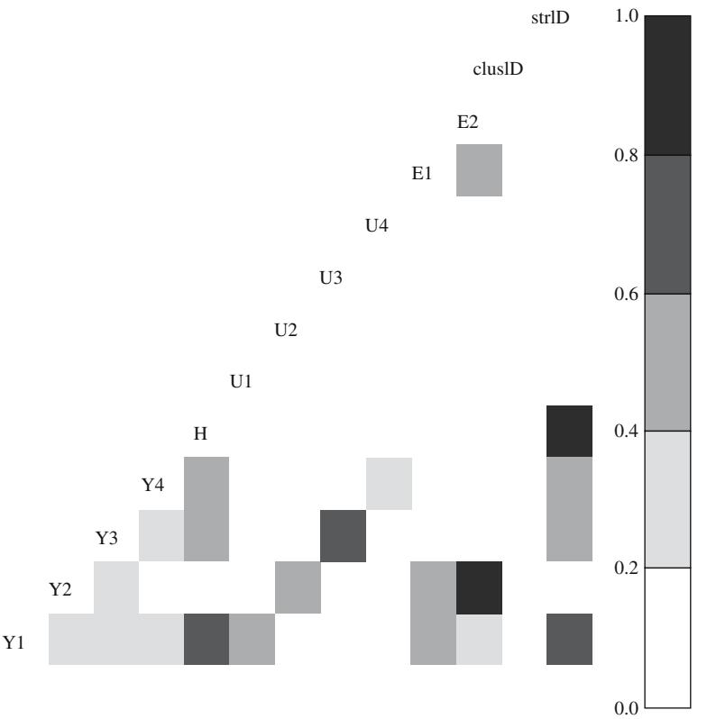
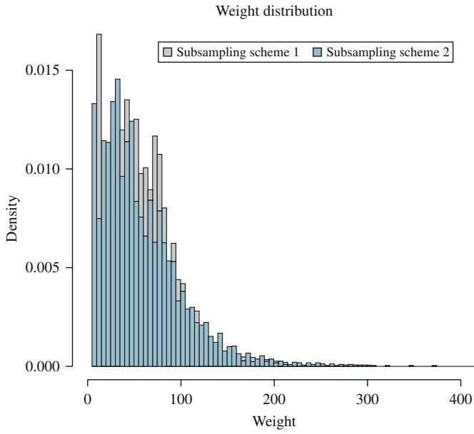
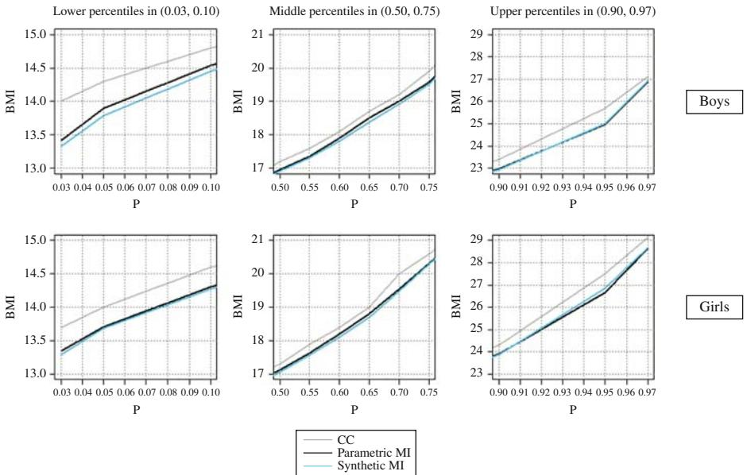

Journal of Official Statistics, Vol. 32, No. 1, 2016, pp. 231–256, <http://dx.doi.org/10.1515/JOS-2016-0011>

# Synthetic Multiple-Imputation Procedure for Multistage Complex Samples

Hanzhi Zhou<sup>1</sup> , Michael R. Elliott<sup>2</sup> , and Trivellore E. Raghunathan<sup>3</sup>

Multiple imputation (MI) is commonly used when item-level missing data are present. However, MI requires that survey design information be built into the imputation models. For multistage stratified clustered designs, this requires dummy variables to represent strata as well as primary sampling units (PSUs) nested within each stratum in the imputation model. Such a modeling strategy is not only operationally burdensome but also inferentially inefficient when there are many strata in the sample design. Complexity only increases when sampling weights need to be modeled. This article develops a generalpurpose analytic strategy for population inference from complex sample designs with item-level missingness. In a simulation study, the proposed procedures demonstrate efficient estimation and good coverage properties. We also consider an application to accommodate missing body mass index (BMI) data in the analysis of BMI percentiles using National Health and Nutrition Examination Survey (NHANES) III data. We argue that the proposed methods offer an easy-to-implement solution to problems that are not well-handled by current MI techniques. Note that, while the proposed method borrows from the MI framework to develop its inferential methods, it is not designed as an alternative strategy to release multiply imputed datasets for complex sample design data, but rather as an analytic strategy in and of itself.

Key words: Finite population Bayesian bootstrap; Haldane prior; stratified sample; clustered sample; sample weights.

# 1. Introduction

Stratified multistage sampling is the most common type of sample design for large-scale surveys conducted by the U.S. federal statistical agencies. This type of sample design combines the advantages of both stratification (for statistical efficiency) and cluster sampling (for cost and logistical efficiency). Under this design, the primary sampling units (PSUs) are stratified in such a way that they are homogeneous with respect to a stratumlevel aggregate of the variable(s) of interest. To permit a maximum degree of stratification

<sup>1</sup> Mathematica Policy Research, Princeton, NJ 08543, USA. Email: zhouhanz@umich.edu. <sup>2</sup> Dept. of Biostatistics, University of Michigan School of Public Health, 1415 Washington Heights, Ann Arbor, MI USA 48109; Survey Methodology Program, Institute for Social Research, University of Michigan, 426 Thompson St., Ann Arbor, MI 48109, USA. Email: mrelliot@umich.edu.

<sup>3</sup> Dept. of Biostatistics, University of Michigan School of Public Health, 1415 Washington Heights, Ann Arbor, MI USA 48109; Survey Methodology Program, Institute for Social Research, University of Michigan, 426 Thompson St., Ann Arbor, MI 48109, USA. Email: teraghu@umich.edu.

Acknowledgments: This work was supported in part by Grant Number R01CA129101 from the National Cancer Institute. The authors would like to thank Rod Little, Brady West, and Richard Valliant, along with the Associate Editor and three reviewers, for their review and helpful comments.

and thus variance reduction, it is common practice to define a large number of strata where only a small number of PSUs are selected in each stratum.

Multiple imputation (MI) (Rubin 1976, 1987) is a method commonly used when item-level missing data are present. However, MI requires that survey design information be built into the imputation models. Reiter et al. (2006) demonstrated the importance of simultaneously accounting for stratum effects and clustering effects in multiple imputation. They showed that when design features were ignored in the imputation model, biases would occur on the estimated parameter, even if a designbased analysis method was applied to the imputed data. Current MI methods typically include dummy variables to represent strata as well as PSUs nested within each stratum in the imputation model. When necessary, they also identify statistically significant interactions between these dummies with other covariates through routine variable selection procedures such as stepwise regression (Reiter et al. 2006; Schenker et al. 2006). Such a modeling strategy is not only operationally burdensome but also inferentially inefficient when there are hundreds of strata in the sample design and the sample in each stratum consequently becomes sparse. For example, the Census Bureau's Current Population Survey design groups 1,768 nonself-representing PSUs into 220 strata.

Possibly a better strategy is to consider clusters as random effects while treating strata as either fixed (using dummies) or random effects. However, many of the popular software packages that implement multiple imputation (e.g., SAS MI procedure, R packages mice or mi, and IVEware) cannot be adapted easily to such an approach. While a few recent software modules (such as R package pan and MLwiN module REALCOM-IMPUTE) have started to incorporate mixed effects or multilevel modeling for imputation purposes, they typically assume normal or latent normal distribution for variables with missing data. Their performances for missing categorical variables (binary in particular) are unclear. Moreover, there has been only little research that formally investigates their use in incorporating strata as well as clusters.

To circumvent these problems with fully parametric model-based imputation techniques, we develop a two-step semiparametric MI method. The idea is to separate the need to account for complex sample designs from the treatment of missing data. In the first step, sample designs are "reversed" through synthetic population data generation using a weighted finite population Bayesian bootstrap (FPBB) (Cohen 1997; Little and Zheng 2007; Dong et al. 2014). In the second step, missing values are imputed in the created synthetic population based on a parametric model that assumes identically independently distributed (IID) data elements. To account for stratum effects, we combine a replication variance estimation method (Efron 1979; Kovar et al. 1988; Rao and Wu 1988; Rao et al.1992; Rust and Rao 1996) with the weighted FPBB. Under a standard missing at random (MAR) assumption (Little and Rubin 2002), our method requires neither complicated modeling of strata and clusters nor design-based analyses of the imputed data. Note that while the proposed method borrows from the multiple-imputation framework to develop its inferential methods, it is not designed as an alternative strategy to release multiply imputed datasets for complex sample design data. Rather, it is intended an alternative analytic strategy for population inference from complex sample design data with item-level missingness.

In this article, we focus on the estimation of two quantities: quantile estimates for a continuous variable, and estimates of rare proportions and their associated logistic regression estimates. We consider a stratified two-stage sample design and investigate a full range of quantiles including tail behaviors. While design-based methods for quantile estimation from complex survey data have been developed (Francisco and Fuller 1991; Woodruff 1952), quantile estimation after imputation is less commonly addressed in the literature. (A recent exception that considers nonparametric fractional imputation outside

of the complex sample design setting is Yang et al. 2013.) This is the case despite the rapid development and increasing popularity of MI. We also consider MI for incomplete binary variables, with a focus on rare outcomes. It is well known that maximum-likelihood estimation of logistic regression models typically suffers from small sample bias, the degree of which is strongly dependent on the number of sample cases in the less frequent of the two categories (King and Zeng 2001). Thus when the dependent binary variable represents the occurrence of rare events, the logistic regression coefficients can be substantially biased even with a simple IID data structure. Random effects logistic models are commonly used for fitting clustered binary data; however, these models rely heavily on asymptotic theory assumptions, which may not be met in sparse samples. All these issues might extend naturally to the missing-data context. As shown by Zhao and Yucel (2009), sequential MI for binary data missing completely at random in a multilevel setting suffers from severe bias and poor coverage in estimating probabilities that are close to 0 or 1, particularly when the intraclass correlation is high.

The objectives of this article are: i) to develop a two-step synthetic MI method as a way to simultaneously account for stratification, clustering, and unequal inclusion probability; and ii) to demonstrate the effectiveness of the new method with respect to quantile estimation and logistic regression for binary rare events data as compared with existing fully parametric imputation strategies. Section 2 discusses the imputation strategies under three different models: simple random sample, fixed effects for clusters/strata, and random effects for cluster/strata. Section 3 introduces the newly proposed procedure and the MI inference rules for quantile estimation under this method. Section 4 presents a Monte Carlo simulation study as the validation tool to assess the repeated sampling properties of MI under the various approaches. Section 5 applies different MI procedures to the analysis of body mass index on youth data from the third National Health and Nutrition Examination Survey (NHANES III). Some concluding remarks follow in Section 6. We focus on the two-PSU-per-stratum design in this chapter, although the methods we develop can accommodate any number of PSUs per stratum.

#### 1.1. Fully Parametric Imputation Methods for the Two-PSU-per-Stratum Design

Here we briefly describe fully parametric multiple-imputation techniques with complex sample design features incorporated to different degrees. We assume the missing data Yi is a member of the exponential family, and that there are fully observed covariates Xi (a ( p þ 1)-dimension vector) such that g(E(YijXi)) ¼ Xib for a known link function g(·) (e.g., g(u) ¼ log(u/(1 2 u)) for binary outcomes (logistic regression), g(u) ¼ log(u) for count outcomes (Poisson regression), or g(u) ¼ u for continuous outcomes (Gaussian regression)).

#### 1.1.1. Standard Regression Model Assuming SRS

Based on the maximum-likelihood estimates <sup>b</sup>ˆ and the associated asymptotic covariance matrix Vˆ(bˆ) for the generalized linear model g(E(YijXi)) ¼ Xib, the posterior predictive distribution of the parameters can be constructed, which is then used to impute the missing values (Rubin 1987, 169–170). Point and variance estimates of the regression parameters can then be obtained using the usual MI combining rules (Rubin 1987, 76). For the p th component of the regression parameter:

$$
\hat{\beta}_p = \frac{1}{M} \sum_{m=1}^{M} \hat{\beta}_p^{(m)},
$$
\n(1)

$$
\hat{V}(\hat{\beta}_p) = \frac{1}{M} \sum_{m=1}^{M} \hat{V}(\hat{\beta}_p^{(m)}) + \frac{M+1}{M(M-1)} \sum_{m=1}^{M} (\hat{\beta}_p^{(m)} - \hat{\beta}_p)^2
$$
(2)

and

$$
\frac{(\hat{\beta}_p - \beta_p)}{\sqrt{\hat{V}(\hat{\beta}_p)}} \sim t_{\nu}, \nu = (M - 1) \left( 1 + \frac{\sum_{m=1}^{M} \hat{\beta}_p^{(m)}}{(M + 1) \sum_{m=1}^{M} (\hat{\beta}_p^{(m)} - \hat{\beta}_p)} \right)^2
$$
(3)

where m ¼ 1, ::: , M imputations are taken from draws widely separated to practically eliminate autocorrelation. Multivariate combining rules for the joint distribution of <sup>b</sup>ˆ are available as well (Schafer 1997, 112–118).

#### 1.1.2. Fixed-Effects Model (FX\_APR)

Compared to the predictive model using standard generalized linear regression, we can add dummy variables indicating stratum and cluster memberships to account for stratification and clustering effects. Note that we also need to include the log transformation of sampling weight as a predictor if the missing-data mechanism depends on weights to make the imputation model truly appropriate. The model takes the following form:

$$
g(E(Y_i|X_i)) = X_i\beta + D_i\gamma + E_i\eta + [\zeta \log(w_i)],
$$
\n(4)

where Di is a 1 £ (H 2 1) row vector of dummies representing the H strata, and Ei is a 1 £ Q row vector of dummies representing the clusters nested within each stratum. Note that <sup>Q</sup> <sup>¼</sup> <sup>P</sup>hQh <sup>2</sup> <sup>H</sup>, where Qh is the number of clusters in each stratum; in the case of the two-PSU-per-stratum case, Q ¼ H. The parameter space under this model is expanded as <sup>u</sup> ¼ (b,g,h,z), and the steps for imputation are similar to those in the SRS setting.

#### 1.1.3. Mixed-Effects Model (RE\_APR)

As there are only two PSUs selected from each stratum, it is not feasible to model clusters as random effects separately within each stratum. Here we pool all Q þ H clusters in the sample and model them using a single random-effect term. The imputation model is specified as follows:

$$
g(E(Y_j|X_j)) = X_j \beta + D_j \gamma + u_i + [\zeta \log(w_j)],
$$
\n(5)

where ui , N 0; <sup>s</sup><sup>2</sup> u is a random intercept term representing cluster effects, for i ¼ 1, ::: ,(Q þ H), and <sup>s</sup><sup>2</sup> <sup>u</sup> denotes the between cluster variance. Other terms are as previously defined. (In the two-PSU-per-stratum case, Q þ H ¼ 2H.)

#### 2. Synthetic MI Using the Weighted FPBB for Stratified Samples

In this section, we develop the two-step multiple-imputation methodology for a stratified two-stage sample design where a combination of complex sampling techniques are considered, namely, stratification, clustering, and unequal inclusion probability. We develop methods for an unrestricted number of clusters per stratum, but for our simulations and application we focus on the special case of two PSUs selected per stratum, which mimics the form of a public-use dataset that is commonly released for analyses.

#### 2.1. Synthetic Data Generation to Account for Complex Sample Designs

Consider a finite population P, which is stratified into H strata with Nh PSUs in the h th stratum, and hence the population size of PSUs is <sup>P</sup><sup>H</sup> <sup>h</sup>¼1Nh <sup>¼</sup> <sup>N</sup>. For the <sup>h</sup> th stratum, select nh PSUs with/without replacement from some probability sampling plan, independently across strata, and hence the total sample size of PSUs is <sup>P</sup><sup>H</sup> <sup>h</sup>¼1nh ¼ n. Subsampling of mhi elements (treated as the ultimate sampling units in this example) from a total of Mhi is then conducted within the i th sampled PSU of the h th stratum for i ¼ 1, ::: ,nh, h ¼ 1,2, ::: ,H. Hence the overall sample size and population size of elements are <sup>P</sup><sup>H</sup> h¼1 Pnh <sup>i</sup>¼1mhi <sup>¼</sup> <sup>P</sup><sup>H</sup> <sup>h</sup>¼1mh <sup>¼</sup> <sup>m</sup> and <sup>P</sup><sup>H</sup> h¼1 PNh <sup>i</sup>¼1Mhi <sup>¼</sup> <sup>P</sup><sup>H</sup> <sup>h</sup>¼1Mh ¼ M, respectively, where mh and Mh are the sample size and population size of elements for the h th stratum, respectively. The population consists of four types of survey variables: a single outcome Y, a single covariate X, a design matrix Z ¼ [S,C,w] including the stratum indicators (S), the cluster indicator (C) and the sample weight (w), and the response indicator R. Let D ¼ ðDs; DnsÞ ¼ fðYhij; Xhij; Zhij; RhijÞ; h ¼ 1; : : :; H; i ¼ 1; : : :; Nh; j ¼ 1; : : :; Mhig denote the population of values measured on the survey variables, which is divided into the sampled component (Ds) and the nonsampled (Dns) component.

We generate synthetic populations using a two-stage procedure. The first stage accommodates stratification and clustering and the second weighting. We have two broad approaches. The first, which we term SYN1, assumes that first-stage (cluster-level) and second-stage (element-level) sample weights are available for the analysis and implements a weighted FPBB at each level to generate the synthetic population. The second, which we term SYN2, assumes that only final weights are available for the analysis; it uses a Bayesian bootstrap to account for stratification and clustering at the first stage and the weighted FPBB to account for the final weight at the second stage.

# 2.1.1. Double-Weighted Finite Population Bayesian Bootstrap (SYN1)

For the h th stratum, let ts,<sup>h</sup> and tns,<sup>h</sup> index the sampled and nonsampled clusters, respectively, and {b <sup>1</sup> , ::: ,b <sup>q</sup> , ::: ,b rh , q ¼ 1, ::: ,rh} be the rh (1 # rh # Nh) distinct matrices of real numbers each of dimension jb<sup>q</sup> row<sup>j</sup> £ <sup>j</sup>b<sup>q</sup> colj with no row vectors in common. Each cluster in the stratum can take the form of one of b <sup>q</sup> s. Let thi ¼ q when the i th cluster takes on the values of b <sup>q</sup> , for i ¼ 1, ::: ,Nh. Assume nh ¼ rh and mhi ¼ bts;hi k k (the number of distinct row vectors in <sup>b</sup> ts,hi) for convenience of exposition. Let wts,<sup>h</sup> (i) be the sample weight of the i th sampled cluster in the h th stratum which equals b <sup>q</sup> , for <sup>i</sup> <sup>¼</sup> 1, ::: , nh. Also let wts,hi,Ds,h(j) be the sample weight of the <sup>j</sup> th sampled element in the i th sampled cluster which equals b ts;hi <sup>k</sup> , for j ¼ 1, ::: , mhi. Finally, let cts,<sup>h</sup> (q) and ctns,<sup>h</sup> (q) be the number of sampled and nonsampled clusters that equal b <sup>q</sup> , and chi th;Ds;<sup>h</sup> ðkÞ and chi th;Dns;<sup>h</sup> ðkÞ be the number of sampled and nonsampled elements that equal b ts;hi <sup>k</sup> .

It can be shown (cf. Zhou 2014) that, within a stratum h, the Polya posterior for the counts of distinct unobserved elements Dns,<sup>h</sup> is given by

$$
p(D_{ns,h}|D_{s,h}) = \frac{\left\{\prod_{q=1}^{r_h} \left\{\Gamma(w_{t_h}(q))/\Gamma(w_{t_{s,h}}(q))\right\}\right\}}{\left\{\Gamma(N_h)/\Gamma(n_h)\right\}} \times \frac{\left\{\prod_{k=1}^{m_h} \left\{\Gamma(w_{t_h}^{\prime}, D_{ns,h}(k))/\Gamma(w_{t_{s,h}, D_{s,h}}(k))\right\}\right\}}{\left\{\Gamma(M_h)/\Gamma(m_h)\right\}},
$$
(6)

where wt 0 h (q) ¼ wts,<sup>h</sup> (q) þ ctns,<sup>h</sup> (q) and wt 0 <sup>h</sup>;Dns;<sup>h</sup> ðkÞ ¼ wts;h;Ds;<sup>h</sup> ðkÞ þ chi th;Dns;<sup>h</sup> <sup>ð</sup>kÞ, for mh <sup>¼</sup> <sup>P</sup>mh k¼1chi th;Ds;<sup>h</sup> ðkÞ and m<sup>0</sup> <sup>h</sup> <sup>¼</sup> Mh <sup>2</sup> mh <sup>¼</sup> <sup>P</sup>mh k¼1chi th;Dns;<sup>h</sup> ðkÞ. The full posterior is then given by the product of the posteriors within each stratum, since these strata are independent and all strata in the population are in the sample:

$$
p(D_{ns}|D_s) = \prod_{h=1}^{H} p(D_{ns,h}|D_{s,h}).
$$
\n(7)

A Monte Carlo procedure to simulate from this posterior distribution is then given as follows:

(i) Draw the Nh 2 nh nonsampled clusters in the population based on the Polya posterior distribution independently for each stratum. Each of the sampled clusters is resampled with probability

$$
s_{hi} = \frac{w_{t_{s,h}}(i) - 1 + l_{hi,k-1} \times \left(\frac{N_h - n_h}{n_h}\right)}{N_h - n_h + (k-1) \times \left(\frac{N_h - n_h}{n_h}\right)}, k = 1, \dots, N_h - n_h + 1,
$$
 (8)

where lhi,k2<sup>1</sup> is the number of times that the i th cluster in the h th stratum has been resampled at the (<sup>k</sup> <sup>2</sup> 1)th resampling, and wts,<sup>h</sup> (i) is the weight for the i th sampled cluster in the h th stratum which is normalized to sum up to the total number of clusters, that is, <sup>P</sup>nh <sup>i</sup>¼1wts;<sup>h</sup> ðiÞ ¼ Nh.

(ii) From Step 1, form a population of clusters {c11, c12, ::: , c1n<sup>1</sup> , c \* 11, c \* 12, ::: , c \* 1N12n<sup>1</sup> , ::: , cH1, cH2, ::: , cHnH , c \* <sup>H</sup>1, c \* <sup>H</sup>2, ::: , c \* HNH2nH }. Record the number of times each of the clusters from the original sample appears in the FPBB population of clusters, denoted by <sup>t</sup>hi, <sup>i</sup> <sup>¼</sup> 1, ::: , nh,<sup>h</sup> <sup>¼</sup> 1, ::: , <sup>H</sup>., and <sup>P</sup><sup>H</sup> h¼1 Pnh <sup>i</sup>¼1<sup>t</sup>hi ¼ N. Then update the within cluster element-level conditional weights as follows: w\* <sup>j</sup>jhi ¼ wj<sup>j</sup>hi £ <sup>t</sup>hi; i ¼ 1; : : :; nh; h ¼ 1; : : :; H, where wj<sup>j</sup>hi is the inverse of the conditional probability that element j is selected given cluster i in stratum h is selected. Now pool all elements from these clusters together and treat them as a single FPBB sample (i.e., as if they have no stratum or cluster boundaries). Note that this FPBB sample has the same sample size <sup>m</sup> <sup>¼</sup> <sup>P</sup><sup>H</sup> h¼1 Pnh <sup>i</sup>¼1mhi as the original sample, but different sampling weights. We then once more apply the weighted FPBB to these pooled elements to generate M 2 m units from the m units in the FPBB sample. We resample from each of the resampled clusters M 2 m elements, cycling through M 2 m times and resampling with probability

$$
\lambda_{j|h i} = \frac{w_{j|h i}^* - 1 + l_{hij,k-1} \times \left(\frac{M-m}{m}\right)}{M-m+(k-1) \times \left(\frac{M-m}{m}\right)}, \quad k = 1, \ldots, (M-m+1), \quad (9)
$$

where lhij,<sup>k</sup> is the number of times that the j th element in the i th cluster in the h th stratum has been resampled at the k th resampling, and wj<sup>j</sup>hi is the updated conditional weight for the j th element in the i th cluster in the h th stratum. Again, they are normalized to sum up to the total number of units in the entire population, that is, <sup>P</sup><sup>H</sup> h¼1 Pnh i¼1 Pmhi <sup>j</sup>¼1wj<sup>j</sup>hi ¼ M. Thus we create a single synthetic population. Repeat Step 2 B times to obtain B FPBB synthetic populations.

(iii) Repeat Steps 1-2 L times to obtain L bootstrap samples, yielding L £ B FPBB populations Psyn <sup>ð</sup>lb<sup>Þ</sup> <sup>¼</sup> <sup>P</sup>syn <sup>ð</sup>lbÞobs; <sup>P</sup>syn <sup>ð</sup>lbÞmis - , <sup>l</sup> <sup>¼</sup> 1, ::: , <sup>L</sup>, <sup>b</sup> <sup>¼</sup> 1,:::B, each of which consists of both responding elements and nonresponding elements on a vector of variables {Y,X,Z,R}.

#### 2.1.2. Bootstrap –– Weighted Finite Population Bayesian Bootstrap (SYN2)

Because we often do not know the first- and second-stage weights in public-use datasets, we consider an alternative to the procedure proposed in Subsection 2.1.1. Rather than obtaining a sample of clusters from a draw from a Polya posterior, we use replication methods (Rust and Rao 1996) to capture the cluster-level sampling variance. The final sampling weights instead of the adjusted element-level conditional weights are then used directly as input in the second-stage weighted FPBB. We use Rao and Wu's (1988) rescaling bootstrap, which is a generalized extension of McCarthy and Snowden's (1985) "with replacement bootstrap". Once the PSUs have been sampled, we continue with the weighted FPBB approach to complete the synthetic population data generation. The proposed procedure is as follows:

(i) Select a sample of n \* <sup>h</sup> ¼ nh 2 1 PSUs from the parent sample in each stratum via SRSWR sampling;

(ii) Apply the "ultimate cluster principle" (Wolter 2007), that is, once a PSU is taken into the bootstrap replicate, all elements in that PSU are taken into the replicate also. Thus we obtain our first bootstrap sample;

(iii) Repeat the previous steps L times to obtain L bootstrap samples {Boot\_l, l ¼ 1, ::: ,L};

(iv) Within each bootstrap sample, update the element-level sampling weights as: w\* hij ¼ whij £ <sup>t</sup>hi nh n\* h ¼ ¼ nh nh2<sup>1</sup> whij; if the <sup>i</sup>th PSU selected in the bootstrap sample ¼ 0; if the ith PSU not selected in the bootstrap sample 8 < :

As w\* hij itself implicitly carries over the strata and PSU information in addition to unequal inclusion probability, we can drop the subscripts hi henceforth by pooling all elements in the bootstrap sample regardless of which stratum and PSU they originally came from. Normalize w\* <sup>j</sup>s to sum up to m\* : P<sup>m</sup> \* j¼1w\* <sup>j</sup> ¼ m\* , where m \* is the bootstrap sample size.

(v) For the l th bootstrap sample, l ¼ 1, ::: ,L, apply the weighted FPBB algorithm to create an entire population D ¼ Dns; D\* s based on the posterior predictive distribution of elements in the nonsampled population Dns ¼ ðYj; Xj; Zj; RjÞ; j ¼ m\* <sup>þ</sup> <sup>1</sup>; : : :; <sup>M</sup> given the elements in the bootstrap sample D\* <sup>s</sup> ¼ ðYj; Xj; Zj; RjÞ; <sup>j</sup> <sup>¼</sup> <sup>1</sup>; : : :; <sup>m</sup> \* .

Operationally, we draw a Polya sample of size M \* ¼ M 2 m\* from mult M \* ; <sup>l</sup>1; : : :; <sup>l</sup><sup>K</sup> where the selection probability <sup>l</sup>k, <sup>k</sup> <sup>¼</sup> 1, ::: , <sup>K</sup> is a function of w\* j :

$$
\lambda_k = \frac{w_j^* - 1 + l_{j,k-1} \times \left(\frac{M^*}{m^*}\right)}{M^* + (k-1) \times \left(\frac{M^*}{m^*}\right)}, k = 1, \dots, M^* + 1,
$$
\n(10)

Repeat Step (v) for B times to obtain L £ B FPBB populations.

#### 2.2. Imputation of the Synthesized Populations

Once the set of FPBB synthetic populations Psyn ¼ P<sup>ð</sup><sup>l</sup> <sup>Þ</sup> ðbÞ ; l ¼ 1; : : :; L; b ¼ 1; : : :; B n o, where P<sup>ð</sup><sup>l</sup> <sup>Þ</sup> <sup>ð</sup>b<sup>Þ</sup> <sup>¼</sup> <sup>Y</sup><sup>ð</sup><sup>l</sup> <sup>Þ</sup> <sup>ð</sup>bÞmis; <sup>P</sup><sup>ð</sup><sup>l</sup> <sup>Þ</sup> <sup>ð</sup>bÞobs - are created using either the SYN1 method or the SYN2 method, we generate imputations Pimp ¼ P<sup>ð</sup><sup>l</sup> <sup>Þ</sup> ðbaÞ ;l¼1;:::;L;b¼1;:::;B;a¼1;:::;A n o from the posterior predictive distribution p Y<sup>ð</sup><sup>l</sup> <sup>Þ</sup> ðbÞmisjP<sup>ð</sup><sup>l</sup> <sup>Þ</sup> <sup>ð</sup>bÞobs - based on a parametric model that does not condition on sample design features, that is, a model taking a form similar to the SRS model given in Subsection 2.1. We consider imputations based on the covariate (X) only (SYN1\_srs or SYN2\_srs) or imputations that include the log of the sample weights in the linear predictors (SYN1\_lwt or SYN2\_lwt).

To obtain the MI inference, denote the observed set of synthetic populations by PR ¼ P<sup>ð</sup><sup>l</sup> <sup>Þ</sup> <sup>ð</sup>bÞobs; b ¼ 1; : : :; B; l ¼ 1; : : :; L n o and the imputed set of synthetic populations by PR- ¼ Y<sup>ð</sup><sup>l</sup> <sup>Þ</sup> <sup>ð</sup>baÞmis; l ¼ 1; : : :; L; b ¼ 1; : : :; B; a ¼ 1; : : :; A n o. The MI point estimator for the population statistic of interest Q (mean, regression estimator, quantile) is then given by the mean of the lba th point estimators:

$$
\hat{Q}_{MI} = \frac{1}{LBA} \sum_{l} \sum_{b} \sum_{b} \hat{Q}_{lba}.
$$
\n(11)

The MI variance estimator is:

$$
\hat{V}_{MI} = (1 + L^{-1})V_L = (1 + L^{-1})\frac{1}{L - 1}\sum_{l} (\hat{Q}_l - \hat{Q}_{MI})^2, \text{ where }
$$
\n
$$
\hat{Q}_l = \frac{1}{BA} \sum_{b} \sum_{a} \hat{Q}_{lba}.
$$
\n(12)

We then construct the 95% interval estimate for quantiles based on t reference distribution with degrees of freedom equal to min vcom <sup>¼</sup> <sup>P</sup> <sup>h</sup> nh <sup>2</sup> <sup>H</sup>; vsyn <sup>¼</sup> <sup>L</sup> <sup>2</sup> <sup>1</sup> . These results arise from the fact that, by the standard Rubin (1987) MI combining rules, we have

$$
Q|P^{imp} \dot{\sim} t_{L-1} (\bar{Q}_L, (1 + L^{-1})V_L), \tag{13}
$$

where Q- <sup>L</sup> ¼ <sup>1</sup> <sup>L</sup> <sup>l</sup> <sup>P</sup>Q<sup>~</sup> <sup>ð</sup><sup>l</sup> <sup>Þ</sup> , VL ¼ <sup>1</sup> <sup>L</sup>2<sup>1</sup> <sup>l</sup> <sup>P</sup> <sup>Q</sup><sup>~</sup> <sup>ð</sup><sup>l</sup> <sup>Þ</sup> <sup>2</sup> <sup>Q</sup>- L <sup>2</sup> , and Q~ <sup>ð</sup><sup>l</sup> <sup>Þ</sup> ¼ lim A!1 <sup>B</sup>!1 <sup>1</sup> BA <sup>b</sup> P a <sup>P</sup>Q^ lba.

Replacing Q˜ (<sup>l</sup> ) with its finite simulation estimator Qˆ <sup>l</sup> replaces Q¯ <sup>L</sup> with Qˆ MI and gives the results above. A complete theoretical justification for (13) is provided in Dong et al. (2014) and Zhou (2014). Some intuition of the result can be gained by noting that the generation of the synthetic population sets the within imputation variance to 0 so that the posterior variance of Q can be obtained using the between-bootstrap variance only. Moreover, (11) assumes that E(qˆba) ¼ Q – a result guaranteed by our Bayesian bootstrap estimator if the imputation model is also correct – as well as a sufficiently large sample size for the t approximation is reasonable.

Lo (1988) showed that the variance estimator for the FPBB mean in a simple random sample setting should be inflated by the factor (<sup>n</sup>þ<sup>1</sup> <sup>n</sup>21). In the double-weighted FPBB (SYN1) setting, a small sample correction to the variance estimate thus needs to be used when the number of clusters per stratum is small. When nh ¼ a is a constant across all strata, we use nhþ1 nh21(1 <sup>þ</sup> <sup>L</sup> <sup>2</sup><sup>1</sup> ) VL; otherwise we suggest <sup>n</sup><sup>h</sup>þ1 nh21(1 <sup>þ</sup> <sup>L</sup> <sup>2</sup><sup>1</sup> ) VL, where n¯h <sup>¼</sup> <sup>H</sup> <sup>2</sup>1Phnh.

The Appendix provides the sample R code used to conduct the analyses in the application in Section 4 and can easily be adapted to other settings.

### 3. Simulation Study

We conducted a simulation study to investigate the performance of the proposed method for incorporating stratified cluster-sampling effects in multiple imputation. We targeted three population statistics: 1) population quantiles, 2) proportions of binary event data, and 3) logistic regression parameters relating the covariate to the binary data. The simulation is a 2 £ 2 factorial design based on the following factors:

1) keeping the first-stage sampling plan constant, we let the subsampling rate f<sup>2</sup> of elements within sampled clusters be

a) independent of or

b) dependent on the stratum effects, and

2) assume that

a) the missingness on the Y-variable (continuous or binary) depends only on the covariate (X) (MAR\_X), or

b) depends on both X and the final sampling weight W(MAR\_X,W).

We focus on a two-PSU-per-stratum sample design, both because it is a common design, especially in public-use settings, and because it is a "limiting case" in terms of the number of PSUs per stratum. In addition to the two variants of our synthetic MI estimators, we consider standard parametric MI under the SRS, appropriate fixed-effect (FX\_APR), and appropriate random-effect (RE\_APR) models.

#### 3.1. Data Generation

Let i be the index for strata, j be the index for clusters, and k be the index for elements. Suppose there are 50 strata in the population. First, the number of PSUs in each stratum is randomly determined according to a uniform distribution, that is, Ci , Unif(2,54), i ¼ 1, ::: , 50; second, the number of population elements within PSUs is randomly generated as Nij , Unif(20,80), i ¼ 1, ::: ,50, j ¼ 1, ::: ,Ci. Thus we obtain a population of size N ¼ 67385. The complete data for four survey variables Y ¼ (Y1,Y2,Y3,Y4) <sup>T</sup> are generated from a superpopulation model according to a two-step process, In the first step, Y<sup>1</sup> and Y<sup>2</sup> are randomly selected from a bivariate linear mixed-effects model; let N2() denote a bivariate normal distribution function:

$$
\begin{pmatrix} Y_{1ijk} \\ Y_{2ijk} \end{pmatrix} \sim N_2(\mu, \Sigma), \text{ where } \mu = \begin{bmatrix} \beta_1 + S_i + u_{1ij} + \varepsilon_{1ijk} \\ \beta_2 + u_{2ij} + \varepsilon_{2ijk} \end{bmatrix}, \Sigma = \begin{bmatrix} \sigma_{11} & \sigma_{12} \\ \sigma_{12} & \sigma_{22} \end{bmatrix}. (14)
$$

Let b<sup>1</sup> ¼ b<sup>2</sup> ¼ 15 be the fixed covariate effects, Si ¼ <sup>i</sup> <sup>5</sup> be the fixed stratum effects, and let <sup>u</sup>1ij <sup>u</sup>2ij <sup>T</sup> and <sup>1</sup>1ijk <sup>1</sup>2ijk <sup>T</sup> be the random cluster effects and random error terms drawn from two independent bivariate normal distributions: N2(0,Su) and N2(0,S1). Elements of S<sup>u</sup> are set as: <sup>s</sup><sup>2</sup> <sup>u</sup><sup>1</sup> ¼ 4, <sup>s</sup><sup>2</sup> <sup>u</sup><sup>2</sup> ¼ 1, <sup>s</sup>u1u<sup>2</sup> ¼ 0:2, and elements of S1 are set as: <sup>s</sup>2 <sup>1</sup><sup>1</sup> ¼ 4, <sup>s</sup><sup>2</sup> <sup>1</sup><sup>2</sup> ¼ 3, <sup>s</sup>111<sup>2</sup> ¼ 1:732. This results in conditional intraclass correlations (ICC) of Y<sup>1</sup> and Y<sup>2</sup> as <sup>r</sup>Y<sup>1</sup> ¼ 0.5 and <sup>r</sup>Y<sup>2</sup> ¼ 0.25 (note that the unconditional ICC for the two variables may be smaller than these values). In the second step, a random-effects logistic regression model (Anderson and Aitkin 1985; Stiratelli, et al. 1984) is used to simulate two binary outcome variables Y<sup>3</sup> and Y<sup>4</sup> as a function of Y2. Under this model, a random effect is added to the linear part of the logistic regression model for each element in the cluster. The conditional mean of Y3ijk and Y4ijk is

$$
\pi_{ijk} = E(Y_{\cdot ijk}|Y_{2ijk}, u_{\cdot ij}) = \Pr(Y_{\cdot ijk} = 1|Y_{2ijk}, u_{\cdot ij}) = \frac{e^{\alpha_0 + \alpha_1 S_i + \alpha_2 Y_{2ijk} + u_{\cdot ij}}}{1 + e^{\alpha_0 + \alpha_1 S_i + \alpha_2 Y_{2ijk} + u_{\cdot ij}}},
$$
(15)

where u3ij , N(0,6<sup>2</sup> ), u4ij , N(0,10<sup>2</sup> ) and <sup>a</sup> ¼ (a0,a1,a2) <sup>T</sup> is the vector of fixed covariate effects. We fix <sup>a</sup><sup>2</sup> ¼ 1.5 and vary <sup>a</sup><sup>0</sup> and <sup>a</sup><sup>1</sup> to obtain two different binary variables Y3ijk and Y4ijk, with either moderate (<sup>a</sup><sup>0</sup> ¼ 25,<sup>a</sup><sup>1</sup> ¼ 21.5) or rare probabilities (<sup>a</sup><sup>0</sup> ¼ 28,<sup>a</sup><sup>1</sup> ¼ 26). Given uij, the Yijk s in the cluster are independent Bernoulli variables, that is, Yijkjuij , Bern(<sup>p</sup>ijk).

Figure 1 shows the correlations between variables in the simulated population, with the different shades of grey representing different degrees of association between any of the two variables. The darker shades indicate higher correlation. All survey outcome variables (Y1,Y3,Y4) have a moderate to strong (0.2,0.8) stratum effect (H or strID) and clustering effect (U1,U3,U4), indicating that accounting for these effects in the analysis of missing data is essential.



Fig. 1. Correlation between variables in the simulated population (darker shades ¼ higher correlation)

# 3.2. Sample Design

Within each stratum, we draw a two-stage cluster sample according to the following procedure: first, we draw a sample of two PSUs without replacement with probability proportional to the cluster size f <sup>1</sup>ij ¼ 2\*Nij j <sup>P</sup>Nij . Second, we sample elements from each

sampled cluster using two different subsampling schemes:

1) sampling probability independent of Si which is defined in (14): SRS with an equal sampling fraction of f2kjij ¼ 1/5; and

2) sampling probability related to Si: SRS with varying sampling fractions across strata, that is f2kjij ¼ expit(20.8 2 0.12\* Si), where expit(x) ¼ 1/(1 þ e2<sup>1</sup> (x)).

An average of 1,122 elements are selected in each of the 200 simulation replications. The distributions of sampling weights are shown in Figure 2. The distributions of sampling weights under the two subsampling schemes are generally very similar with somewhat more skewness under subsampling scheme 2.

#### 3.3. Imposing Missingness

Throughout the simulation study, we assume that Y<sup>2</sup> is always completely observed and we impose missing values on Y1, Y3, and Y<sup>4</sup> independently according to the following deletion



Fig. 2. Distribution of weights under the two subsampling schemes

function conditional on Y<sup>2</sup> and/or log transformation of the weight:

$$
Pr(R = 0|Y_2, W) = \frac{\exp(\lambda_0 + \lambda_1 * Y_2 + \lambda_2 * \log(W))}{1 + \exp(\lambda_0 + \lambda_1 * Y_2 + \lambda_2 * \log(W))},
$$
(16)

where R is the response indicator and W is the overall sample weight. Setting <sup>l</sup><sup>2</sup> ¼ 0, we obtain the first MAR mechanism (i.e., MAR\_X, note that we treat Y<sup>2</sup> as a covariate X here), under which we further set <sup>l</sup><sup>0</sup> ¼ 3.42, <sup>l</sup><sup>1</sup> ¼ 20.2 and <sup>l</sup><sup>0</sup> ¼ 22.58, <sup>l</sup><sup>1</sup> ¼ 0.2 for deleting values on Y<sup>1</sup> and Y3, Y4, respectively. Setting <sup>l</sup><sup>2</sup> ¼ 20.6, we obtain the second MAR mechanism (i.e., MAR\_X,W), under which we fix <sup>l</sup><sup>1</sup> ¼ 0.2 and set two values on <sup>l</sup><sup>0</sup> ( ¼ 20.274 or 20.33) for deleting values independently on all three outcome variables under subsampling scheme 1 and subsampling scheme 2, respectively. All deletion functions result in approximately 40% missingness on each variable.

#### 3.4. Parametric Multiple Imputation

Both simple random sample SRS (including SRS, SYN1\_srs and SYN2\_srs) and fixedeffects model FX\_APR can be implemented in R (R Core Team 2013) using mice routines; for the logistic model associated with the binary outcome, the method 'logreg' must be specified. We use the pan package in R for the mixed-effects imputation (RE\_APR) for the missing continuous outcome; logistic mixed-effects imputation is programmed in SAS for the missing binary outcome, as there is no missing-data software package readily available for use.

#### 3.5. Parameters of Interest and Inference

We focus on inference for the following population parameters: the mean of the continuous variable Y1, the mean of the binary variables Y<sup>3</sup> and Y<sup>4</sup> (i.e., Bernoulli proportions), linear regression coefficients of Y<sup>1</sup> on Y2, logistic regression coefficients of Y<sup>3</sup> (or Y4) on Y2, and the population percentiles of the continuous variable Y1.

Weighted analyses and sandwich variance estimators accounting for strata and clusters are used to estimate smooth statistics (including proportions and regression parameters) under the three fully parametric MI methods. For estimating quantiles of the distribution of a continuous survey variable, we construct the sample-weighted point estimator with confidence intervals based on the test-inversion method (Francisco and Fuller 1991). We chose the test-inversion method instead of Woodruff's method (Woodruff 1952) despite the computational intensity, because the literature suggests that it may outperform Woodruff in heavily stratified samples or in small-to-moderate-sized samples (Kovar et al. 1988). Based on the a th imputed dataset, the empirical distribution function can be written as

$$
\hat{F}^{(a)}(y) = \frac{\left[\sum_{S_R} w_{hij} I\left(y_{hij}^{obs} < y\right) + \sum_{S_{\bar{R}}} w_{hij} I\left(y_{hij}^{(a)} < y\right)\right]}{\sum_{S} w_{hij}},\tag{17}
$$

where SR and SR¯ are subsets of the sample data S, consisting of respondents and nonrespondents respectively. The estimator Fˆ( y) and its associated estimated variance v(Fˆ( y)) can then be obtained using the variance estimator proposed by Francisco and Fuller (1991) together with standard Rubin combining rules as previously described. The sample <sup>g</sup>th quantile estimator thus is q^<sup>g</sup> ¼ ðF^Þ <sup>2</sup><sup>1</sup>ðgÞ, with 95% asymptotic confidence interval (CI) given by

$$
[L, U] = \left[ [\hat{F}]^{-1} \left( \gamma - t_{0.025} \sqrt{\text{var}(\hat{F}(q_{\gamma}))} \right), [\hat{F}]^{-1} \left( \gamma + t_{0.025} \sqrt{\text{var}(\hat{F}(q_{\gamma}))} \right) \right]. \quad (18)
$$

#### 3.6. Results

Table 1 compares the average width £ 102<sup>2</sup> and average coverage rates of the 95% CI of q(a), where <sup>a</sup> ¼ 0.05, 0.10, 0.25, 0.50, 0.75, 0.90, and 0.95, corresponding to seven selected population quantiles. Among all methods considered, the SRS imputation model yields the poorest coverage. This results from the compounding effects of biases and variance underestimation, due to ignoring stratum effects and clustering effects respectively. As we increase the dependence of both the sampling mechanism and response mechanism on stratum effects and sampling weights, the performance of SRS becomes even worse, as exhibited by the markedly increased RelBias and decreased coverage rates. In addition, ignoring stratum and/or weight effects that are highly relevant to either mechanism seems to impact the median and second and third quartiles more than the tail quantiles under SRS, as evident in the relatively lower coverage rates in the right part of Table 1.

Table 1. Comparison of average width £ 102 and 95% CI coverage rates of q(a) for a ¼ 0.05, 0.10, 0.25, 0.50, 0.75, 0.90, and 0.95.

The FX\_APR model (Reiter et al. 2006; Rubin 1996; Schenker et al. 2006), generally performs fairly well in our simulation study with respect to the estimation of population quantiles. There is some modest underestimation of the small percentile quartiles with the second-stage sampling constant. The RE\_APR model also performs well, with the exception of moderate to high overcoverage when the second-stage sampling probability is associated with the stratum mean and the missingness mechanism.

In contrast, our synthetic MI (SYN2 in particular) compares favorably with all of its competitors, and in most cases yields results comparable to the RE\_APR, which is regarded as a "gold standard" as it is compatible with the data-generating mechanism (Meng 1994). There is some undercoverage when the stratified double-weighted FPBB estimator (SYN1) is used, perhaps due to the fact that the Lo small-sample adjustment is not as accurate when nh ¼ 2. However, use of a stratified bootstrap-weighted FPBB estimator (SYN2) generally eliminates this issue. Although an imputation model assuming SRS suffices for the synthetic MI method in most scenarios, we need to include the sampling weight as a predictor when the outcome Y and the response indicator R are strongly associated with each other through the sampling mechanism I, as is the case with the second subsampling scheme, when both the missingness indicator and the secondstage sampling rate are functions of the stratum mean.

Tables 2 and 3 compare the absolute relative bias relbias <sup>¼</sup> <sup>100</sup> £ ^ j j <sup>u</sup>2<sup>u</sup>complete <sup>u</sup>complete %, RMSE and 95% nominal CI coverage for the estimated mean/proportions of Y1, Y<sup>3</sup> and Y<sup>4</sup> and the slopes of the three outcome variables on Y2, respectively. (<sup>u</sup>complete is the estimated parameter with complete data, and <sup>u</sup>ˆ is the estimated parameter under one of the different MI methods.) As in the estimation of the quantiles, the SRS imputation model is biased and has poor coverage as it ignores stratum and cluster effects. Again, dependence of subsampling on stratum effects and dependence of response on sampling weights damage the performance of SRS even further.

FX\_APR generally performs well in estimating the mean of a continuous variable (Y1) and a regular binary variable (Y3) with moderate probability as well as the slopes. However, it fails for proportion estimation for rare events data (Y4), yielding biased point estimates and less than nominal coverage throughout all scenarios. One interpretation might be that overfitting occurs when too many dummies are included to account for fixed strata and cluster effects, yielding dummy variables where all observed cases are 0 or 1. In this case, "complete separation" yields unstable coefficient estimates, damaging the predictive efficacy when the fitted model is used for drawing missing values. The problem is particularly prominent when the logistic fixed-effects imputation model is used along with the current sampling design, where an average of only ten elements are selected per PSU within each stratum; this results in even more substantial biases on Y¯ <sup>4</sup> than the SRS model. (Use of a Bayesian approach with an informative prior of the form t1(0,2.5) on the fixed-effect parameters using the mi function in R (Gelman et al. 2008) reduced but did not remove the impact of complete separation. A relative bias of 12–13% remained for the estimation of of Y¯ <sup>4</sup> under the MAR\_X missingness mechanism, with 95% nominal coverage of 89%, while a relative bias of 17–22% remained under the MAR\_X,W mechanism, with nominal coverage of 84%.) The random-effects model RE\_APR more effectively avoids the overfitting issue through shrinkage effects: note that under RE\_APR, we pooled all PSUs from all

b1,Y4 jY2 ¼ 0.083 Sampling scheme Missingness mechanism Methods RelBias RMSE 95% CI coverage b1,Y1jY2 b1,Y3jY2 b1,Y4jY2 b1,Y1jY2 b1,Y3jY2 b1,Y4jY2 b1,Y1jY2 b1,Y3jY2 b1,Y4jY2 Complete data Actual – – – 0.103 0.065 0.098 98.0% 96.0% 90.0% Syn1BD 0.4% 1.1% 1.9% 0.104 0.067 0.098 96.0% 93.5% 88.0% Syn2BD 0.2% 2.8% 5.0% 0.103 0.067 0.100 98.0% 97.5% 91.5% f2 / const. SRS 4.6% 4.6% 24.7% 0.110 0.071 0.100 93.0% 90.0% 91.0% MAR\_X FX\_APR 0.2% 1.0% 44.7% 0.103 0.063 0.087 97.0% 97.0% 92.5% Actual samples BD: RE\_APR 0.3% 2.1% 22.6% 0.100 0.056 0.068 98.0% 95.5% 95.0% b1,Y1jY2 ¼ 0.481 Syn1\_srs 0.0% 0.5% 2.8% 0.114 0.079 0.111 95.5% 93.0% 88.0% b1,Y3jY2 ¼ 0.232 Syn2\_srs 0.2% 3.0% 4.4% 0.115 0.082 0.111 96.5% 96.5% 94.5% b1,Y4jY2 ¼ 0.086 MAR\_X,W SRS 7.3% 7.5% 45.6% 0.121 0.070 0.100 93.0% 90.5% 87.0% FX\_APR 0.4% 1.7% 53.5% 0.114 0.064 0.087 96.5% 96.0% 91.5% RE\_APR 0.2% 6.5% 22.9% 0.105 0.054 0.073 97.5% 96.0% 96.0% Syn1\_srs 3.6% 2.7% 9.7% 0.123 0.076 0.105 94.5% 91.5% 91.0% Syn2\_srs 3.5% 0.5% 4.6% 0.121 0.076 0.107 96.5% 96.0% 93.0% Syn1\_lwt 1.8% 1.4% 2.8% 0.121 0.075 0.104 95.5% 93.0% 90.0% Syn2\_lwt 2.2% 1.5% 2.1% 0.120 0.075 0.106 96.5% 96.0% 96.5% f2 / h(Si) Complete data Actual – – – 0.108 0.066 0.088 95.0% 96.0% 95.0% Syn1BD 0.1% 0.6% 2.2% 0.109 0.068 0.089 95.0% 95.0% 93.0% Syn2BD 0.4% 2.9% 6.5% 0.109 0.069 0.090 95.0% 96.5% 96.0% Actual samples BD: MAR\_X SRS 12.8% 9.1% 52.0% 0.136 0.074 0.096 89.5% 90.0% 88.0% b1,Y1jY2 ¼ 0.481 FX\_APR 0.5% 0.6% 43.5% 0.114 0.069 0.079 93.5% 95.0% 97.0% b1,Y3jY2 ¼ 0.229 RE\_APR 0.8% 2.5% 19.0% 0.111 0.061 0.065 95.0% 95.5% 97.0% b1,Y4jY2 ¼ 0.090 Syn1\_srs 0.4% 0.7% 5.6% 0.126 0.082 0.097 94.0% 92.0% 91.5% Syn2\_srs 0.0% 3.5% 2.7% 0.124 0.082 0.098 95.0% 94.0% 96.5% MAR\_X,W SRS 17.6% 12.4% 69.5% 0.141 0.069 0.101 86.0% 94.0% 83.0% FX\_APR 0.4% 5.7% 42.2% 0.118 0.066 0.082 93.5% 95.5% 55.0% RE\_APR 1.7% 3.1% 30.1% 0.111 0.054 0.073 97.5% 98.0% 97.5% Syn1\_srs 6.7% 3.1% 23.0% 0.136 0.073 0.093 93.0% 94.0% 94.5% Syn2\_srs 7.4% 0.4% 19.0% 0.136 0.075 0.095 96.0% 97.5% 97.0% Syn1\_lwt 0.9% 0.9% 6.0% 0.130 0.075 0.092 93.0% 95.5% 93.5% Syn2\_lwt 1.7% 2.6% 3.3% 0.126 0.076 0.094 97.0% 98.0% 97.5% strata as if there were no strata bounds, and the stratum effects can be thought as being implicitly modeled in the random intercept term (uj ¼ Ih þ uh( <sup>j</sup> )).

As in the quantile estimation setting, our synthetic MI compares favorably with all of its competitors, and in most cases yields comparable results to the RE\_APR for estimation of means and logistic regression parameters. In the case of rare events data, our proposed new method increases the analytical size through generating synthetic population data thus is even superior to RE\_APR, consistently yielding negligible biases and close to nominal coverage. The impact of ignoring the weights in the imputation (under MAR\_X,W mechanism) is less than in the quantile estimation setting, with the exception of the estimation of the continuous mean Y¯ 1, where including the weight is required to obtain approximately correct coverage.

A disadvantage of the method lies in its relative inefficiency for estimating nonlinear parameters (regression coefficients) (e.g., the synthetic MI results in unbiased point estimates but a larger RMSE than the two model-based MI methods). This is typical in that nonparametric methods cannot typically compete with their fully parametric counterparts under the correct model, and is a tradeoff made to improve robustness to model misspecification.

### 4. Application to NHANES III

We apply our method to the National Health and Nutrition Examination Survey (NHANES) III (1988–1994), which is designed to provide national estimates of the health and nutritional status of the civilian noninstitutionalized population of the United States aged two months and older (National Center for Health Statistics 1996). The data are obtained from a stratified, multistage area probability sampling design with oversampling of certain age and ethnicity groups. For confidentiality and computational reasons, the public-use data provides two pseudo-PSUs per stratum. Another unique feature of NHANES is that data are collected through both interview and actual physical examinations of the sampled persons. Both unit- and item-level nonresponse occurs in both components of the survey, and there is a particularly high missing rate on the body mass index (BMI) measure for youth data in the physical examination component (30%). As a popular measure of overweight status and obesity, the percentiles of BMI for children and youths are of particular interest for public health reasons. The upper percentiles and the lower percentiles are also closely monitored for overweight and underweight status, respectively. As a result, we restrict our analysis sample to children and youths from two months to 16 years of age. The Appendix provides the sample R code used to conduct the analyses below.

We estimate population quantiles (from 0.05 to 0.95 with an increment of 0.05 along with two extreme percentiles: 0.03 and 0.97) of BMI for children and youths by gender. We also estimate the proportion of such a population being covered by health insurance, overall and by race. To assure congenial inference, we include the following variables that are either of primary interest in the substantive analysis or are important predictors for BMI measures in the imputation model: age, gender, race, education, mother's BMI, father's BMI and family income (Yuan and Little 2007). We compared three different methods in our treatment of the missing data:

1) complete case analysis (CC) with design-based estimation;

2) fully parametric model-based MI using design-based estimation, within which we apply both an imputation model assuming SRS and the appropriate model conditional on all three sample design features (i.e., dummy variables indicating cluster and stratum memberships as well as the log transformation of sampling weights); and

3) our proposed finite population Bayesian bootstrap method (using SYN2 since we do not have separate weights for the first and second stages of sampling), and including the log of the weight in the imputation model.

Estimates of the median BMI and the proportion of children with health insurance are given in Table 4. The CC method appears to overestimate the median of both the BMI measure and health-insurance coverage for the full sample and race domains relative to the MI approaches, and yields the widest confidence intervals or largest standard errors as a result of decreased sample size. Then again, the median of BMI obtained from synthetic MI is quite similar to that from the model-based MI, while demonstrating some advantages in efficiency by yielding shorter intervals. The generally lower health-insurance coverage estimates under the synthetic MI relative to model-based MI might be attributable to the fact that the synthetic MI are able to capture certain interactions between the sample design variables and the regular covariate matrix which are not explicitly modeled in the fully model-based MI.

Figure 3 displays a visual comparison of the percentile estimation for the three methods under consideration. We look at how those methods perform in three different percentile ranges by gender domains: the middle percentiles from 0.5 to 0.75, the upper percentiles from 0.90 to 0.97 and the lower percentiles from 0.03 to 0.1. We chose these percentile ranges because the extreme lower and upper percentiles of BMI are typically used to monitor under- and overweight for children and youths, and there is evidence that gender difference exists in these BMI percentile ranges (particularly when age is considered, i.e., growth patterns in BMI). In general, both MI methods result in very similar BMI estimates, and they are lower than those obtained from CC analysis. This makes sense since our comparison of the distributions of age for complete cases and for missing cases on the BMI measure revealed that younger children are more susceptible to missingness, and therefore CC analysis tends to overestimate BMI by excluding those younger missing cases. The inclusion of the age variable as a predictor in the imputation model corrects such an

Table 4. Alternative methods in estimating the median of BMI and the health-insurance coverage rate, for full sample and by gender and race, respectively



Fig. 3. Comparison of methods for quantile estimation of BMI, by gender

overestimation. The magnitude of this correction for boys is bigger than that for girls in estimating the lower percentiles (0.03, 0.05). When examining a report on BMI-for-age percentiles by gender released by the Center for Disease Control and Prevention ([http://](http://www.cdc.gov/nchs/data/series/sr_11/sr11_246.pdf) [www.cdc.gov/nchs/data/series/sr\\_11/sr11\\_246.pdf](http://www.cdc.gov/nchs/data/series/sr_11/sr11_246.pdf)), we find that baby boys (corresponding to the lower quantiles here) have a relatively higher BMI, which might be at least part of the explanation.

#### 5. Discussion

While multiple imputation has become a popular option for the analysis of missing data, some issues remain unresolved in its practical application to complex sample survey data. The complex features of sampling compounded with nonresponse in survey data often result in a rather complicated data structure, which prevents the straightforward application of the standard MI techniques (such as a multivariate normal model assuming simple random sampling). In this article, we develop a general-purpose approach to account for various design features in a highly stratified two-stage sample using a two-step synthetic MI framework. We have focused on evaluating the performance of the new method compared with existing methods with respect to several missing-data issues frequently encountered in large population-based socioeconomic and epidemiological studies. These include: i) accommodating stratification and multistage sampling in the imputation process; ii) the employment of nonstandard or non-normal imputation models for estimating probabilities of rare events; and iii) the estimation of population quantiles with multiply imputed data. (For examples that consider alternative sample designs, such as independent unequal probability of selection designs, or cluster and weighted designs without stratification, as well as estimators of quantities such as means and linear regression parameters, see Zhou (2014).

Although multiple imputation is technically valid only for maximum-likelihood estimates (Kim et al. 2006), we demonstrate that the coverage properties of the proposed method are fairly good for nonsmooth statistics. Specifically, our stratified variations of the weighted Polya posterior exhibits robustness to the loss function for estimating the upper and lower tails of the distribution function where even the appropriate model-based method (i.e., FX\_APR) fails. In contrast with existing fully parametric MI methods, most of which perform poorly when applied to rare outcome binary data, the proposed method yields quite stable parameter estimates regardless of the rarity of the outcome. An alternative approach for MI estimation of quantiles that relies on estimating the CDF using a smooth regression curve is given by Wei et al. (2012), and could be used at the second-stage imputation step after the weighted finite population Bayesian bootstrap has been implemented.

It is worth stressing that our method requires only the most straightforward form of imputation modeling and combining rules for inference. This is because the effects of the complex sample design and the effect of estimating the nuisance parameters in imputation (e.g., regression parameters when the main quantity of interest is a quantile of Y) are both correctly reflected in the replication variance estimation given the design-reversed and multiply imputed synthetic populations. Any higher-level and nonlinear interactions in the covariate data, including those with the weights, clusters, or strata, will automatically be captured in the synthesizing step. However, when the imputation is conducted parametrically, as it is here, such design-variable interactions will still need to be considered if they are associated with the missingness mechanism, although the impact of misspecification will generally be attenuated. Similarly, not-missing-at-random mechanisms that are dependent on the missing values are not accommodated in this framework. Finally, we note that assuming SRS for imputation results in correct inference only at the population level: correct inference for domain estimation requires that the domains be included in the imputation model. For example, if variables X and Y are positively correlated in stratum A but negatively correlated in stratum B, this interaction will be correctly averaged over for the population inference using weighted FPBB, but if this interaction is of direct interest, it will be attenuated unless incorporated in the imputation model for the synthetic population. Further, imputing under SRS does not absolve the imputer from correctly modeling the data. To give a trivial example, assume data are sampled from two strata denoted by Z ¼ {1,2}, where P(Z ¼ 1) ¼ P(Z ¼ 2) ¼ .5 in the population, and YjZ ¼ 1 , N(5,1) and YjZ ¼ 2 , N(25,1), and stratum 1 is oversampled with P(IjZ ¼ 1) / .8 The method proposed here will correct the imbalance between the strata, and assuming a two-component normal mixture model will allow imputations of Y that maintain the correct marginal distribution of Y with equal-sized components. This will allow for correct estimation of percentiles, whereas simply assuming a unimodal normal distribution will only consistently estimate the mean. Correct estimation of percentiles within the strata will require also conditioning on the strata, as mentioned above. We note that one advantage of the proposed method is that, with design issues cleared out of the way, more focus can be given to developing missing-data models.

We also note that the method developed here does not allow for the release of a small number of multiply imputed datasets to be combined using the standard Rubin rules. It would be possible to publically release all L £ B £ A multiply imputed datasets to be analyzed using the methods developed here, although this would typically involve hundreds to thousands of datasets. Methods to allow a more modest release, with minimal impact on inference, are a topic for future research.

Future research will investigate the inferential properties of the proposed method in situations where auxiliary information on all population units is available, using a constrained version of the Polya posterior. Two other possible research directions include: (i) extending the two-step synthetic MI framework to deal with unit nonresponse problems, and (ii) extending it to deal with generating synthetic data for disclosure risk limitation.

# Appendix: R Code for Using the Proposed Two-step MI Method on NHANES III

```
require(survey)
require(mice)
require(polyapost)
set.seed(seed #)
syn_bmi , -function(dt, N, Bt1, Bt2, Mt){
##Step 1: Generate synthetic populations with missing data;
#Stage 1: Create bootstrap samples from the parent sample;
        dsgn ,- svydesign(ids ¼ , predcl, strata ¼ , pstrat, nest ¼ TRUE, data ¼
        dat, weights ¼ , predwt)
        dsgn.RW,-as.svrepdesign(design ¼ dsgn, type ¼ "subbootstrap", replicates
        ¼ Bt1)
        dim(dsgn.RW$repweights)
        repwt,-as.matrix(dsgn.RW$repweights)
        repwt[repwt ¼ ¼0],-NA
        dim(repwt)
        #set up arrays to hold point estimates from bootstrap samples;
        btm,-matrix(0,nrow ¼ Bt1,ncol ¼ 3)
        btqt,-matrix(0,nrow ¼ Bt1,ncol ¼ 21)
        btqtm,-matrix(0,nrow ¼ Bt1,ncol ¼ 21)
        btqtf,-matrix(0,nrow ¼ Bt1,ncol ¼ 21)
        for (j in 1:Bt1){
               st.bb , -cbind(dat,repwt[,j])
               #delete those units with zero weights for each bootstrap sample;
               st.BB , -na.omit(st.bb)
               #recode those 999 back to NA so that the mice package can be used for
               imputation;
               st.BB$pybmi[st.BB$pybmi ¼ ¼ 999] , -NA
               #need to calculate the replicate weights;
               Samwt , -st.BB[,9]*st.BB[,13]
               #normalize again the adjusted weights;
               Samwts , -Samwt*N/sum(Samwt)
               np , -nrow(st.BB)
```

```
ids , -seq(np)
ns , -N-np
```
##Stage 2: Create unweighted synthetic populations within each bootstrap sample; #Set up arrays to hold point estimates from imputed unweighted synthetic populations;

```
fbm , -matrix(0,nrow ¼ Bt2,ncol ¼ 3)
fbqt , -matrix(0,nrow ¼ Bt2,ncol ¼ 21)
fbqtm , -matrix(0,nrow ¼ Bt2,ncol ¼ 21)
fbqtf , -matrix(0,nrow ¼ Bt2,ncol ¼ 21)
```

```
for(boott in 1:Bt2){
```
l , -vector() smp , -wtpolyap(ids, Samwts, ns) #input the adjusted weights in the weighted Polya sampling algorithm; for (k in 1:np){ l , -c(l,length(smp[smp ¼ ¼ k])) }

#check if the vector of l sums up to the number of synthetic population size; sum(l);

```
predY1 , -c(rep(st.BB[,1],l)) #bmi
predY2 , -c(rep(st.BB[,2],l)) #race
predY3 , -c(rep(st.BB[,3],l)) #gender
predY4 , -c(rep(st.BB[,4],l)) #income
predY5 , -c(rep(st.BB[,5],l)) #education
predY6 , -c(rep(st.BB[,6],l)) #mother's bmi
predY7 , -c(rep(st.BB[,7],l)) #father's bmi
predY8 , -c(rep(st.BB[,8],l)) #age
predwt1 , -c(rep(st.BB[,9],l))
predlwt , -log(predwt1) #log of sample weight
predCID , -c(rep(st.BB[,12],l)) #cluster ID
predSTID , -c(rep(st.BB[,11],l)) #stratum ID
```
##Step 2: Multiple imputation of the unweighted synthetic populations;

```
#use the imputation model including log of weight as a predictor (syn_lwt);
temp1 , -data.frame(cbind(predY1, predY2, predY3, predY4, predY5, predY6,
predY7, predY8, predlwt))
temp1_imp , -mice(temp1,method ¼ "norm", m ¼ Mt)
ml , -complete(temp1_imp, 'long')
ml$bmit , -exp(ml$predY1) #back transform bmi to its normal scale
mlmale , -subset(ml, predY3 ¼ ¼ 1)
mlfem , -subset(ml, predY3 ¼ ¼ 2)
multm , -cbind(as.vector(by(ml$bmit,ml$.imp,mean)),
as.vector(by(mlmale$bmit,mlmale$.imp,mean)),
as.vector(by(mlfem$bmit,mlfem$.imp,mean)))
```

```
multqt , -sapply(with(ml,by(ml,.imp,function(x)quantile(x$bmit,
       c(0.03,seq(0.05,0.95,0.05),0.97)))),as.vector)
       multqtm , -sapply(with(mlmale,by(mlmale,.imp,function(x)quantile(x$bmit,
       c(0.03,seq(0.05,0.95,0.05),0.97)))),as.vector)
       multqtf , -sapply(with(mlfem,by(mlfem,.imp,function(x)quantile(x$bmit,
       c(0.03,seq(0.05,0.95,0.05),0.97)))),as.vector)
          fbm[boott,] , -t(apply(multm,2,mean))
          fbqt[boott,] , -t(apply(multqt,1,mean))
          fbqtm[boott,] , -t(apply(multqtm,1,mean))
          fbqtf[boott,] , -t(apply(multqtf,1,mean))
          print(boott)
          }
     btm[j,] , -t(apply(fbm,2,mean))
     btqt[j,] , -t(apply(fbqt,2,mean))
     btqtm[j,] , -t(apply(fbqtm,2,mean))
     btqtf[j,] , -t(apply(fbqtf,2,mean))
     print(j)
     }
     smpm , -apply(btm,2,mean)
     smpv , -(1 þ 1/Bt1)*apply(btm,2,var)
     smpse , -sqrt(smpv)
     smpqt , -apply(btqt,2,mean)
     smpqtv , -(1 þ 1/Bt1)*apply(btqt,2,var)
     smpqtse , -sqrt(smpqtv)
     smpqtm , - apply(btqtm,2,mean)
     smpqtvm , -(1 þ 1/Bt1)*apply(btqtm,2,var)
     smpqtsem , -sqrt(smpqtvm)
     smpqtf , -apply(btqtf,2,mean)
     smpqtvf , -(1 þ 1/Bt1)*apply(btqtf,2,var)
     smpqtsef , -sqrt(smpqtvf)
tt , -cbind(smpqt,smpqtm,smpqtf,smpqtse,smpqtsem,smpqtsef)
ss , -cbind(smpm,smpse)
write.table(tt,file ¼ "D:/Dissertation/paper3/nhanes/synbmiqt_lwt.csv",row.
names ¼ FALSE,sep ¼ ",")
write.table(ss,file ¼ "D:/Dissertation/paper3/nhanes/synbmimn_lwt.csv",
row.names ¼ FALSE,sep ¼ ",")
##Example##
syn_bmi(dt ¼ dt, N ¼ 100000, Bt1 ¼ 50, Bt2 ¼ 5, Mt ¼ 5)
dt , -read.csv("D:/Dissertation/paper3/nhanes/synbmi.csv")
#Set the synthetic population size about 10 times the sample size;
N , -100000
```
}

#Normalize the weights to sum up to the assumed synthetic population size; dt[,"predwt"] , -dt[,"predwt"]\*N/sum(dt[,"predwt"]) sum(dt\$predwt) #Recode the missing values to 999; dat[is.na(dat)] , -999

#### 6. References

- Anderson, D. and M. Aitkin. 1985. "Variance Component Models With Binary Response: Interviewer Variability." Journal of the Royal Statistical Society, Series B: Statistical Methodology 47: 203–210.
- Cohen, M. P. 1997. "The Bayesian Bootstrap and Multiple Imputation for Unequal Probability Sample Designs." In Proceedings of the Section on Survey Research Methods, American Statistical Association (ASA), Anaheim, CA, 1997, 635–638.
- Dong, Q., M.R. Elliott, and T.E. Raghunathan. 2014. "A Nonparametric Method to Generate Synthetic Populations to Adjust for Complex Sample Design." Survey Methodology 40: 29–46
- Efron, B. 1979. "Bootstrap Methods: Another Look at the Jackknife." Annals of Statistics 7: 1–26.
- Francisco, C.A. and W.A. Fuller. 1991. "Quantile Estimation With a Complex Survey Design." Annals of Statististics 19: 454–469.
- Kim, J.K., M.J. Brick, W.A. Fuller, and G. Kalton. 2006. "On the Bias of the Multiple-Imputation Variance Estimator in Survey Sampling." Journal of the Royal Statistical Society, Series B: Statistical Methodology 68: 509–521. Doi: [http://dx.doi.org/10.1111/](http://dx.doi.org/10.1111/j.1467-9868.2006.00546.x) [j.1467-9868.2006.00546.x.](http://dx.doi.org/10.1111/j.1467-9868.2006.00546.x)
- King, G. and L. Zeng. 2001. "Logistic Regression in Rare Events Data." Political Analysis 9: 137–163.
- Kovar, J.G., J.N.K. Rao, and C.F.J. Wu. 1988. "Bootstrap and Other Methods to Measure Errors in Survey Estimates." Canadian Journal of Statistics 16: 25–45.
- Little, R.J. and D.B. Rubin. 2002. Statistical Analysis with Missing Data, (2nd ed.). New York: Wiley and Sons, New York.
- Little, R.J. and H. Zheng. 2007. "The Bayesian Approach to the Analysis of Finite Population Surveys." Bayesian Statistics 8: 283–302.
- Lo, A.Y. 1988. "A Bayesian Bootstrap for a Finite Population." The Annals of Statistics 16: 1684–1695.
- McCarthy, P.J., and C.B. Snowden. 1985. "The Bootstrap and Finite Population Sampling. Vital and Health Statistics." Data Evaluation and Methods Research, Series 2, No. 95. Public Health Service Publication 85–1369, U.S. Government Printing Office, Washington
- Meng, X.L. 1994. "Multiple Imputation Inferences With Uncongenial Sources of Input." Statistical Science 9: 538–558. Doi: [http://dx.doi.org/10.1214/ss/1177010269.](http://dx.doi.org/10.1214/ss/1177010269)
- National Center for Health Statistics. 1996. Analytic And Reporting Guidelines: The Third National Health and Nutrition Examination Survey, NHANES III (1988–94). National Center for Health Statistics, Centers for Disease Control and Prevention, Hyattsville,

Maryland. Available at: <http://www.cdc.gov/nchs/data/nhanes/nhanes3/nh3gui.pdf> (accessed May 22, 2014)

- Rao, J.N.K. and C.F.J. Wu. 1988. "Resampling Inference With Complex Survey Data." Journal of the American Statistical Association 83: 231–241. Doi: [http://dx.doi.org/10.](http://dx.doi.org/10.2307/2288945) [2307/2288945.](http://dx.doi.org/10.2307/2288945)
- Rao, J.N.K.C.F., J. Wu, and K. Yue. 1992. "Some Recent Work on Resampling Methods for Complex Surveys." Survey Methodology 18: 209–217.
- Reiter, J.P., T.E. Raghunathan, and S.K. Kinney. 2006. "The Importance of Modeling the Sampling Design in Multiple Imputation for Missing Data." Survey Methodology 32: 143–149.
- Rubin, D.B. 1976. "Inference and Missing Data." Biometrika 63: 581–592.
- Rubin, D.B. 1987. Multiple Imputation for Nonresponse in Surveys. New York: Wiley.
- Rubin, D.B. 1996. "Multiple Imputation After 18þYears." Journal of the American Statistical Association 91: 473–489. Doi: [http://dx.doi.org/10.2307/2291635.](http://dx.doi.org/10.2307/2291635)
- Rust, K. and J.N.K. Rao. 1996. "Variance Estimation for Complex Estimators in Sample Surveys." Statistics in Medical Research 5: 381–397.
- Schafer, J.L. 1997. Analysis of Incomplete Multivariate Data. London: Chapman and Hall.
- Schenker, N., T.E. Raghunathan, P. Chiu, D.M. Makuc, G. Zhang, and A.J. Cohen. 2006. "Multiple Imputation of Missing Income Data in the National Health Interview Survey." Journal of the American Statistical Association 101: 924–933. Doi: [http://dx.](http://dx.doi.org/10.1198/016214505000001375) [doi.org/10.1198/016214505000001375](http://dx.doi.org/10.1198/016214505000001375).
- Stiratelli, R., N. Laird, and J. Ware. 1984. "Random-Effects Models for Serial Observations With Binary Response." Biometrics 40: 961–971. Doi: [http://dx.doi.org/](http://dx.doi.org/10.2307/2531147) [10.2307/2531147](http://dx.doi.org/10.2307/2531147).
- Wei, Y., Y. Ma, and R.J. Carroll. 2012. "Multiple Imputation in Quantile Regression." Biometrika 99: 423–438. Doi: <http://dx.doi.org/10.1093/biomet/ass007>.
- Wolter, K.M. 2007. Introduction to Variance Estimation. New York: Springer.
- Woodruff, R. 1952. "Confidence Interval for Medians and Other Position Measures." Journal of the American Statistical Association 47: 635–646. Doi: [http://dx.doi.org/10.](http://dx.doi.org/10.1080/01621459.1952.10483443) [1080/01621459.1952.10483443](http://dx.doi.org/10.1080/01621459.1952.10483443).
- Yang, S., J.K. Kim, and D.W. Shin. 2013. "Imputation Methods for Quantile Estimation under Missing at Random." Statistics and Its Interface 6: 369–377.
- Yuan, Y. and R.J. Little. 2007. "Parametric and Semiparametric Model-Based Estimates of the Finite Population Mean for Two-Stage Cluster Samples With Item Nonresponse." Biometrics 63: 1172–1180. Doi: <http://dx.doi.org/10.1111/j.1541-0420.2007.00816.x>.
- Zhao, E. and R.M. Yucel. 2009. "Performance of Sequential Imputation Method in Multilevel Applications." In Proceedings of the Section on Survey Research Methods, American Statistical Association ASA, August, Washington D.C., 2800–2810.
- Zhou, H. 2014. "Accounting for Complex Sample Designs in Multiple Imputation Using the Finite Population Bayesian Bootstrap." Unpublished PhD Thesis

Received June 2014 Revised April 2015 Accepted April 2015