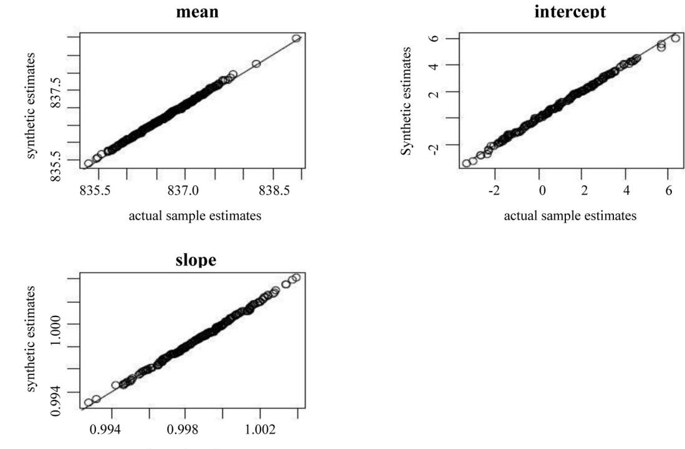

# **HHS Public Access**

Author manuscript

Surv Methodol. Author manuscript; available in PMC 2017 November 30.

Published in final edited form as: Surv Methodol. 2014 June ; 40(1): 29–46.

# **A nonparametric method to generate synthetic populations to adjust for complex sampling design features**

## **Qi Dong**,

Netflix, Inc. 100 Winchester Cir, Los Gatos, CA 95032

# **Michael R. Elliott**, and

Department of Biostatistics, University of Michigan, 1420 Washington Heights, Ann Arbor, MI 48109, Survey Methodology Program, Institute for Social Research, University of Michigan, 426 Thompson St., Ann Arbor, MI 48106

## **Trivellore E. Raghunathan**

Department of Biostatistics, University of Michigan, 1420 Washington Heights, Ann Arbor, MI 48109, Survey Methodology Program, Institute for Social Research, University of Michigan, 426 Thompson St., Ann Arbor, MI 48106

# **Abstract**

Outside of the survey sampling literature, samples are often assumed to be generated by a simple random sampling process that produces independent and identically distributed (IID) samples. Many statistical methods are developed largely in this IID world. Application of these methods to data from complex sample surveys without making allowance for the survey design features can lead to erroneous inferences. Hence, much time and effort have been devoted to develop the statistical methods to analyze complex survey data and account for the sample design. This issue is particularly important when generating synthetic populations using finite population Bayesian inference, as is often done in missing data or disclosure risk settings, or when combining data from multiple surveys. By extending previous work in finite population Bayesian bootstrap literature, we propose a method to generate synthetic populations from a posterior predictive distribution in a fashion inverts the complex sampling design features and generates simple random samples from a superpopulation point of view, making adjustment on the complex data so that they can be analyzed as simple random samples. We consider a simulation study with a stratified, clustered unequal-probability of selection sample design, and use the proposed nonparametric method to generate synthetic populations for the 2006 National Health Interview Survey (NHIS), and the Medical Expenditure Panel Survey (MEPS), which are stratified, clustered unequal-probability of selection sample designs.

# **Keywords**

Synthetic populations; Posterior predictive distribution; Bayesian bootstrap; Inverse sampling

# **1 Introduction**

Statistical methods outside the survey methodology setting have usually been developed without careful consideration for sample design, often implicitly assuming simple random

samples, or, occasionally, one-stage cluster samples. Major efforts of modern survey statistics focus on extending methods to analyze complex survey data (Skinner, Holt and Smith 1989), accommodating issues such as stratification, unequal probability of selection, nonresponse bias or calibration. Hinkins, Oh and Scheuren (1997) proposed an inverse sampling design algorithm that connects the survey statistics and the classical statistics from another perspective. Their basic idea is to choose a subsample that has a simple random sample structure unconditionally. The subsample is often much smaller than the original sample, so they propose to repeat the process independently many times and average the results to increase the precision. They also described exact or approximate inverse sampling schemes for stratified simple random sampling, one-stage cluster sampling, and two-stage cluster sampling. However, this new idea is not used widely in practice, perhaps because it is extremely computionally intensive and the precision losses are often substantial. Similarly, generating synthetic populations from a posterior predictive distribution of a population conditional on complex sample data in a fashion that accounts for the complex sample design is not straightforward (Little 1991). However, in recent years demand for synthetic populations has increased, in order to deal with weight trimming or windorization problems (Lazzeroni and Little 1998; Elliott and Little 2000; Elliott 2007; Chen, Elliott and Little 2010), disclosure risk settings (Little 1993; Raghunathan, Reiter and Rubin 2003; Reiter 2004, 2005), or combining data from multiple surveys (Raghunathan, Xie, Schenker, Parsons, Davis, Dodd and Feuer 2007; Dong 2012). Often the synthetic populations are generated under a distributional assumption (normal, binomial, Poisson), with the posterior distribution of the model parameters approximated by the asymptotic normal distribution. The mean and covariance matrix of the normal distribution are estimated after complex sampling design features are taken into account (Raghunathan et al. 2007).

A major weakness of model-based methods is that if the model is seriously misspecified, it may yield invalid inferences (Little 2004). In multivariate settings, we need to consider the relationships among the variables of interest and determine an appropriate model that fits the data, which may be hard if the data contains different types of variables. In this paper we propose a nonparametric method as a counterpart of the model-based method to generate synthetic populations. This work extends the finite population Bayesian bootstrap and related Pólya posterior models of Lo (1988), Ghosh and Meeden (1983), and Cohen (1997) to account for complex sample designs. Since it achieves the same goal of the inverse sampling technique, it can be treated as the Bayesian finite population version of inverse sampling. To make inference using this weighted finite population Bayesian bootstrap, we can either make use of the draws directly, or, for computational efficiency, use results previously derived in the disclosure risk and multiple imputation literature, since these nonparametrically-generated populations can be viewed as multiple imputations of the unobserved elements of the population.

This paper is organized as follows. Section 2 briefly discusses synthetic populations in the context of Bayesian finite population inference. Section 3 reviews and summarizes the Bayesian bootstrap method and its finite population extension, and shows that, for an unequal probability of selection sample, the distribution of synthetic populations generated under a variant of a Pólya urn scheme matches the posterior predictive distribution of a finite population Bayesian bootstrap. Section 4 presents the proposed method under stratified

clustering sampling with unequal selection probabilities. Section 5 shows that inference from these non-parametrically-generated synthetic populations can be obtained using results from the disclosure risk and multiple imputation literature, where each synthetic population has zero "within-imputation" variance. Section 6 provides a simulation study to evaluate the performance of the nonparametric method in a repeated sampling context. Section 7 applies the method to generate synthetic populations than can be used to estimate health insurance coverage rates using the 2006 NHIS and MEPS data, and compares the result with a parametric (log-linear) modeling approach. Concluding remarks are provided in Section 8.

# **2 Generating synthetic populations from survey data**

The basic concept of Bayesian finite population inference involves imputing the nonsampled values of the population from the posterior predictive distribution based on the observed data. Assume the population values are Y = (Y1, …, YN) and the observed data, Yobs = (y1, …, yn) is obtained in a survey with sampling indicators I = (I1, …, IN). The Bayesian population inference allows for the use of parametric model Pr(Y | θ) for population data based on the posterior predictive distribution for the unobserved elements of the population Pr(Ynob | Yobs) :

$$
Pr(Y_{\text{nob}}|Y_{\text{obs}}) = \int Pr(Y_{\text{nob}}|Y_{\text{obs}}, \theta) Pr(\theta|Y_{\text{obs}}) d\theta
$$

(Ericson 1969; Little 1993; Rubin 1987; Scott 1977; Skinner et al. 1989). Here we use the model Pr(Y | θ) to approximate the entire population distribution Pr(Y) and average over the posterior distribution based on the sampled data Pr(θ | Yobs). In the case that there are design variables known for the entire population available, the above model can be naturally extended by conditioning on these variables.

Implicit in the derivation of above is that the sampling indicator I need not be modeled. This requires ignorable sampling (Rubin 1987) (the distribution of I does not depend on unobserved data), as well as a model for the data Pr(Y | θ) that is attentive to design features and robust enough to sufficiently capture all relevant aspects of the distribution of Y of interest. Our goal here is to develop a method to generate draws from Pr(Ynob | Yobs) that account for all the design features in Yobs so that draws from the posterior distribution of Ynob | Yobs can be treated as a simple random sample in analysis.

## **3 Weighted finite population Bayesian bootstrap**

#### **3.1 Finite Population Bayesian Bootstrap (FPBB)**

Assume that the (scalar) population elements Yi , i = 1, …, N are exchangeable and can take on K ≤ N possible values (b1, …, bK); thus Yi | θ ~ MULTI (1;θ1, …, θK). Further assuming a conjugate Dirichlet prior for θ ~ DIR (α1, …, αK) yields (Ghosh and Meeden 1983)

$$
P(Y_{\text{nob}}|y) = P\left(b_1^{\text{nob}} = N_1 - n_1, \dots, b_K^{\text{nob}} = N_K - n_K |b_1^{\text{obs}} = n_1, \dots, b_K^{\text{obs}} = n_K\right)
$$
  
\n
$$
= \frac{\int_0^1 \dots \int_0^1 P(Y_{\text{nob}}|y, \theta) p(y|\theta) p(\theta) d\theta_1 \dots d\theta_K}{\int_0^1 \dots \int_0^1 p(y|\theta) p(\theta) d\theta_1 \dots d\theta_K}
$$
  
\n
$$
= \frac{\int_0^1 \dots \int_0^1 p(Y_{\text{nob}}|\theta) p(y|\theta) p(\theta) d\theta_1 \dots d\theta_K}{\int_0^1 \dots \int_0^1 p(y|\theta) p(\theta) d\theta_1 \dots d\theta_K}
$$
  
\n
$$
= \frac{\int_0^1 \dots \int_0^1 \prod_{i=1}^K \theta_i^{N_i - n_i} \prod_{i=1}^K \theta_i^{n_i} \prod_{i=1}^K \theta_i^{\alpha_i - 1} d\theta_1 \dots d\theta_K}{\int_0^1 \dots \int_0^1 \prod_{i=1}^K \theta_i^{n_i} \prod_{i=1}^K \theta_i^{\alpha_i - 1} d\theta_1 \dots d\theta_K}
$$
  
\n
$$
= \frac{\left(\prod_{i=1}^K \Gamma(N_i + \alpha_i) / \Gamma(\alpha_i)\right) / (\Gamma(N + \alpha_0) / \Gamma(\alpha_0))}{\prod_{i=1}^K \Gamma(n_i + \alpha_i) / \Gamma(n + \alpha_0)}
$$
(3.1)

where , and n1, …, nK refers to the number of distinct values we observe from our sample y = (y1, …, yn), . If αi ≡ 0 then p (Ynob | y) reduces to

$$
\left(\prod_{i=1}^K \Gamma(N_i)/\Gamma(n_i)\right)/(\Gamma(N)/\Gamma(n)).
$$

To ease implementation, Lo (1988) proposed making draws from the FPBB posterior predictive distribution using a "Pólya urn scheme" procedure. Suppose an urn contains n balls, each of which have a distinct real number label bi , i = 1, …, K. A Pólya sample of size m is selected by first selecting a ball at random from the urn and returning the selected ball into the urn, then putting one same ball into the urn and repeating this process until m balls have been selected. It can be shown that the probability of getting mi balls of type bi is given by

$$
p(b_1=m_1,\ldots,b_K=m_K) = \frac{\prod_{i=1}^K \Gamma(n_i+m_i)/\Gamma(n_i)}{\Gamma(n+m)/\Gamma(n)}
$$
(3.2)

where ni is the number of balls of type bi originally in the urn. The distribution of the counts of type bi is invariant under any permutation of the draws. Note that this corresponds directly to the posterior probability of a total of (m1, …, mK) elements of type (b1, …, bK) in a population, given that (n1, …, nK) elements were observed in a (simple random) sample of size . Hence a FPBB replicate sample can be drawn from this Pólya posterior using the following steps:

Step 1. Draw a Pólya sample of size m = N − n, denoted by from the urn {y1, …, yn}; by (3.2), with mk = Nk − nk draws of value for k = 1, …, K, this corresponds to a draw of P (Ynob | y) from (3.1).

#### **3.2 FPBB with unequal probabilities of selection**

Cohen (1997) extended the FPBB procedure to adjust for the unequal probabilities of selection. Assume (y1, …, yn) is a sample from a finite population (Y1, …, YN) with design weights (w1, …, wn), where

$$
w_i = \frac{1}{P\left(I_i = 1\right)}
$$

and I is the sampling indicator. The procedure has two steps:

Step 1. Draw a sample of size N − n, denoted by , by drawing from (y1, …, yn) in such a way that yi is selected with probability

$$
\frac{w_i-1+l_{i,k-1}*(N-n)/n}{N-n+(k-1)*(N-n)/n},
$$

where wi is the weight of unit i and li,k−1 is the number of bootstrap selections of yi among (The function wtpolyap in the R package polypost can be used to obtain draws from a weighted Pólya urn.)

Step 2. Form the FPBB population y1, …, yn, .

Although Cohen (1997) did not provide theoretical proof for this procedure, it can be obtained as a straightforward extension of the standard FPBB and Pólya urn equivalency described in Section 3.1. First, we determine the posterior distribution of the FPBB sample with unequal probabilities of selection implied by the weighted FPBB procedure. The multinomial likelihood based on our weighted sample is given by

$$
p\left(y_{\rm obs}|\theta\right)\!\!=\!\!\prod_{i=1}^{K}\!\theta_i^{w_i^*},
$$

where

$$
w_i^*\text{=} \left(\frac{n}{N\text{---}n}\right)\sum_{j=1}^n I\left(y_j\text{---}b_i\right)\,\left(w_j\text{---}1\right)
$$

is the sum of the design weights minus one across all sampled elements with value bi , i = 1, …, K, normalized to sum to n. (Note that this removes subjects sampled with weights equal to one – "certainty sample" elements – from the likelihood, as they have no chance to be part of the unobserved portion of the population, and thus contribute no information about these

unobserved elements.) Assuming an improper Dirichlet prior , the weighted finite population Bayesian bootstrap posterior is given by

$$
P(Y_{\text{nob}}|y, w) = P\left(b_1^{\text{nob}} = r_1, ..., b_K^{\text{nob}} = r_K |w_1^*, ..., w_K^*\right)
$$
  
\n
$$
= \frac{\int_0^1 ... \int_{0}^1 p(Y_{\text{nob}}|\theta) p(y|\theta) p(\theta) d\theta_1 ... d\theta_K}{\int_0^1 ... \int_{0}^1 p(y|\theta) p(\theta) d\theta_1 ... d\theta_K}
$$
  
\n
$$
= \frac{\int_0^1 ... \int_{0}^1 \prod_{i=1}^K \theta_i^{r_i} \prod_{i=1}^K \theta_i^{w_i^*} \prod_{i=1}^K \theta_i^{-1} d\theta_1 ... d\theta_K}{\int_0^1 ... \int_{0}^1 \prod_{i=1}^K \theta_i^{w_i^*} \prod_{i=1}^K \theta_i^{-1} d\theta_1 ... d\theta_K}
$$
  
\n
$$
= \prod_{i=1}^K \frac{\Gamma(w_i^* + r_i)}{\Gamma(w_i^*)} / \frac{\Gamma(N)}{\Gamma(n)}
$$
(3.3)

since and .

Next, we show the distribution of samples obtained from the unequal probability of selection Pólya Urn scheme of Cohen (1997) is equal to the posterior distribution of the FPBB sample with unequal probabilities of selection. Given the observed data, the probability that we draw N − n balls and that the first r1 balls have value b1 through the last rk balls have value bk is:

$$
P(b_1 = r_1, \dots, b_K = r_K) = \frac{w_1^*}{n} \times \frac{w_1^* + 1}{n+1} \dots \times \frac{w_1^* + r_1 - 1}{n+r_1 - 1} \times \dots \times \frac{w_K^*}{n + \sum_{i=1}^{K} r_i} \times \dots \times \frac{w_K^* + r_K - 1}{n + \sum_{i=1}^{K} r_i - 1}
$$
  
= 
$$
\prod_{i=1}^{K} \frac{\Gamma(w_i^* + r_i)}{\Gamma(w_i^*)} / \frac{\Gamma(N)}{\Gamma(n)}
$$

where the first equality follows from the fact the distribution of the counts of type bi is invariant under any permutation of the draws, as in the unweighted setting, and the second equality from the identity Γ(x) = (x − 1)Γ(x) for x > 0. Thus, noting that

$$
\frac{w_i-1+l_{i,k-1} * (N-n)/n}{N-n+(k-1) * (N-n)/n} = \frac{w_i^*+l_{i,k-1}}{n+(k-1)}
$$

a draw from the unequal probability of selection Pólya Urn scheme yields a draw from P (Ynob | y, w) in (3.3).

#### **4 Nonparametric method to generate synthetic populations**

In this section, we extend the finite population Bayesian bootstrap methods to a stratified, clustered, unequal probability sample design setting to develop a nonparametric method to generate synthetic populations that adjusts for the complex sampling design features. The idea is to treat the unobserved part of the population as missing data and impute it by

making draws from the actual data. We do the imputation in such a fashion that the resulting draws from the posterior distribution of the population will capture the complex design features and can be used in a standard fashion to compute posterior distributions of the population quantities of interest.

#### **4.1 Use the Bayesian bootstrap to adjust for stratification and clustering**

For a stratified clustering sampling, we first need to resample clusters within the strata.

Denote c as the total number of clusters in the actual data, , and C as the number of clusters in the population, . One approach is to first apply FPBB Pólya urn scheme to impute the unobserved clusters within each stratum, , which together with the observed clusters provide the clusters in stratum h in the population. However, we typically do not know the number of clusters in a stratum from available public use data. Thus we suggest as an alternative to FPBB sample drawing a standard Bayesian bootstrap sample of the clusters within each stratum. Considering the equivalence between the classical bootstrap and Bayesian bootstrap, we follow Rao and Wu (1988), who suggested drawing a simple random sample with replacement (SRSWR) of mh from the ch clusters and within each stratum h calculating replicate weights for computation for each bootstrap sample as

$$
w^{*(l)} = \left\{ w_{hik}^{*(l)},\ h=1,\ldots,\ H,\ i=1,\ldots,\ c_h,\ k=1,\ldots,\ N_{hi} \right\},\
$$

where

$$
w_{hik}^* = w_{hik} \left( \left( 1 - \sqrt{\frac{m_h}{c_h - 1}} \right) + \sqrt{\frac{m_h}{c_h - 1}} \frac{c_h}{m_h} m_{hi}^* \right)
$$

and denotes the number of times that cluster i, i = 1, …, ch is selected. To ensure all the replicate weights are non-negative, mh ≤(ch − 1); here and below we take mh = (ch − 1).

Note that, when clustering is not present, we simply draw a standard Bayesian bootstrap sample from the sampled data within each stratum (when stratification is present) or from the entire sample (if stratification not present, so that H = 1) and calculate the replicate weights as .

This procedure is repeated L times to produce L Bayesian bootstrap (BB) samples denoted by S1, …, SL. This step generates L Bayesian bootstrap samples which essentially are L draws from the posterior predictive distribution of the unobserved clusters given the actual data. However, the units for the L Bayesian bootstrap samples still have weights and cannot be analyzed as simple random samples.

#### **4.2 Use weighted FPBB Pólya urn scheme to adjust for weighting**

Once we have L BB samples with replicate weights, the second step imputes the unobserved units using the weighted FPBB Pólya urn scheme. In practice, the probability of selecting the k th unit, , depends on the selection of the first k − 1 units, . In other words, to determine the probability of selecting a new unit, we have to count the number of times that each unit in the sample has been selected among the previous selections. In settings where the population size is extremely large, we need only generate synthetic populations of size T \* n, where T is sufficiently large to overwhelm the sample size (e.g., 20–100). To further computational efficiency, we could also draw a moderate sized population F > 1 times and then pool these F populations to produce one synthetic population, Sl . The size of Sl then is F \* T \* n.

Note that our method only requires knowledge of the final weights in multistage cluster samples, since all stages of unequal probabilities of sampling will be corrected by use of the weighted FPBB Pólya urn scheme. This is a particularly useful feature of the proposed method, as in many public use datasets the components of the probabilities of selection (e.g., cluster-level selection probabilities, non-response weights) are not available.

### **5 Inference from multiple nonparametric synthetic populations**

Assume we generate L synthetic populations, Sl , l = 1, …, L using the nonparametric method described in Section 4, and that our inferential target is Q ≡ Q (Y), a function of the population data (e.g., population mean, correlation, population maximum likelihood estimator of a regression parameter, etc.). We can compute Ql as the estimate of Q obtained from pooling the F synthetic populations that impute the unobserved units of Sl ; since these are direct draws from the posterior predictive distribution of the population, we can compute posterior means, quantiles, and credible intervals from the corresponding empirical estimates from the draws, if L is sufficiently large.

However, in many settings, the computational effort required to impute the population may be very large, even if the full population is not required to be synthesized. Hence an alternative approach for inference is to approximate the posterior predictive distribution of a scalar population statistic Q via a t-distribution:

$$
Q|S_1, \ldots, S_L \sim t_{L-1} \left(\overline{Q}_L, \left(1 + L^{-1}\right) V_L\right)
$$

where

$$
\overline{Q}_L = \frac{\sum_{l=1}^{L} Q_l}{L} = \frac{\sum_{l=1}^{L} \sum_{f=1}^{F} Q_{lf}}{LF} \text{ and } V_L = \frac{1}{L} \sum_{l=1}^{L} (Q_l - \overline{Q}_L)^2.
$$

The result follows immediately from Section 4.1 of Raghunathan et al. 2003, and is based on the standard Rubin (1987) multiple imputation combining rules, treating the unobserved units of Sl as missing data and the sampled units as observed data. The average "within"

imputation variance is zero, since the entire population is being synthesized; hence the posterior variance of Q is entirely a function of the between-imputation variance, and the degrees of freedom is simply given by the number of FPBB samples. (When the population is extremely large, we need only synthesize a draw sufficiently large for average "within" imputation variance to be trivial relative to the between imputation variance VL.) The result assumes that E(Qlf ) = Q - a result guaranteed by our weighted FPBB estimator - as well as a a sufficiently large sample size for Bayesian asymptotics to apply.

#### **6 Simulation studies**

In this section, we conduct two simulation studies to evaluate the repeated sampling properties of the population estimators constructed using the nonparametric method that generates synthetic populations while adjusting for the complex sampling design features. The first of these considers a one-stage, unequal probability of selection design where we vary the number of weighted FPBB draws for each synthetic population and the number of synthetic populations to assess the impact on inference. The second compares inferential properties from observed data and from the posterior distribution obtained from synthetic population in a stratified, multistage, unequal probability of selection sample, this time fixing the posterior sample size while considering both population means and population regression parameters as targets of inferences.

#### **6.1 Single stage, unequal probability of selection sample design**

We generated outcome data Y in a population of N subjects from a moderately skewed gamma distribution, conditional on uniformly distributed covariate X :

$$
X_i \sim
$$
UNI (0.05;0.65),  $i=1,..., N$   
 $Y_i|X_i=x_i \sim$ GAMMA (10 \*  $x_i$ , 1)

We assume X is fully observed for the population, and that the probability of selection π is proportional to X, so that in a without-replacement sample design as long as n ≪ N. The estimand of interest is the population mean . Note that corr (Yi , Xi ) =0.6794, so that unweighted sample means will be positively biased, and use of design weights wi = 1/πi are required to obtained unbiased estimates of Ȳ. We generated a population of size N = 1,000 from which we sampled n = 100; bias, empirical and estimated variance, 95% interval length, and nominal 95% coverage are then estimated from 200 independent samples from the population. We varied the total number of simulated populations L as 5, 20, 100, and 1,000, and the number of FPBB draws F of size N − n (so that K = 9) as 1, 20, and 100, in full factorial design. Variance, interval length, and interval coverage are obtained via the normal approximation; for L =100 and 1,000, we also obtained variance, interval length, and interval coverage using the direct draws from the posterior predictive distribution, since a sufficient number of draws from the posterior were available to make such estimates.

Table 6.1 shows the results of the simulation study. In all cases the point estimate Q̄ L of the population mean was approximately unbiased, reflecting the ability of the weighted FPBB to "undo" the sampling weights in the generation of the synthetic population. Under the normal approximation, larger numbers of the synthetic population were associated with smaller variances and narrower interval lengths, as expected with larger numbers of degrees of freedom, although the difference between 20 and 100 was minimal, just as the t20 distribution begins to approximate a standard normal. Finally, using only a single FPBB draw of size N − n appeared to overestimate the variance and lead to overcoverage, especially for small values of L. Values of L and F of 20 or greater appeared to yield reasonable results. Use of the direct draws for L =100 and 1,000 yielded to variance and credible interval estimates that were very similar to that of the normal approximation, with slightly narrower interval lengths and somewhat less conservative coverage.

#### **6.2 Stratified, multistage, unequal probability of selection sample design**

We generated a population with strata and clusters within each stratum from the following bivariate normal distribution:

$$
\left(\begin{array}{c} X_{1ijk} \\ X_{2ijk} \end{array}\right) \sim N\left(\left(\begin{array}{c} 500+4.5*i+u_{ij} \\ 500+4.5*i+u_{ij} \end{array}\right), \left(\begin{array}{cc} 100 & 50 \\ 50 & 100 \end{array}\right)\right),
$$

where

i = 1 : 150 denotes the stratum effect,

uij ~ N (0,10) denotes the random cluster effect,

ai ~ uniform (2,52) is the number of clusters within stratum i,

bij ~ uniform (10, 20) is the number of units within cluster j of stratum i.

The population for the simulation study has 61,324 subjects. We draw a stratified clustering sampling with unequal probabilities of selection. Specifically, we select two clusters from

each stratum with probabilities proportional to cluster size (PPS) given by . Within each selected cluster, we select approximately 1/5 of the population. Thus, the probability that unit ij is selected is given by

$$
\pi_{ij} = \frac{2b_{i\bullet}}{\sum_{j=1}^{a_i} b_{ij}} \times \frac{\lfloor b_{ij}/5 \rfloor}{b_{ij}}
$$

for all j elements in cluster i with corresponding weight

$$
w_{ij} = \frac{b_{ij} \sum_{j=1}^{a_i} b_{ij}}{2b_{i\bullet} |b_{ij}/5|}.
$$

Since the number of clusters and units are random, the complex sample size is slightly different across replications, averaging approximately 770.

Because of the large sample and population size, we focus on inference using t approximations. We generate L = 100 synthetic populations using F weighted FPBB samples of size K = 100n. The estimands of interest are the population marginal mean for x1

$$
\overline{X}_1 = N^{-1} \sum_{i=1}^N X_{1i}
$$

and similarly for x2, and the population regression coefficients of x1 on x2 given by

$$
B_0=\overline{X}_1-B_1\overline{X}_2, B_1=\frac{\sum_{i=1}^N(X_{1i}-\overline{X}_1)(X_{2i}-\overline{X}_2)}{\sum_{i=1}^N(X_{2i}-\overline{X}_2)^2}.
$$

We drew 200 independent samples from the population and used the sample data directly to compute weighted sample means and linear regression coefficients along with associated variance estimates and 95% nominal confidence intervals using Taylor Series approximations, and compared these with the equivalent estimates obtained using the nonparametric synthetic data. Results are given in Table 6.2. (Since the marginal means have the same superpopulation value, we combine the results in Table 6.2.) Figure 6.1 displays the scatter plot of the pairs of estimated mean, intercept and slope from the actual samples and the corresponding synthetic populations along with a 45-degee line. The sampling distributions of the actual sample and synthetic population estimates closely correspond. The point estimates and standard errors for both the means and regression parameters closely correspond. The 95% confidence interval coverage rates for all three statistics also closely correspond, and are close to nominal values.

### **7 Application**

In this section, we use data from the 2006 National Health Interview Survey (NHIS) and the 2006 Medical Expenditure Panel Survey (MEPS) to evaluate the performance of the nonparametric method in a stratified clustering sampling design. The National Health Interview Survey (NHIS) is a nationwide, face-to-face health survey based on a stratified multistage design, with oversamples of black, Hispanic, and elderly populations. For confidentiality purposes, the true stratification and primary sampling unit (PSU) variables are not publicly-released; instead pseudo-strata and PSUs (two per stratum) are released. The MEPS is a subsample of the previous year's NHIS sample, and retains the same stratified multistage design.

Both NHIS and MEPS ask respondents whether they are covered by any health insurance and, if so, what type health insurance they are using (private versus government-sponsored such as Medicare or Medicaid). We estimate overall health insurance coverage rates as well as coverage rates in subpopulations defined by demographic variables such as gender, race,

income level, or combinations thereof: specifically, we estimate health insurance coverage for males, non-Hispanic whites, and non-Hispanic whites with household income between \$25,000 and \$35,000 per year. We delete the cases with item-missing values and focus on our simulation on the complete cases. This results in 20,147 and 20,893 cases in the NHIS and MEPS data respectively.

#### **7.1 Estimation of health insurance coverage from the NHIS and MEPS**

In this simulation study, we will use the nonparametric method to adjust for the stratified clustering sampling used by the 2006 NHIS and MEPS and generate synthetic populations that can be analyzed as simple random samples. We also consider a model-based approach for generating synthetic populations using a log-linear model for the health insurance status by six independent demographic variables: gender, race, census region, education level, age (categorical), and income level (categorical). Then we evaluate the method by comparing the estimates of the health insurance coverage rate for the whole population and selected subdomains obtained from both the non-parametric and log-linear model synthetic populations to those obtained from the actual data.

**7.1.1 Generating nonparametric synthetic populations—**Using the nonparametric method developed in Section 3, we generate 200 synthetic populations for each survey. Specifically, we generate B = 200 BB samples and for each BB sample, we generate F = 10 FPBB of size 5n (K = 5). Thus, each synthetic population is 50 times as big as the actual sample (1,007,350 for NHIS, 1,044,650 for MEPS). Each synthetic population is analyzed as a simple random sample and the estimates are combined as described in Section 5.

**7.1.2 Generating synthetic populations via log-linear models—**In the common situation that the survey data of interest are in the form of a multidimensional contingency table, a log-linear model might be considered as a parametric approach to generate draws from a posterior predictive distribution. For simplicity of exposition, assume Y is the variable of our interest with m levels, and Z is a design variable with n levels (e.g., gender, race, etc.) whose marginal distribution is known for the population. Assume πij , i = 1, …, m,

j = 1, …, n, represents the cell proportion of the ij th cell, . A fully saturated log-linear model is given by (Agresti 2002):

where log(πij ) is the log of the probability that one observation falls in cell ij of the

contingency table, is the main effect for Z, is the main effect for Y and is the interaction effect for Z and Y. This model includes all possible one-way and two-way effects and thus is saturated as it has the same number of effects as cells in the contingency table. To avoid over-fitting the data in the example, we can consider non-saturated models that exclude some or all of the interaction terms, choosing the model based on likelihood ratio tests or AIC or BIC criteria.

The synthetic populations can be generated from the posterior predictive distribution from the model. However, when the data is collected under a complex sampling design, we are not aware of standard statistical software that can produce both the point estimate and covariance estimate of the regression coefficients. Instead, we have to use a jackknife replication method to adjust for stratification, clustering and weighting. Specifically, the parametric synthetic populations can be generated from the following steps:

**1.** Estimate coefficients and covariance matrix:

Under the selected model (assume the two-dimensional saturated model here just

for illustration), estimate the coefficients , i = 1, …, m − 1,

j = 1, …, n − 1 and the covariance matrix of the estimates after taking into account the complex design features using jackknife repeated replication (JRR):

**•** For each replication, withdraw one cluster, and inflate the weights for the respondents in the other clusters within the same stratum by ch / (ch − 1) (replication weights), where ch denotes the number of clusters

within stratum h. Assume we have clusters in total, then we have C replications. For each replication, we fit the log-linear model and obtain the maximum likelihood estimates (MLE) of the

coefficients, , i = 1, …, m − 1, j = 1, …, n − 1.

**•** For each replication, use the replication weights to fit the log-linear model. Specifically, use the replication weights to calculate the size of each cell of the contingency table, which is used to fit the log-linear model. We denote the MLE for the r th replication by a column vector,

$$
\hat{\lambda}_P \ r = 1, \dots, c_h \text{ for stratum } h. \text{ Notice that } \lambda = (\lambda_0, \lambda_i^Z, \lambda_j^Y, \lambda_{ij}^{ZY}) \ , \ i = 1, \dots, m-1, j = 1, \dots, n-1 \text{ is a } mn \text{ by } 1 \text{ column vector. We denote}
$$
\n
$$
\lambda = (\lambda_0, \lambda_i^Z, \lambda_j^Y, \lambda_{ij}^{ZY})' = (\lambda_0, \lambda_1, \dots, \lambda_{mn})' \text{. Similarly, } \hat{\lambda}_P \ r = 1, \dots, c_h h
$$

= 1, …, H are also mn by 1 column vectors denoted by

$$
\left(\hat{\lambda}_0^{(r)}, \hat{\lambda}_1^{(r)}, \dots, \hat{\lambda}_{mn}^{(r)}\right)'
$$

The MLE of the coefficients , i = 1, …, m − 1, j = 1, …, n − 1 can be obtained by . For the mn by mn covariance matrix, the jackknife replication estimate of the pq th(p, q = 1, …, mn) element is the covariance between the p th and q th coefficients, which is given by:

$$
\sum_{h=1}^{H} \frac{c_h - 1}{c_h} \sum_{r=1}^{c_h} \left( \hat{\lambda}_p^{(r)} - \overline{\hat{\lambda}}_p \right) \left( \hat{\lambda}_q^{(r)} - \overline{\hat{\lambda}}_q \right),
$$

where and . This gives us the correct variance estimate of λ̂MLE.

**2.** Approximate the posterior distribution of the coefficients:

Let T denote the Cholesky decomposition such that TT t = cov(λ̄MLE). Generate a vector z of random normal deviates and define Λ\* = λ̄MLE + Tz.

**3.** Impute the unobserved values of the population:

Suppose L draws, Λ1, …, ΛL, are made from the approximate posterior distribution of λ. For each

$$
l=1,\ldots,L, \Lambda_l=\left(\Lambda_0^{(l)},\Lambda_i^{X(l)},\Lambda_j^{Y(l)},\Lambda_{ij}^{XY(l)}\right)', i=1,\ldots,m-1, j=1,\ldots,n-1,
$$

we can generate one synthetic table using the assumed model:

$$
\log\left(\pi_{ij}^{(l)}\right) = \Lambda_0^{(l)} + \Lambda_i^{X(l)} + \Lambda_j^{Y(l)} + \Lambda_{ij}^{XY(l)}, i = 1, \dots m-1, j = 1, \dots, n-1.
$$

Once the cell proportions are determined, we can generate the synthetic table of any size.

The results below are based on a seven-dimension contingency table (see Table 7.1 for the specific covariate categories). BIC measures indicated that a model with all 2-way but no 3 way interactions provided the most parsimonious fit.

#### **7.2 Results**

The results are summarized in Table 7.2. For the total population and the larger subpopulations, we can see that the point estimates (posterior mean) of health insurance rates are the same for both the nonparametric and log-linear approach, and are almost identical to those obtained from the actual data after complex sampling design features are accounted for. Both methods yield synthetic populations with slightly higher (posterior) variances than the actual data, reflecting the information loss in the synthesis. In the NHIS, the loss for the non-parametric estimator averaged a little over 20% and was slightly greater than for the log-linear model, which averaged around 10%. Both had losses of about 10% over the actual data in MEPS. However, for the smaller subpopulation (non-Hispanic whites earning \$25,000–\$35,000 per year), the log-linear model produced biased results, due to the fact that the log-linear model did not include all possible interactions. The nonparametric method yields estimates almost identical to those obtained from the actual data after complex sampling design features are accounted for. The log-linear model also substantially underestimated the variance of insurance coverage by 30–40% in these cells, versus an overestimation in the nonparametric approach of 10–40%.

#### **8 Discussion**

In this paper, we propose and evaluate a nonparametric method to generate synthetic populations. This method adjusts for the complex sampling design features without assuming any models to the observed data so it is robust to model-misspecification. Also, unlike model-based methods that needs to develop separate imputation models for different variables of interest, the nonparametric method only uses the design variables to generate synthetic populations and thus is not variable-specific.

We considered the repeated sampling properties of our non-parametric synthetic estimators in a univariate gamma and bivariate normal setting, estimating means, slopes, and intercepts. Point estimates were unbiased, intervals had approximately nominal coverage, and losses of efficiency relative to the actual data were trivial. We also considered a "real world" setting, generating a predictive distribution for the 2006 NHIS and MEPS and estimating rates and associated variance estimates of health insurance coverage using both the nonparametric method and a fully parametric log-linear modeling approach. When the model fits the data well, the model-based method is more efficient than the nonparametric method. However, when the assumed model does not fit the data well, as was the case in certain small domains, the model-based method may produce invalid inference. In such situations, the nonparametric method is robust to model misspecfication.

In addition to robustness to model misspecification, another advantage is that the nonparametric method only uses the design variables such as stratum, cluster and weight to impute the unobserved part of the population. Unlike model-based methods, it does not need to model the complicated relationships among the variables of interest, which becomes impossible if there are item missing values in the actual data. The synthetic populations generated by the nonparametric method still preserve the item missing values in the actual data. This potentially fills in a gap in the multiple imputation area in that existing imputation methods typically ignore the complex sampling design features in the data and impute the missing values as if they are simple random samples. A related advantage is that, while design variables are used in the nonparametric generation of the synthetic populations, the synthetic populations themselves do not need to contain them, since they can be analyzed as simple random samples. Hence, disclosure risk associated with release of design variables can be eliminated (De Waal and Willenborg 1997; Mitra and Reiter 2006; Reiter and Mitra 2009).

A fourth practical advantage of the nonparametric method is that it is easier to implement in existing statistical software packages because it focuses on the design variables; thus specific strategies for various types of variables and data structures do not need to be developed.

Because use of the weighted FPBB does not require information about the number of clusters in the population or conditional probabilities of selection at each stage of selection in a multistage sample setting, we use an approximate Bayesian bootstrap method to adjust for stratification and clustering. We view this as advantageous in many ways, since public use datasets typically do not break out weights for each stage of the sample. However, it

does have the disadvantage that, to ensure positive replicate weights, the Bayesian bootstrap method produces fewer clusters within strata than in the actual data. In the setting where the probabilities of selection are known for all stages of the sample, it seems likely that the weighted FPBB can be implemented at each stage, with the population of unobserved clusters and the population of elements within each cluster imputed in a two-stage fashion, paralleling Meeden (1999) just as the one-stage FPBB parallels Ghosh and Meeden (1983). This remains an area for future research.

#### **Acknowledgments**

This research was supported by NCI grant R01CA129101. The authors wish to thank the Editor, Associate Editor, and two anonymous reviewers for their comments. We are especially indebted to the reviewer that helped us to better understand and explain the links between the finite population Bayesian bootstrap and Pólya posterior discussed in Section 3.

### **References**

Agresti, A. Categorical Data Analysis. New York: John Wiley & Sons, Inc; 2002.

- Chen Q, Elliott MR, Little RJA. Bayesian penalized spline model-based inference for finite population proportion in unequal probability sampling. Survey Methodology. 2010; 36(1):23–34.
- Cohen, MP. Proceedings of the Survey Research Methods Section. American Statistical Association; 1997. The Bayesian bootstrap and multiple imputation for unequal probability sample designs; p. 635-638.
- de Waal AG, Willenborg LCRJ. Statistical disclosure control and sampling weights. Journal of Official Statistics. 1997; 13:417–434.
- Dong, Q. Unpublished Thesis. 2012. Combining Information from Multiple Complex Surveys.
- Elliott MR. Bayesian weight trimming for generalized linear regression models. Survey Methodology. 2007; 33(1):23–34.
- Elliott MR, Little RJA. Model-based approaches to weight trimming. Journal of Official Statistics. 2000; 16:191–210.
- Ericson WA. Subjective Bayesian modeling in sampling finite populations. Journal of the Royal Statistical Society. 1969; B31:195–234.
- Ghosh M, Meeden G. Estimation of the variance in finite population sampling. Sankhy : The Indian Journal of Statistics. 1983; B45:362–375.
- Hinkins S, Oh HL, Scheuren F. Inverse sampling design algorithms. Survey Methodology. 1997; 23(1): 11–21.
- Lazzeroni LC, Little RJA. Random effects models for smoothing poststratification weights. Journal of Official Statistics. 1998; 14:61–78.
- Little RJA. Inference with survey weights. Journal of Official Statistics. 1991; 7:405–424.
- Little RJA. Statistical analysis of masked data. Journal of Official Statistics. 1993; 9:407–426.
- Little RJA. To model or not to model? Competing modes of inference for finite population sampling. Journal of the American Statistical Association. 2004; 99:546–556.
- Lo AY. A Bayesian bootstrap for a finite population. Annals of Statistics. 1988; 16:1684–1695.
- Meeden G. A noninformative Bayesian approach for two-stage cluster sampling. Sankhy : The Indian Journal of Statistics. 1999; B61:133–144.
- Mitra R, Reiter JP. Adjusting survey weights when altering identifying design variables via synthetic data. Privacy in statistical databases: Lecture Notes in Computer Science. 2006; 4302:177–188.
- Raghunathan TE, Reiter JP, Rubin DB. Multiple imputation for statistical disclosure limitation. Journal of Official Statistics. 2003; 19:1–16.
- Raghunathan TE, Xie DW, Schenker N, Parsons VL, Davis WW, Dodd KW, Feuer DJ. Combining information from two surveys to estimate county-level prevalence rates of cancer risk factors and screening. Journal of the American Statistical Association. 2007; 102:474–486.

- Rao JNK, Wu CFJ. Resampling inference with complex survey data. Journal of the American Statistical Association. 1988; 83:231–241.
- Reiter JP. Simultaneous use of multiple imputation for missing data and disclosure limitation. Survey Methodology. 2004; 30(2):235–242.
- Reiter JP. Releasing multiply imputed, synthetic public use microdata: An illustration and empirical study. Journal of the Royal Statistical Society. 2005; A168:185–205.
- Reiter JP, Mitra R. Estimating risks of identification disclosure in partially synthetic data. Journal of Privacy and Confidentiality. 2009; 1:1. Article 6.
- Rubin, DB. Multiple Imputation for Non-Response in Surveys. New York: John Wiley & Sons, Inc; 1987.
- Scott AJ. Large sample posterior distributions in finite populations. The Annals of Mathematical Statistics. 1977; 42:1113–1117.
- Skinner, C., Holt, D., Smith, T. Analysis of Complex Surveys. New York: John Wiley & Sons, Inc; 1989.

#### **Figure 7.1.**

Scatter plot of the descriptive and analytic statistics from the actual and synthetic populations

Author Manuscript

# **Table 6.1**

Bias, empirical variance, mean of estimated variance, interval length and coverage of 95% nominal confidence interval of a population mean as a function of the number of synthetic populations ( L) and the number of weighted finite Bayesian bootstraps that make up the synthetic population ( F). Interval length and coverage obtained via t - approximation and empirically via direct simulation. One stage unequal probability of selection sample design. Results from 200 simulations.

Author Manuscript

# **Table 6.2**

Descriptive and analytic statistics estimated from the actual data and the synthetic populations in a simulation evaluation of the nonparametric method. Two-stage, unequal probability of selection stratified sample design. Results from 200 simulations.

#### **Table 7.1**

Variables and response categories for the 2006 NHIS and MEPS used in log-linear model.

Author Manuscript

# **Table 7.2**

Estimates from actual data and from the synthetic populations (Nonparametric and log-linear model) for the 2006 NHIS and MEPS.

Author Manuscript

Author Manuscript