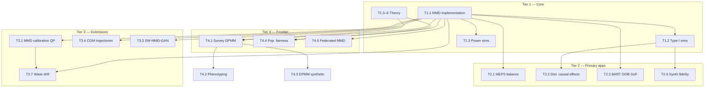

# Design-Based Distributional Learning (DBDL)

**Position note and research roadmap**  
**Author:** A. Quijano · **Date:** July 2026  
**Status:** Field definition / program document (condensed from `survey_weighted_mmd.md`)

---

## 1. What this field is

**Design-Based Distributional Learning (DBDL)** is the study of **finite-population distributions** under complex survey designs, using nonparametric tools from reproducing kernel Hilbert spaces (RKHS) and Bayesian additive/nonparametric regression.

The central object is not a mean or a regression coefficient, but the **population probability measure** $\mathbb{P}_{\rm pop}$ (or subgroup measures $\mathbb{P}_{\rm pop}(\cdot \mid G)$) on covariates, outcomes, trajectories, or model outputs — estimated from survey samples with unequal probabilities, stratification, and clustering.

**Organizing principle:** replace the classical empirical measure with the **Hajek (design-weighted) empirical measure**, embed it in an RKHS via the **kernel mean embedding**, and use **Maximum Mean Discrepancy (MMD)** as the universal distance, test statistic, calibration criterion, and convergence metric. **Uncertainty** is quantified by the **Kim-Rao stratified PSU bootstrap**, already implemented in the Survey BART stack.

### 1.1 Three methodological pillars

| Pillar | Role | Target object |
|---|---|---|
| **Survey BART** | Design-weighted Bayesian additive regression trees | $\mathbb{P}(Y \mid X)$ — conditional structure |
| **Survey-weighted DPMM** | Design-weighted Dirichlet process mixture model | $\mathbb{P}(X)$ — marginal structure, phenotypes, synthetic data |
| **Survey-weighted MMD** | Distance, two-sample test, loss, calibration | $\mathrm{MMD}(\mathbb{P}, \mathbb{Q})$ in $\mathcal{H}_k$ |

Survey BART handles **regression**; DPMM and MMD handle **distributions**. Together they specify the joint population law $\mathbb{P}(X,Y) = \mathbb{P}(Y \mid X)\,\mathbb{P}(X)$, both estimated design-consistently and calibrated by the same Kim-Rao bootstrap (`generate_kim_rao_weights()` in `scripts/survey_bart_rcpp.R`).

### 1.2 What DBDL is not

- **Not superpopulation / model-based survey inference** as the primary frame: randomness comes from the sampling mechanism; the estimand is the finite population, not an i.i.d. data-generating process.
- **Not i.i.d. kernel testing**: permutation nulls and unweighted empirical measures are out of scope as default tools.
- **Not parametric distributional modeling** (copulas, parametric mixtures) unless used as components inside the nonparametric layer.
- **Not hospital-cohort or convenience-sample inference** when the scientific question is population-level — though survey data can *audit* models trained on such cohorts.

### 1.3 Adjacent fields and DBDL's niche

| Adjacent field | Typical focus | DBDL contribution |
|---|---|---|
| Design-based survey inference | Totals, means, linear regression | Full multivariate / functional distributions |
| Kernel two-sample testing (Gretton et al.) | i.i.d. samples, permutation | Hajek measures, Kim-Rao null |
| Causal inference on surveys | SMDs, IPTW, ATE/ATT | Omnibus balance; distributional treatment effects |
| MMD-GANs / generative modeling | Sample distribution matching | Population distribution matching via weights |
| Algorithmic fairness | Cohort-level parity, calibration | Population-level score distributions via MEPS/NHANES |
| Functional data analysis | i.i.d. curves | Design-weighted trajectory embeddings |

**Open territory:** to our knowledge, no existing framework combines (i) characteristic-kernel distributional testing, (ii) complex survey designs (strata, PSUs, unequal weights), and (iii) a unified bootstrap protocol shared with Bayesian survey regression — in a single design-based program.

---

## 2. Core framework (the executable center)

Everything else in DBDL extends this pipeline.

### 2.1 Weighted empirical measure

For sample units $i = 1,\ldots,n$ with design weights $w_i$:

$$\hat{\mathbb{P}}_w = \sum_{i=1}^n \tilde{w}_i \,\delta_{X_i}, \qquad \tilde{w}_i = \frac{w_i}{\sum_j w_j}$$

Under standard design regularity (Isaki–Fuller conditions), $\hat{\mathbb{P}}_w(f) \xrightarrow{p} \mathbb{E}_{\mathbb{P}_{\rm pop}}[f(X)]$ for bounded $f$ — **design consistency**.

### 2.2 Weighted kernel mean embedding

$$\hat{\mu}_w = \sum_{i=1}^n \tilde{w}_i \, k(\cdot, X_i) \in \mathcal{H}_k$$

**Conjecture (embedding consistency):** For bounded, continuous, characteristic $k$, $\|\hat{\mu}_w - \mu_{\mathbb{P}_{\rm pop}}\|_{\mathcal{H}_k} \xrightarrow{p} 0$ under the design. Proof program: uniform consistency over the RKHS unit ball via boundedness of $k$ and Hajek consistency. *Formal statement and conditions: Tier 1 theory.*

### 2.3 Survey-weighted MMD statistic

For groups $A$ and $B$ with normalized weights $\tilde{\mathbf{w}}_A$, $\tilde{\mathbf{w}}_B$ and kernel matrices $K_{AA}$, $K_{BB}$, $K_{AB}$:

$$\widehat{\mathrm{MMD}}_w^2 = \tilde{\mathbf{w}}_A^\top K_{AA}\,\tilde{\mathbf{w}}_A + \tilde{\mathbf{w}}_B^\top K_{BB}\,\tilde{\mathbf{w}}_B - 2\,\tilde{\mathbf{w}}_A^\top K_{AB}\,\tilde{\mathbf{w}}_B$$

This is $\|\hat{\mu}_{w,A} - \hat{\mu}_{w,B}\|_{\mathcal{H}_k}^2$. Under $H_0\!: \mathbb{P}_A = \mathbb{P}_B$ (population equality), $\widehat{\mathrm{MMD}}_w^2 \xrightarrow{p} 0$; under fixed $H_1$, it converges to the population MMD squared — **test consistency**.

**Known issue:** diagonal terms induce finite-sample bias; an unbiased weighted U-statistic variant (zero diagonal, renormalize) should be the default for inference. *Tier 1 implementation.*

### 2.4 Null distribution: Kim-Rao bootstrap (not permutation)

Permutation fails under survey designs (unequal weights, within-PSU dependence). The Kim-Rao procedure resamples PSUs within strata via a multinomial draw, constructs bootstrap weights $w_i^{*(b)}$, and preserves design structure. Implemented as `generate_kim_rao_weights()`.

**Two-sample test algorithm:**

1. Compute observed $T_0 = \widehat{\mathrm{MMD}}_w^2$ on original normalized weights.
2. Generate $W^A \in \mathbb{R}^{B \times n_A}$ and $W^B \in \mathbb{R}^{B \times n_B}$ via Kim-Rao on each group.
3. For $b = 1,\ldots,B$: normalize row $b$ of each matrix; compute $T_b$ (same kernel matrices, resampled weights).
4. $p = \frac{1}{B}\sum_b \mathbf{1}[T_b \geq T_0]$.

**Conjecture (bootstrap validity):** The bootstrap distribution of $T_b$ consistently approximates the sampling distribution of $T_0$ under $H_0$, for smooth functionals of $\hat{\mathbb{P}}_w$, under bounded $k$ and $n_h \to \infty$ (PSUs per stratum). *Tier 1 theory + simulation.*

### 2.5 Shared infrastructure

```
Kim-Rao Bootstrap (W_mat)
        │
        ├── Survey BART      →  P(Y | X), G-computation, OOB units
        ├── Survey MMD test  →  two-sample inference, balance, fidelity
        └── Survey DPMM      →  P(X), phenotypes, synthetic draws
```

OOB units (bootstrap weight exactly zero, probability $\approx e^{-1}$ per PSU) arise naturally from the Kim-Rao draw and support cross-validated variance estimation and BART goodness-of-fit diagnostics.

---

## 3. Tiered research roadmap

Applications are ordered by **maturity** and **dependence on the core pipeline**. Each tier should produce at least one implementable artifact and one validation result before expanding.

### Tier 1 — Core (establish the field)

*Goal: prove the field is statistically valid and computationally real.*

| ID | Thread | Deliverable | Validation | Est. effort |
|---|---|---|---|---|
| **T1.1** | `compute_weighted_mmd2()` + `survey_mmd_test()` | R functions wrapping existing Kim-Rao generator | — | 1 week |
| **T1.2** | Type I error calibration | Simulation under $H_0$ with stratified cluster DGP mimicking MEPS | Empirical rejection rate $\approx \alpha$ | 1 week |
| **T1.3** | Power study | $H_1$: mean shift, variance shift, correlation shift | Compare vs. Bonferroni SMDs, unweighted MMD | 1 week |
| **T1.4** | Unbiased weighted U-statistic | Diagonal-zeroed estimator | Bias reduction at small $n_h$ | 3 days |
| **T1.5** | Embedding consistency proposition | Formal statement + proof sketch | — | Ongoing |
| **T1.6** | Bootstrap validity proposition | Conditions on $k$, design, $n_h$ | Align with Rao survey-bootstrap literature | Ongoing |
| **T1.7** | Citation / positioning | Related-work section naming design-based KS, energy distance, domain-adaptation MMD | — | 3 days |

**Exit criterion for Tier 1:** A published or preprint-ready **methods paper**: "Survey-weighted MMD with Kim-Rao bootstrap for complex survey data."

---

### Tier 2 — Primary applications (show the field solves real problems)

*Goal: two flagship use cases on MEPS/NHANES that demonstrate DBDL's value over status quo.*

| ID | Thread | Source § | Deliverable | Blocker / note |
|---|---|---|---|---|
| **T2.1** | MEPS covariate balance (pre/post IPTW) | §5.1 | Joint omnibus balance test in `estimate_causal_meps.R` | None — direct Tier 1 output |
| **T2.2** | Distributional causal effects | §5.2 | MMD between $\hat{Y}(1)$ and $\hat{Y}(0)$ posterior draws from Survey BART | Two-level bootstrap (design × MCMC) |
| **T2.3** | OOB goodness-of-fit for Survey BART | §4.5 | $T_{\rm GoF}^{(b)}$ MMD on OOB predictions vs. outcomes per MCMC iter | Requires posterior predictive on OOB |
| **T2.4** | BART leaf kernel | §5.3 | Data-adaptive kernel from `Node::route()` in `survey_bart.cpp` | Extract + benchmark vs. Gaussian |
| **T2.5** | Mixed-type product kernel | §7.2 | Gaussian × Aitchison–Aitken for MEPS covariates | Standard implementation |
| **T2.6** | Synthetic data fidelity score | §6.1.3 | One-sample MMD + Kim-Rao p-value for synthetic vs. real | Needs synthetic generator to evaluate |

**Exit criterion for Tier 2:** An **applied paper** on MEPS causal distributional inference, or a **methods + data** paper with MEPS balance + distributional treatment effect as headline results.

---

### Tier 3 — Extensions (expand the field's reach)

*Goal: demonstrate DBDL generalizes beyond two-sample tests on tabular MEPS covariates.*

| ID | Thread | Source § | Deliverable | Blocker / note |
|---|---|---|---|---|
| **T3.1** | MMD calibration QP | §6.2 | $\min_{\tilde{w}} \mathrm{MMD}^2(\hat{\mathbb{P}}_w, \hat{\mathbb{P}}_{\rm census})$ with simplex constraints | Add entropy penalty toward base weights; $O(n^2)$ memory |
| **T3.2** | Survey-to-census diagnostic | §6.2.4 | Post-raking distributional test (survey vs. ACS) | Census microdata access |
| **T3.3** | SW-MMD-GAN loss | §6.1.2 | `survey_mmd_loss()` for generative training | Differentiable cross-term; compare to DPMM route |
| **T3.4** | CGM trajectory testing (NHANES) | §6.3 | $L^2$ kernel on glucose curves; diabetic vs. non-diabetic | Data access; curve alignment; analytic weights |
| **T3.5** | Elastic shape kernel (SRV) | §6.3.5 | Phase-invariant CGM comparison | Registration cost |
| **T3.6** | Conditional kernel mean embedding | §6.3.4 | Distributional regression on trajectories | Song et al. (2013) machinery + survey weights |
| **T3.7** | Inter-wave population drift | §6.7 | Sequential MMD $D_t$ across MEPS panels; CUSUM | Multi-wave weight harmonization |
| **T3.8** | MMD wave-transfer weights | §6.7.3 | Cross-wave importance weights via §6.2 QP | Same as T3.1 |

**Exit criterion for Tier 3:** One **domain paper** (functional health curves, calibration, or synthetic data) showing a problem that mean-based survey methods cannot address.

---

### Tier 4 — Frontier (define the field's long horizon)

*Goal: position DBDL at intersections with regulation, privacy, and Bayesian nonparametrics. Higher risk; publish after Tier 1–2 credibility is established.*

| ID | Thread | Source § | Research question | Key risk |
|---|---|---|---|---|
| **T4.1** | Survey-weighted DPMM | §6.9 | Does weighted DPMM posterior concentrate on $\mathbb{P}_{\rm pop}$ in MMD? | Weighted Bayesian inference theory; dependence |
| **T4.2** | DPMM phenotyping (MEPS) | §6.9.5 | Population-representative healthcare phenotypes with bootstrap stability | Cluster label alignment across bootstraps |
| **T4.3** | DPMM synthetic data | §6.9.4 | Posterior predictive draws as population-faithful synthetic MEPS | vs. SW-MMD-GAN (T3.3) |
| **T4.4** | Population AI fairness audit | §6.5 | $\mathbb{P}_{f,G_1} = \mathbb{P}_{f,G_2}$ for clinical model $f$ on survey covariates | **Covariate transportability** (survey $\neq$ EHR inputs) |
| **T4.5** | Intersectional conditional MMD | §6.5.5 | Fairness across joint demographic profiles | Small cells in survey data |
| **T4.6** | Federated kernel embeddings | §6.8 | Cross-agency MMD without microdata sharing | Nyström error; agency weight harmonization |
| **T4.7** | Differentially private embeddings | §6.8.4 | DP guarantees on transmitted $\hat{z}^{(k)}$ | Privacy–power tradeoff; formal sensitivity proof |
| **T4.8** | Policy changepoint via MMD | §6.7.4 | ACA Medicaid expansion as distributional break in MEPS | Causal interpretation of $D_t$ |

**Exit criterion for Tier 4:** Each thread is a **standalone paper** or regulatory/white-paper contribution; none are prerequisites for the field's core identity.

---

## 4. Dependency graph



---

## 5. Publication sequence (suggested)

| Order | Paper | Tier | Audience |
|---|---|---|---|
| **1** | Survey-weighted MMD + Kim-Rao bootstrap: method, theory sketches, simulations | T1 | *JASA*, *Biometrika*, *JMLR* |
| **2** | Distributional causal inference on MEPS with Survey BART + MMD | T2 | *Health Economics*, *J. Survey Stat. Methodol.* |
| **3** | MMD calibration of surveys to census / functional CGM comparison / synthetic fidelity | T3 (pick one) | Domain journal |
| **4** | Survey-weighted DPMM convergence + phenotyping | T4.1–4.2 | *Bayesian Analysis*, *Annals of Applied Stat.* |
| **5** | Population-level clinical AI fairness via survey MMD | T4.4 | *Science* / *NEJM AI* / *FAccT* |

Paper 1 establishes the field. Papers 2–3 demonstrate breadth. Papers 4–5 are frontier positioning.

---

## 6. Immediate next actions (next 30 days)

1. **Implement** `compute_weighted_mmd2()` and `survey_mmd_test()` per skeleton in `survey_weighted_mmd.md` §10.
2. **Simulate** Type I error under a synthetic MEPS-like design ($n_h$ PSUs, 2 strata, unequal weights); compare to permutation MMD and unweighted MMD.
3. **Integrate** one call in `estimate_causal_meps.R`: pre-IPTW omnibus balance test.
4. **Fix** bootstrap citation lineage in both documents (Kim–Rao 2009 → correct survey-bootstrap reference).
5. **Label** §6.9.3 DPMM theorem and §4.6 bootstrap table as **conjectures** in `survey_weighted_mmd.md` until formalized.

---

## 7. Open problems (field-level)

1. **Weighted Bayesian consistency:** Under what conditions does a survey-weighted DPMM / power posterior concentrate on $\mathbb{P}_{\rm pop}$?
2. **Two-level bootstrap:** How to jointly propagate Kim-Rao design uncertainty and Survey BART MCMC uncertainty for distributional causal tests?
3. **Calibration identifiability:** MMD calibration QP may be underdetermined; what constraints (marginal totals, entropy, weight bounds) are needed?
4. **Transportability for fairness:** When can $f(X_i^{\rm survey})$ approximate $\mathbb{P}_{f,G,\rm pop}$ for EHR-trained $f$?
5. **Scalability:** Nyström / RFF approximations that preserve design consistency for $n > 50{,}000$.
6. **Functional registration:** $L^2$ vs. SRV kernel for CGM — which is more powerful for population-level group comparisons?

---

## 8. One-paragraph field statement (for grants, talks, bios)

> **Design-Based Distributional Learning (DBDL)** extends complex survey inference from means and totals to **full finite-population distributions**. The framework replaces classical empirical measures with **Hajek-weighted measures**, embeds them in reproducing kernel Hilbert spaces, and uses **Maximum Mean Discrepancy** as a unified distance, hypothesis test, calibration criterion, and generative loss. **Uncertainty** is quantified by the **Kim-Rao stratified bootstrap**, shared with design-weighted Bayesian additive regression trees (Survey BART) and survey-weighted Dirichlet process mixtures. DBDL enables population-level nonparametric inference for causal covariate balance, distributional treatment effects, synthetic data evaluation, health trajectory comparison, survey calibration, and population-representative algorithmic auditing — all under the same design-based probability calculus.

---

*Full technical detail, algorithms, and extended applications: see `survey_weighted_mmd.md`.*
